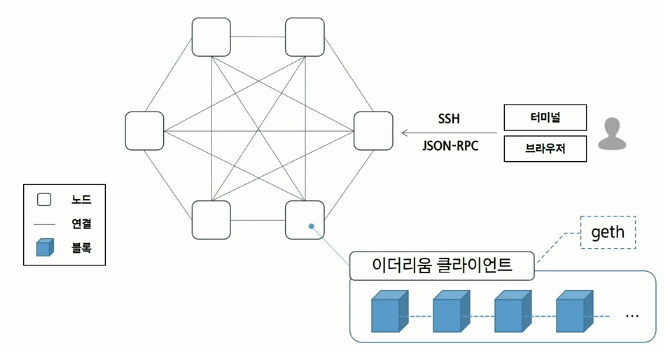
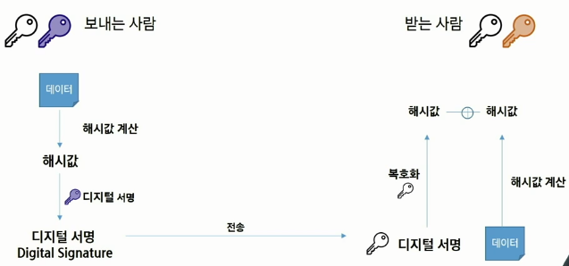
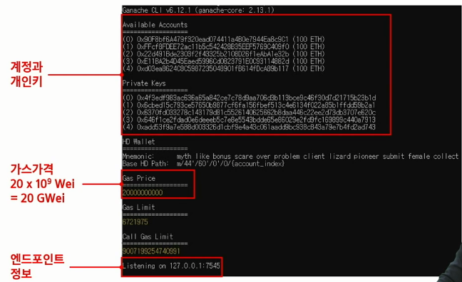
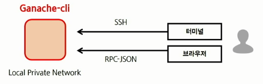

<center>

</center>
<br>

# <a style="color:#00adb5">Ethereum</a>

## <a style="color:#00adb5">Ethereum</a> 이란 무엇인가

- <a style="color:red"><strong>스마트 컨트랙트를 구현한 블록체인 플랫폼</strong></a>이다.
- <big>스마트 컨트랙트</big> 만을 위한 <a style="color:red"><strong>언어 ( Solidity, LLL 등 )</strong></a> 을 개발하고 이를 실행시키기 위한 <a style="color:red"><strong>가상 머신 ( EVM, Ethereum Virtual Machine )</strong></a> 도 제작하였다.
- 비트코인에서는 반복문이 동작할 수 없는 튜링 불완전한 스택 기반의 스크립트 언어라면 이더리움의 스마트 컨트랙트는 반복문을 포함하여 좀 더 복잡한 로직을 구성할 수 있는 <a style="color:red"><strong>튜링 완전 언어</strong></a>를 사용한다.
- 비트코인의 블록체인을 확장하여 <a style="color:red"><strong>탈중앙화된 응용 프로그램 ( dApps ) 이 블록체인상에서 구동 될 수 있는 구조</strong></a>를 가지고 있다.
- 하나의 암호화폐가 하나의 블록체인에서만 거래되던 기존의 패러다임을 <a style="color:red"><strong>여러개의 암호화폐가 하나의 블록체인에 거래될 수 있도록 한 블록체인</strong></a>이다.
- 단순 분산 원장 ( 광범위하게 널리 분포되어 있고 거래 내역을 적은 장부가 있는 ) 수준에 머물러 있던 블록체인을 <a style="color:red"><strong>수많은 서비스에 적용할 수 있게끔 탈바꿈시킨 혁신적인 시스템</strong></a>이다.
- 그래서 이더리움 부터 <a style="color:red"><strong>2세대 블록체인, 2세대 암호화폐</strong></a> 라 불린다. ( 비트코인은 1세대 )
- 단순한 가치 저장의 수단이 아닌 안에서 애플리케이션을 구동하고, 증권 등 자산을 만들고, 계약도 할 수 있는 비즈니스 플랫폼으로 가치를 가진다.

## <a style="color:#00adb5">이더리움과 비트코인 ( 1세대 블록체인 ) 차이점</a>

- 암호 해시함수
  - 1세대는 SHA 계열의 해시함수를 사용
  - 이더리움은 ASIC 저항성을 향상하고 채굴의 중앙화 해소를 위해 <a style="color:red"><strong>Ethash</strong></a> 라는 KECCACK 기반의 해시 알고리즘을 개발하여 사용
- MPT ( Modified Merkle Patricia Trie )
  - MPT는 <a style="color:red"><strong>트랜잭션 데이터의 위변조 감지 및 스마트 컨트랙트 관련 상태 정보를 저장, 관리하기 위한 기술</strong></a>
  - 1세대는 Merkle Tree를 이용해서 감지
  - 이더리움은 Merkle Tree를 Patricia Trie와 접목시킨 MPT를 사용하여 상태 정보를 Key-Value 형식으로 저장하고 관리
- 암호화폐의 관리 기술에 관한 차이
  - 비트코인은 '소비되지 않은 거래 출력 ( 잔액 )' , 즉 UTXO ( Unspent Transaction Output )를 기반으로 한다. 즉 <a style="color:red"><strong>암호화폐 중심</strong></a> 으로 관리
  - 이더리움은 '사용자 계정' 에 기반하여 암호화폐를 관리한다. 즉 <a style="color:red"><strong>사용자 중심</strong></a> 으로 관리

## <a style="color:#00adb5">이더리움 블록체인 네트워크 분류</a>

### <a style="color:#00adb5">Public Network</a> 퍼블릭 네트워크

- <a style="color:red"><strong>전 세계 사람들이 다 같이 동일한 데이터를 유지하고 있는 네트워크</strong></a>

<br>

- 메인넷
  - 거래소에 있는 이더리움
  - 실제 스마트 컨트랙트를 접할 수 있는
- 테스트넷
  - 메인넷에 하기 전에 이더리움을 경험해볼 수 있는 네트워크
  - 롭슨 (Ropsten), 코반 (Kovan), 링키비 (Rinkeby), 고얼리 (Roerli)

### <a style="color:#00adb5">Private Network</a> 프라이빗 네트워크

- <a style="color:red"><strong>Test용, 실습용</strong></a>
- 실제로 이더가 왔다갔다 하지만 메인넷처럼 Valuable 한 이더를 교환하는 것이 아닌 개인적으로 마음껏 이더를 채굴하고 스마트 컨트랙트를 배포할 수있고 이더를 거래할 수 있는 환경이다.

## <a style="color:#00adb5">이더리움 네트워크 개념도</a>

<center>

</center>
<br>

- 이더리움 네트워크는 많은 <a style="color:red"><strong>노드</strong></a>로 구성되어져있다. ( 로컬PC는 노드1개 )
- 노드들은 수많은 이더리움에 들어있는 데이터들을 다 동기화해서 똑같이 가지고 있다.
- <a style="color:red"><strong>블록</strong></a>의 형태로 가지고 있다.
- 이 노드들을 활용해서 이더리움 네트워크를 활용할 수 있다.
- 네트워크에 참여하기 위해서는 <a style="color:red"><strong>이더리움 클라이언트</strong></a>가 필요하다.
- <a style="color:red"><strong>geth</strong></a>라는 클라이언트를 사용한다.

## <a style="color:#00adb5">환경 설정</a>

- <big>Chocolatey 설치</big>

  - 윈도우 소프트웨어를 위한 머신 수준의 명령 줄 패키지 관리자 이자 인스톨러이다.
  - 참고 링크 : <a href="https://chocolatey.org/install">https://chocolatey.org/install</a>
  - Powershell에 설치 명령 ( 관리자로 실행 )
  
  </center>
  <br>

  - 사전 필요 요소 설치

  ```powershell
  # git
  > choco install git -y
  # go language -> geth가 go language로 되어있다 -> git에서 go 다운 받아 이용하기 때문
  > choco install golang -y
  > choco install mingw -y
  ```

- <big>Geth 설치 ( Go Ethereum)</big>

  - cmd 창에서 설치

  ```powershell
  # 디렉토리 생성
  > mkdir src\github.com\ethereum
  # git clone ( go ethereum source code )
  > git clone https://github.com/ethereum/go-ethereum --branch v1.9.24 src\github.com\ethereum\go-ethereum
  # 디렉토리로 이동
  > cd src\github.com\ethereum\go-ethereum
  # compile 작업
  > go get -u -v golang.org/x/net/context
  # install 작업
  > go install -v ./cmd/...

  # 설치 확인 ( cmd 창을 닫았다가 다시 실행 )
  > geth version
  # 1.9.24-stable 버전 확인
  ```

- <big>ganache 설치</big>

  - ganache ( 가나슈 ) - <a style="color:red"><strong>이더리움 개발 툴</strong></a> - 로컬PC내에 이더리움 블록체인 가상 네트워크를 생성 - 스마트 계약 트랜젝션 송신 가능 - MetaMask 지갑으로 송금가능 - Ganache와 MetaMask 연동으로 이더리움 블록체인 개발 가능
    <br>
  - node.js 설치

    - powershell 에서 설치

    ```powershell
    > choco install nodejs-lts
    ```

  - ganache-cli 설치

    - cmd 에서 설치

    ```powershell
    > npm install -g ganache-cli
    ```

    - cmd 에서 설치 확인

    ```powershell
    > ganache-cli --version
    ```

- <big>MetaMask 설치</big> 지갑 프로그램
  - 설치 링크 : <a href="https://metamask.io/">MetaMask</a>
  - 크롬 확장 프로그램으로 설치
    <br>
  1. 지갑 생성하기
  2. 동의
  3. 비밀번호 등록
  4. 이더리움 지갑 생성 완료

## <a style="color:#00adb5">이더리움 계정</a>

1. 개인키 생성: 256bit의 무작위 숫자 -> 64자리 Hex 값으로 인코딩
2. 타원곡선전자서명 알고리즘(ECDSA, secp256k1)을 사용하여 공개키 생성
3. Keccak-256 hashing
4. 마지막 20Byte가 계정 주소

## <a style="color:#00adb5">이더리움 지갑 생성 과정</a>

- <a style="color:red"><strong>비대칭키 암호화</strong></a>

  <center>
  
  </center>
  <br>

  - 복호화키와 암호화키가 서로 다른 것이다. 공개키 ( 사람들에게 공개된 키 ) 개인키 ( 본인만 알고있는 키 )로 구분
  - 공개키 개인키가 하나의 쌍을 이루고 있다.
  - <a style="color:red"><strong>디지털 서명을 할 때는 개인키로 암호화</strong></a>
  - <a style="color:red"><strong>복호화할 때는 공개키를 사용해서 복호화</strong></a>
  - 비대칭 키에서 개인키로 암호화 할 시 <a style="color:red"><strong>안전한 전자서명을 통한 인증 과정</strong></a>에 중점을 둔 것
  - 비대칭 키에서 공개키로 암호화 할 시 <a style="color:red"><strong>데이터 보안</strong></a>에 중점을 둔 것
  - 개인키로 암호화한 공개키로 복호화한 해시값이 같으면 본인이 서명한 것으로 판단
  - 대표적인 것으로는 ECDSA ( 타원곡선암호 ), RSA, 디피-헬만

## <a style="color:#00adb5">로컬 네트워크 활용 및 실습</a>

- <big>가나슈 구동</big>

  - 직접 이더리움 네트워크에 연결하면 복잡하다.
  - 이더리움 네트워크에 연결한 것 처럼 로컬 PC에서 경험할 수 있음.
  - cmd창에 geth가 다운받아진 디렉토리에 가서

  ```powershell
  > ganache-cli -d -m -p 7545 -a 5
  # -d -m ( --deterministic --mnemonic ) HD Wallet 생성 시 니모닉 구문 사용
  # -p ( --port ) 포트 지정 ( default : 8545 )
  # -a ( --account ) 구동 시 생성할 계정 수 ( default 10 )

  # 명령어 옵션 확인
  > ganache-cli --help
  ```

  - 가나슈 구동 화면

    

    <br>

- <big>Geth로 네트워크 접속</big>

  - 구조

    

    <br>

  - Geth 명령어로 가나슈 테스트넷에 접속 ( 새 cmd )

  ```powershell
  > geth attach http://localhost:7545
  ```

- <big>네트워크 기본 사항 확인</big>

  - cmd 창

  - 연결성 확인 Connectivity Check

  ```powershell
  # listening 상태인지
  > net.listening
  # peer가 얼마나 있는지 -> local은 없다
  > net.peerCount
  ```

  - 계정 목록 확인

  ```powershell
  # 계정 정보 리스트로
  > eth.accounts
  ```

  - 계정 보유 잔액 확인
    ```powershell
    > web3.fromWei(eth.getBalance(eth.accounts[0]))
    ```

- <big>MetaMask로 네트워크 접속</big>

  - 사용자 정의 RPC > 네트워크 추가
  - 네트워크 이름 : Localhost 7545
  - 새로운 RPC URL : http://localhost:7545
  - chainId : geth console에서 chainId 확인

  ```powershell
  > eth.chainId()
  "0x539"
  ```

- <big>MetaMask 계정으로 이더 전송</big>

  - geth console로 이동 ( cmd )

  ```powershell
  # 1 Ether = 10^18 Wei
  > tx = { from : "가나슈_제공_계정_중_하나" , to : "메타마스크_계정", value : 1e18}
  # 전송
  > eth.sendTransaction(tx)
  ```

  - MetaMask를 확인하면 1 이더가 전송된 것을 볼 수 있다.

- <big>Transaction 정보 확인</big>

  ```powershell
  > eth.getTransaction("hash")
  ```

- <big>from 주소 잔액 확인</big>

  ```powershell
  > eth.getBalance(eth.accounts[0])
  98999580000000000000
  # gas 값 때문에 딱 안 떨어진다
  ```

  - 잔액 : 98.99958 Ether
  - total gas : 420000GWei ( 21000 \* 20GWei ) = 0.00042 Ether
  - ( value + 소요 가스 ) 만큼 차감

- <big>단위 환산</big>

  ```powershell
  > web3.fromWei(eth.getBalance(eth.accounts[0]), "ether")
  98.99958
  ```

- <big>Text ( Data ) 같이 첨부하기</big>

  ```powershell
  # 1 이더를 "hello" 라는 메세지와 함께 보내기
  > eth.sendTransaction({from:"가나슈_제공_계정_중_하나", to:"메타마스크_계정", value:web3.toWei(1,"ether"),data:web3.toHex("hello")})
  ```
