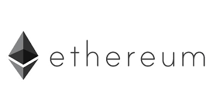

 

# <a style="color:#00adb5">ERC-20 TOKEN</a>

## <a style="color:#00adb5">ERC-20 TOKEN</a> 이란 무엇인가

- 대표적인 이더리움 토큰의 표준이다.
- 하지만 이더리움 네트워크 상의 유일한 프로토콜은 아니며 다양한 이더리움 프로토콜이 존재
- 이더리움에는 개선하기 위한 Ethereum Improvement Proposals 라는 이더리움 소프트웨어의 품질을 개선하기 위해 제안을 정리한 항목들이 있다.
- 이 중 ERC라는 이더리움에서 요청한 카테고리가 존재한다.
- ERC20은 이중 20번째로 제안된 내용을 이더리움 개발자이자 창시자인 Fabian Vogelsteller와 비탈릭이 확정하여 정한 표준안이다.
- 추상화된 function 들에 맞춰 구현하게 되면 상호간의 규약이 지켜지게 되니 아름다운 이더리움 세상을 만들 수 있게 되는 **상호 합의 규약**인 셈이다.
- ERC-223 ( 안전 장치로 사용 ), ERC-777 ( 20 + 223 ), ERC-721 ( NFT 용으로 구성 ), ERC-998 ( 721과 같이 사용, 데이터를 한번에 전송 ), ERC-1155 ( NFT 형태의 토큰 발행, 721과 다르게 20과 721 혼합 거래 가능, 멀티 전송기능 )
- ERC-20 TOKEN은 채굴할 수 없다.
- <a style="color:red"><strong>채굴 ( Mining, 마이닝 )</strong></a> 이란, 거래내역을 기록한 블록 생성에 기여하고 그 대가로 디지털 자산을 얻는 것
- ERC-20 TOKEN은 채굴할 수 없다. 새로운 ERC-20 TOKEN이 생성되는 경우 이를 통상 <a style="color:red"><strong>Minted</strong></a>라 한다.
- Minted는 스마트 컨트랙트를 배포할 때 사전에 정의된 양의 토큰을 발행하기 위해 Constructor에서 한 번만 호출된다.
- 추가 토큰을 발행하려면 mint와 같은 새로운 공개 메소드를 도입해야 한다.

## <a style="color:#00adb5">ERC-20 TOKEN 장점</a>

1. 대체 가능성

   - ERC-20 TOKEN은 <a style="color:red"><strong>하나의 토큰을 다른 토큰으로 대체하는 것이 가능</strong></a>하다.
   - 대체가능이란 어떤 자신이 누구에게나 동등한 가치를 가지고 있으며 더 작은 단위로 쪼개질 수 있는 것
   - 통화로 사용될 때 유용하다.
   - <a style="color:red"><strong>상호호환성</strong></a>을 보유하고 있다. 동일한 이더리운 지갑으로 전송 가능
   - 따라서 많은 DApps에서 자체 생태계 토큰을 ERC-20 기반으로 발행하고 있으며 이더리움 네트워크상에서 상호호환이 가능하다.

2. 유연성

   - <a style="color:red"><strong>특정한 개발을 제한하지 않는다.</strong></a>
   - 적합한 부가적인 기능이나 다양한 변수를 설정할 수 있다.

3. 대중성

   - 활용성과 상호운용성 측면에서 이점이 있기 때문에 현재 발행된 디지털자산의 90%가 ERC-20 TOKEN을 기반으로 하고 있다.

## <a style="color:#00adb5">ERC-20 TOKEN 단점</a>

1. 확장성

   - <a style="color:red"><strong>디파이 ( DeFi ) 서비스들의 성장은 이더리움 네트워크 내에서 많은 트랜잭션을 발생시켜 이더리움 네트워크의 과부화</strong></a>를 일으키고 있다.
   - 따라서 Gas비가 증가하기 때문에 금전적인 부담을 가중시킨다.
   - 이는 ERC-20 TOKEN을 사용할 때 영항을 받을 수 있는 문제이다.
   - 이 문제를 해결하기 위해 이더리움 2.0으로 통합했으며 업그레이드 하기 위해 노력중이다.

2. 스캠

   - 대중성을 가지고 있을 정도로 편리하여 누구나 토큰을 생성할 수 있다.
   - 그래서 <a style="color:red"><strong>누구나 토큰을 너무 쉽게 발행할 수 있는 점</strong></a>이 단점이다.
   - 따라서 구입시 주의 깊게 분석해야한다.

## <a style="color:#00adb5">ERC-20 TOKEN 특성</a>

- 스마트 컨트랙트가 ERC-20 TOKEN을 만들어낸다.
- 이 토큰을 다른 주소로 보낼 수 있으며, 여러가지 역할을 한다.

1. Total Supply ( 총 발행량 )

   - 토큰이 총 몇개 있는지 알려준다.

2. Transfer ( 송금 )

   - 송금을 통해 토큰을 총 발행 주소에서 개인 계정으로 송금 가능하다.

3. Balance Of ( 잔액 )

   - 계정에 있는 토큰을 반환

4. Transfer From ( 유저간 송금 )

   - 사용자는 "송금" 기능을 사용하여 토큰을 다른 사용자에게 송금할 수 있다.

5. Approve ( 승인 )

   - 사람들이 위조 토큰을 만드는 것을 방지한다.
   - 토큰의 총 발행량을 확인하여 트랜잭션을 허용하거나 거부한다.

6. Allowance ( 허용 )
   - 사용자들이 자신이 가진 것보다 더 많은 토큰을 보낼 수 없게 한다.
   - 거래가 이루어지면 취소된다.
