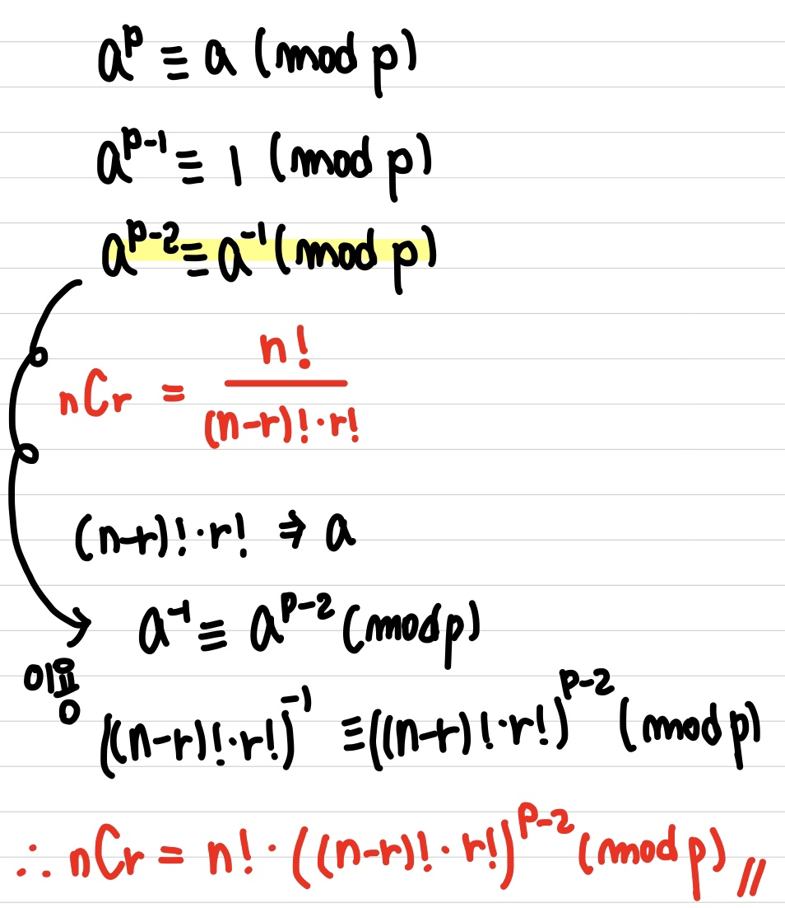

# 📁 <b><a style="color:#00adb5" href="https://swexpertacademy.com/main/code/problem/problemDetail.do?contestProbId=AWXGKdbqczEDFAUo" target=_blank>[D3_5607] [Professional] 조합</a></b>

```java
import java.io.BufferedReader;
import java.io.IOException;
import java.io.InputStreamReader;
import java.util.StringTokenizer;

public class Solution{
	static long res;
	static final long num = 1234567891;
	public static void main(String[] args) throws IOException{
		BufferedReader br = new BufferedReader(new InputStreamReader(System.in));
		StringBuilder sb = new StringBuilder();
		StringTokenizer st = null;
		
		// 테스트 케이스
		int TC = Integer.parseInt(br.readLine());
		
		for(int tc=1; tc<=TC; tc++) {
			sb.append("#").append(tc).append(" ");
			
			st = new StringTokenizer(br.readLine(), " ");
			
			// nCr N
			int N = Integer.parseInt(st.nextToken());
			
			// R
			int R = Integer.parseInt(st.nextToken());
			
			res = 0;
			
			// N factorial 구하기
			long[] fac = new long[N+1];
			fac[0] = 1;
			for(int i=1; i<=N; i++) {
				fac[i] = (fac[i-1]*i) % num;
			}
			
			// nCr = n! / (n-r)! * r!
			// 분자
			long up = fac[N];
			// 분모
			long down = (fac[N-R] * fac[R]) % num;
			// 페르마 소정리
			// nCr = n! * ((n-r)! * r!)^(num-2)
			long reFacDown = pow(down, num-2);
			
			// nCr 계산
			res = (up*reFacDown)%num;
			
			sb.append(res).append("\n");
		}
		System.out.println(sb);
	}
	
	// aⁿ 구하기 최적의 방법
	static long pow(long a, long N) {
		// 조합 성질 
		if(N==0) return 1;
		if(N==1) return a;
		// 짝수이면
		if(N%2==0) {
			long temp = pow(a,N/2);
			return (temp*temp)%num;
		}
		long temp = pow(a,N-1)%num;
		return (temp*a)%num;
	}
}
```

## 🤔 <b><a style="color:#00adb5">나의 생각</a></b>
이 문제는 조합문제이지만 일반 조합문제가 아니다.<br>
페르마 소정리를 이용해야한다.<br>
<center>

</center><br>
위에서 p가 num 값이 되는 것이다. 결과는 식을 이용해서 값을 구해주면 된다.<br>
그리고 Math.pow() 과정을 하고 mod 를 해주기에는 Math.pow()하는 과정에서 수의 크기가 엄청나게 커지기 때문에 pow를 직접 재귀 방식으로 구현하여 곱할때마다 mod를 진행해 값이 커지는 것을 방지했다.