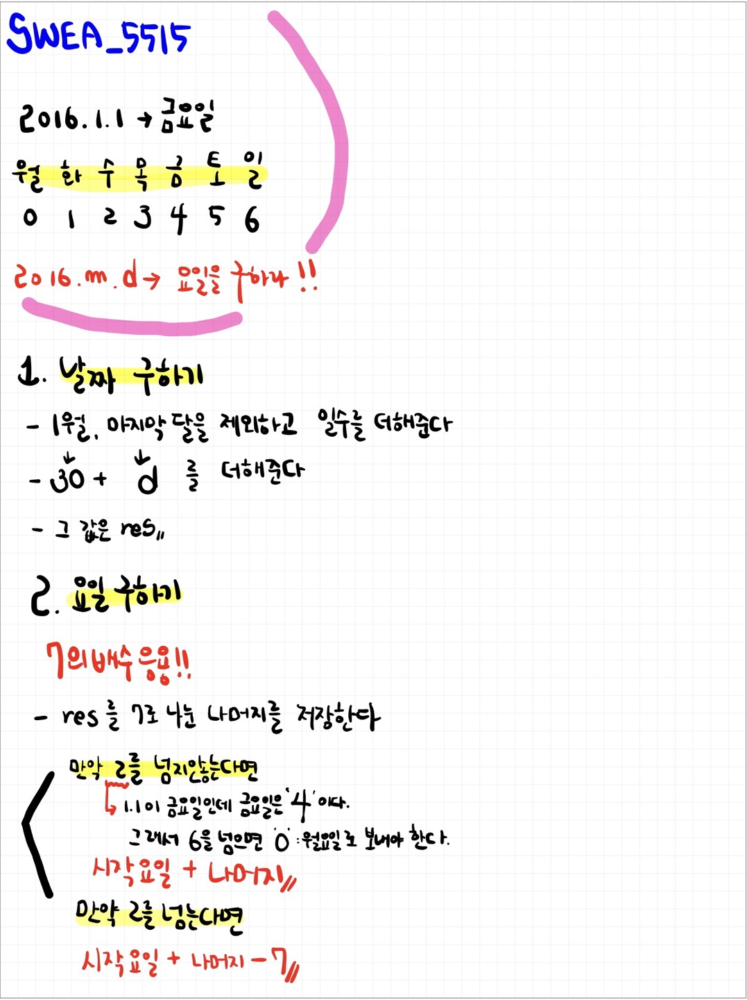

# 📁 <b><a style="color:#00adb5" href="https://swexpertacademy.com/main/code/problem/problemDetail.do?contestProbId=AWWOwecaFrIDFAV4" target=_blank>[D3_5515] 2016년 요일 맞추기</a></b>

```java
import java.io.BufferedReader;
import java.io.IOException;
import java.io.InputStreamReader;
import java.util.StringTokenizer;

public class Solution {
	// 1월 부터 12월 까지 일수
	static int[] days = { 0, 31, 29, 31, 30, 31, 30, 31, 31, 30, 31, 30, 31 };

	public static void main(String[] args) throws IOException {
		StringTokenizer st = null;
		BufferedReader br = new BufferedReader(new InputStreamReader(System.in));
		StringBuilder sb = new StringBuilder();

		// 테스트 케이스
		int TC = Integer.parseInt(br.readLine());

		for (int tc = 1; tc <= TC; tc++) {
			st = new StringTokenizer(br.readLine(), " ");

			// 월
			int month = Integer.parseInt(st.nextToken());

			// 일
			int day = Integer.parseInt(st.nextToken());

			// 요일 값 ( 처음 금요일 = 4 )
			int ans = 4;

			// 일 수
			int res = 0;

			// 1월인 경우
			if (month == 1) {
				res = day - 1;
			}
			// 1월 제외 나머지 달
			else {
				for (int i = 2; i < month; i++) {
					res += days[i];
				}
				// 1월 나머지 값 ( 30 ) + 마지막 달 day
				res += (30 + day);
			}

			// 요일 계산
			int temp = res % 7;

			// 0 ~ 6
			if (temp <= 2) {
				ans += temp;
			} else {
				ans = ans + temp - 7;
			}

			sb.append("#").append(tc).append(" ").append(ans).append("\n");
		}
		System.out.println(sb);
	}
}
```

## 🤔 <b><a style="color:#00adb5">나의 생각</a></b>
7의 배수를 이용하는 것이 key point 였던 것 같다.<br>
2016년 안에서만 날짜를 이동해서 비교적 어렵지 않은 문제 인 것 같다.

<br>
<center>
    
</center>