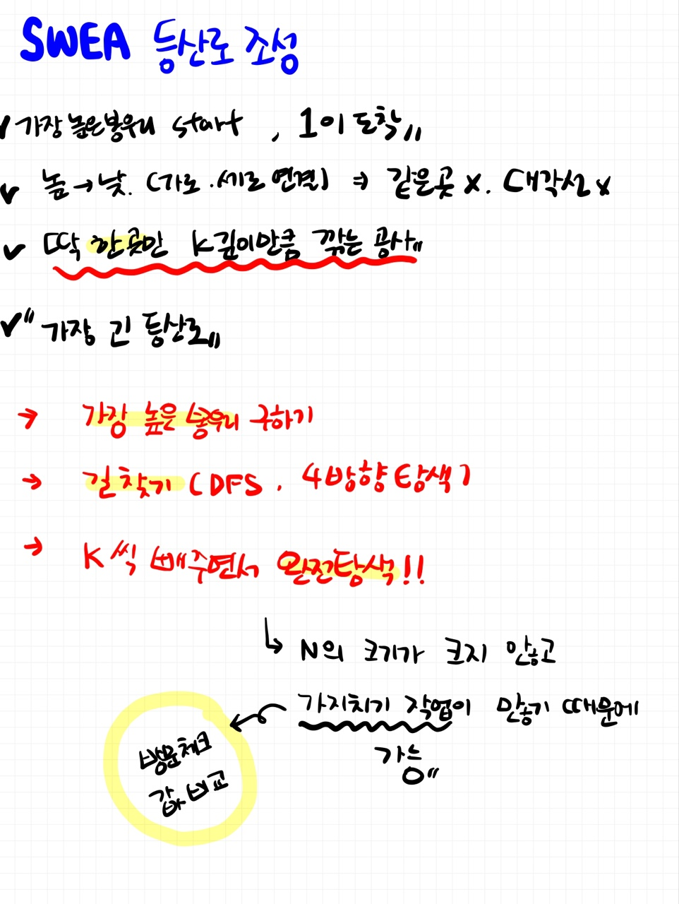

# 📁 <b><a style="color:#00adb5" href="https://swexpertacademy.com/main/code/problem/problemDetail.do?contestProbId=AV5PoOKKAPIDFAUq" target=_blank>[SW_1949] 등산로 조성</a></b>

```java
import java.io.BufferedReader;
import java.io.IOException;
import java.io.InputStreamReader;
import java.util.StringTokenizer;

public class Solution {
	static int dx[] = { 1, -1, 0, 0 };
	static int dy[] = { 0, 0, 1, -1 };
	static int[][] map;
	static boolean[][] v;
	static int N, K, res;

	public static void main(String[] args) throws IOException {
		BufferedReader br = new BufferedReader(new InputStreamReader(System.in));
		StringTokenizer st;
		StringBuilder sb = new StringBuilder();

		// 테케
		int TC = Integer.parseInt(br.readLine());

		for (int t = 1; t <= TC; t++) {
			sb.append("#").append(t).append(" ");

			st = new StringTokenizer(br.readLine(), " ");

			// N개의 줄
			N = Integer.parseInt(st.nextToken());

			// 공사 가능 깊이 K
			K = Integer.parseInt(st.nextToken());

			// 지도 정보
			map = new int[N][N];

			// 방문 여부
			v = new boolean[N][N];

			// 총 등산로 길이
			res = 0;

			// 지도 입력
			for (int i = 0; i < N; i++) {
				st = new StringTokenizer(br.readLine(), " ");
				for (int j = 0; j < N; j++) {
					map[i][j] = Integer.parseInt(st.nextToken());
				}
			}

			// 완전 탐색
			for (int i = 0; i < N; i++) {
				for (int j = 0; j < N; j++) {
					// 제일 높은 봉우리 찾기
					int highest = highest();
					for (int k = 0; k <= K; k++) {
						map[i][j] -= k;
						// 길 찾기
						findRoad(highest);
						// 백트래킹
						map[i][j] += k;
					}
				}
			}
			sb.append(res).append("\n");
		}
		System.out.println(sb);
	}

	// 가장 높은 봉우리 찾기
	static int highest() {
		int top = 0;
		for (int i = 0; i < N; i++) {
			for (int j = 0; j < N; j++) {
				// 제일 높은 봉우리 높이 찾기
				top = Math.max(top, map[i][j]);
			}
		}
		return top;
	}

	// 길 찾기
	static void findRoad(int highest) {
		// 제일 높은 봉우리부터 시작
		for (int i = 0; i < N; i++) {
			for (int j = 0; j < N; j++) {
				// 제일 높은 봉우리 일때
				if (map[i][j] == highest) {
					init();
					dfs(j, i, 1);
				}
			}
		}
	}

	// dfs 4방향 탐색
	static void dfs(int x, int y, int val) {
		// 최대 등산로
		res = Math.max(res, val);

		// 4방향 탐색
		int nx, ny;
		for (int i = 0; i < 4; i++) {
			nx = x + dx[i];
			ny = y + dy[i];

			// 범위를 벗어나는 경우, 이미 방문한 경우
			if (nx < 0 || ny < 0 || nx >= N || ny >= N || v[ny][nx])
				continue;

			// 이동 가능
			if (map[y][x] > map[ny][nx]) {

				// 방문 처리
				v[ny][nx] = true;

				// dfs 호출
				dfs(nx, ny, val + 1);

				// 백트래킹
				v[ny][nx] = false;
			}
		}
	}

	// 방문 배열 초기화
	static void init() {
		for (int i = 0; i < N; i++) {
			for (int j = 0; j < N; j++) {
				v[i][j] = false;
			}
		}
	}
}
```

## 🤔 <b><a style="color:#00adb5">나의 생각</a></b>

DFS + 완전 탐색을 통해 문제를 해결했다.<br>
처음엔 K를 어떻게 해결하나 고민을 많이 했는데 결국 N의 크기가 그렇게 크지 않고 많은 가지치기 작업이 있다고 생각하여 완전 탐색으로 해결을 하였다.<br>
완전 탐색 말고도 가장 높은 봉우리에서 -1 만 해가며 체크하는 풀이도 있던데 그것은 조금 헷갈려서 해내지 못했다.<br>
다음에 다시 풀 기회가 있으면 다른 방법으로 해결해 보아야 겠다.<br>
그리고 마지막에 자꾸 51 test case 중에 50개만 맞아서 고생을 했는데 약간 문제에서 안내가 좀 부족한 것 같다..<br>
가장 높은 봉우리에서 시작해서 k씩 빼갈 때 봉우리를 초기화 하면 안된다... 초기화 하는게 맞는 줄 알았는데 ...ㅋㅋ<br>
쨌든 DFS 와 완전 탐색을 이용해 풀어낸 문제이다.

<br>
<center>
    
</center>
