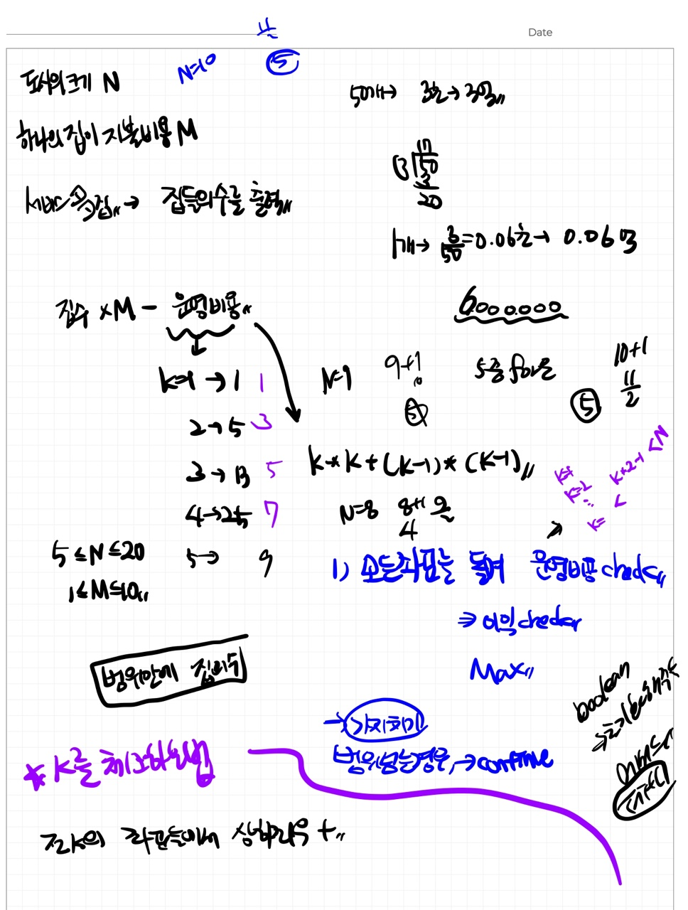

# 📁 <b><a style="color:#00adb5" href="https://swexpertacademy.com/main/code/problem/problemDetail.do?contestProbId=AV5V61LqAf8DFAWu" target=_blank>[SW_2117] 홈 방범 시스템</a></b>

```java
import java.io.BufferedReader;
import java.io.IOException;
import java.io.InputStreamReader;
import java.util.ArrayList;
import java.util.StringTokenizer;

public class Solution {
	static int N, M;

	public static void main(String[] args) throws IOException {
		BufferedReader br = new BufferedReader(new InputStreamReader(System.in));
		StringTokenizer st;
		StringBuilder sb = new StringBuilder();

		int tc = Integer.parseInt(br.readLine());

		for (int TC = 1; TC <= tc; TC++) {
			sb.append("#").append(TC).append(" ");

			st = new StringTokenizer(br.readLine(), " ");

			// map의 크기
			N = Integer.parseInt(st.nextToken());

			// 집의 지불비용
			M = Integer.parseInt(st.nextToken());

			ArrayList<Integer> HX = new ArrayList<>();
			ArrayList<Integer> HY = new ArrayList<>();

			// 집 입력
			for (int i = 0; i < N; i++) {
				st = new StringTokenizer(br.readLine(), " ");
				for (int j = 0; j < N; j++) {
					int temp = Integer.parseInt(st.nextToken());
					// 집인 경우 좌표 저장
					if (temp == 1) {
						HX.add(i);
						HY.add(j);
					}
				}
			}

			// map안에 있는 집 개수
			int H = HX.size();
			// 최대 집수
			int max = 0;
			// 줄여가면서 구하기
			for (int k = (int) Math.sqrt(N * N) + 1; k > 0; k--) {
				int cost = k*k + (k-1)*(k-1);
				for(int X=0; X<N; X++) {
					for(int Y=0; Y<N; Y++) {
						// 포함되는 집수
						int cnt = 0;
						// 거리안에 속하면 집 개수 ++
						for(int i=0; i<H; i++) {
							if(Math.abs(HX.get(i)-X) + Math.abs(HY.get(i) - Y)<k) {
								cnt++;
							}
						}
						// 조건 충족 한다면 최대집 개수 갱신
						if(cnt*M >= cost) {
							max = Math.max(max, cnt);
						}
					}
				}
			}
			sb.append(max).append("\n");
		}
		System.out.println(sb);
	}
}
```

## 🤔 <b><a style="color:#00adb5">나의 생각</a></b>

<br>
<center>
    
</center>

문제 풀기전 계획을 세워보았다.. 좀 정리가 안되어있지만 살아있는 필기를 기록하기 위해 따로 정리는 하지 않았다..<br>
문제를 다 풀고 보면 계획세운 것이 그렇게 틀리진 않았는 것 같다.<br>
근데 아쉬운게 처음 계획이 완탐을 하면서 k를 잘 찾는 것인데.. 자꾸 49에서 fail이 떠서 결국엔 실패했다..<br>
이론적인 구조적인 방법은 아무래도 맞는 것 같은데 어디서 잘못된 것 같다.. 뭔가 k를 탐색하는데 너무 많은 시간을 소요하는 것이 문제인 것 같다..<br>
그래서 다른 사람들의 풀이를 보다가 거리로 구하는 것을 보고 머리를 한대 맞은 듯 했다..<br>
완탐하는 것은 같지만 굳이 다 돌면서 확인할 필요없이 거리를 구해서 거리가 k보다 작으면 집의 개수를 구해주는 것이다.<br>
코드도 훨씬 간략하고 가독성도 좋았다.<br>
왜 거리를 생각하지 못했을까..ㅠ 이 문제를 통해 다음에 다른 문제를 만난다면 거리 생각을 충분히 할 수 있을 것 같다 !
