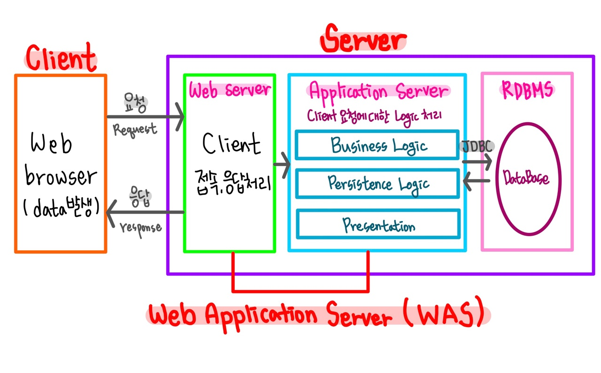

# 📚 <a style="color:#00adb5">WEB</a>

 

# 📚 <a style="color:#00adb5">WEB ( World Wide Web )</a>

## <a style="color:#00adb5">WEB</a> 이란 무엇인가?

웹은 <a style="color:red"><strong>월드 와이드 웹 ( World Wide Web )의 줄임말</strong></a>이다. WWW 라고 부르기도 한다. 
인터넷과 같은 의미로 많이 사용되지만, 정확히 말하면 웹은 인터넷상의 인기있는 하나의 서비스일 뿐이다. 

## <a style="color:#00adb5">WEB</a> 의 특징

웹은 인터넷 상에서 텍스트나 그림, 소리, 영상 등과 같은 멀티미디어 정보를 하이퍼텍스트 방식으로 연결하여 제공한다. 
웹은 <a style="color:red"><strong>HTML이라는 언어를 사용해서 누구나 자신만의 문서를 만들 수 있다.</strong></a> 그리고 이렇게 작성한 웹상 문서에는 HTTP라는 프로토콜을 사용하면 누구나 검색하고 접근할 수 있다.

## <a style="color:#00adb5">WEB</a> 의 구성

- 웹 페이지 ( web page ) 
HTML 언어를 사용하여 작성된 하이퍼텍스트 문서

- 웹 사이트 ( web site ) 
서로 관련된 웹 페이지들의 집합

- 웹 서핑 ( web surfing) 
웹 페이지를 하이퍼링크에 따라 계속해서 이동하는 것 

- 웹 브라우저 ( web browser ) 
사용자가 웹 페이지를 검색하기 위해 사용하는 프로그램

## <a style="color:#00adb5">WEB</a> 아키텍쳐 ( Architecture )

  
웹 아키텍쳐에 대해 알아보자. 
가장 크게는 Client와 Server로 나눌 수 있다.  

전체적인 과정은 

1. Client에서는 사용자의 데이터를 받고 Server에 요청한다. ( 요청할 때의 데이터를 파라미터 parameter 라고 한다 )
2. Server에서 Login을 처리한다.  
Logic 에는 두가지가 있다. Business Logic ( 일반 일처리 ), DB Login ( 데이터베이스 관련 일처리 )
3. 다시 Client에게 응답을 해준다. ( HTML )   

Client 에는 <a style="color:red"><strong>Web Browser 가 있는데 여기서는 데이터가 발생하며, Request 요청 / response 응답 한다.</strong></a> 
그리고 HTML, CSS, JS 파일을 해석 및 표시한다. 
크게 Chrome, Microsoft Edge, FireFox 등이 있다.  

Server는 크게 세 가지 <a style="color:red"><strong>Web Server, Application Server, RDBMS</strong></a> 로 나눌 수 있다.  

Web Server 에서는 <a style="color:red"><strong>Client 에서 요청받은 데이터 ( 파라미터 )에 대해 접속 및 응답 처리를 진행하는 구역</strong></a>이다. 
Web Server에서는 파라미터를 돌릴 수 있는 능력이 없기 때문에 Application Server로 넘겨준다.  

Application Server에서는 <a style="color:red"><strong>Clinet 요청에 대한 Logic 처리를 진행</strong></a>한다. 
그리고 Programming Language를 돌릴 수 있다.  

RDBMS 에서는 <a style="color:red"><strong>DataBase가 존재하며 Java를 사용할 시 JDBC로 Application Server와 연결이 된다.</strong></a> 
현재에는 Oracle, MySql, MS-SQL 등이 있다.  

현재 <a style="color:red"><strong>Web Server + Application Server = Web Application Server로 WAS</strong></a>를 사용하고 있다. 
WAS는 인터넷 상에서 HTTP 프로토콜을 통해 사용자 컴퓨터나 장치에 어플리케이션을 수행하는 미들웨어로써 웹 서버에서 처리할 수 없는 동적인 정보를 처리하여 웹 서버에 정적인 정보를 제공한다. 
현재 webLogin, JEUS, Tomcat 등등이 있다.

## <a style="color:#00adb5">WEB</a> 마무리
웹에 대해 알아보았는데 사실 중요한 것은 웹 아키텍쳐이다. 
웹 개발을 진행할 때 꼭 알아야할 구조이다. 그래서 혼자 여러번 그려보기도 하고 과정을 따라가보기도 하였다. 
이 과정을 이제 하나하나씩 단계 깨듯이 나갈거기 때문에 꼭 알고 있어야한다. 
왜 이게 쓰이고 언제 이게 쓰이는지, 어떤 영향을 주는지 잘 알고 있자 !

    
👏 참조 
<a href="http://www.tcpschool.com/webbasic/www" target=_blank>http://www.tcpschool.com/webbasic/www</a> 