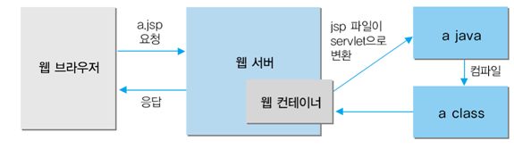

# 📚 <a style="color:#00adb5">WEB</a>

<center>

</center>
<br>

# 📚 <a style="color:#00adb5">JSP ( Java Server Page )</a>

## <a style="color:#00adb5">JSP</a> 란 무엇인가?
자바 서버 페이지 ( JSP ) 는 <a style="color:red"><strong>HTML내에 자바 코드르 삽입하여 웹 서버에서 동적으로 웹 페이지를 생성하여 웹 브라우저에 돌려주는 언어</strong></a>이다.<br>
Java EE 스펙 중 일부로 웹 애플리케이션 서버에서 동작한다.<br>
자바 서버 페이지는 실행시에는 자바 서블릿으로 실행되므로 서블릿과 굉장히 유사하다고 볼 수 있다.<br>
하지만 서블릿과는 달리 HTML 표준에 따라 작성되므로 웹 디자인하기에 편리하다.

## <a style="color:#00adb5">JSP</a> 의 특징
- 동적 웹 어플리케이션 컴포넌트이다.
- 확장자는 jsp이다.
- 틀라이언트(사용자)의 요청에 동적을 동작을 하며 ,응답은 html로 응답을 한다.
- jsp 파일은 서블릿으로 변환되어 실행된다.
- MVC 패턴에서 view 에서 주로 이용된다.


## <a style="color:#00adb5">JSP</a> 동작과정

<center>

</center>
<br>

1. jsp 파일 요청
2. 해당 요청을 웹 컨테이너( Servlet 컨테이너 )에거 넘김
3. 기존에 요청된 JSP 파일인지 체크
 - 처음 요청 
    - Servlet java file 로 변환 ( 파싱 작업 )
    - Servlet class compile
    - Servlet class를 메모리에 적재
 - 이미 작업
    - 파싱 과정 생략하고 클래스 파일로 즉시 컴파일
4. 메모리에 적재되어 실행
5. 실행 결과를 웹 서버에 전달
6. 전달반든 실행결과를 브라우저가 인식할 수 있는 HTML 파일로 바꾸어 브라우저에서 실행 ( 웹 서버 X )


<br>
<a style="color:red"><strong>servlet 변환 파일 확인 ( jsp 파일 )</strong></a><br>
workspace > .metadata > .plugins > org.eclipse.wst.server.core > tmp() > work > catalina > localhost > project 명 > org > apache > jsp


## <a style="color:#00adb5">JSP</a> 스크립팅 요소

### <a style="color:#00adb5">선언 ( Declaration )</a> 
<a style="color:red"><strong>멤버 변수 선언이나 메서드를 선언 하는 영역</strong></a><br>

```jsp
양식
<%! 멤버변수와 method 작성 %>

<%!
String name;

public void init(){
    name = "호아호";
}
%>
```

### <a style="color:#00adb5">스크립트릿 ( Scriptlet )</a> 
<a style="color:red"><strong>Client 요청시 매번 호출 영역으로 Servlet으로 반환 시 service() method 에 해당되는 영역</strong></a><br>
request, response에 관련된 코드 구현<br>
<a style="color:red"><strong>스크립트릿 안에는 메서드를 작성할 수 없다.</strong></a><br>
이미 service() method 안에 있기 때문에 메서드안에 메서드는 작성할 수 없다.


```jsp
양식
<% java code %>

<%
for(int i=0;i<10;i++){
    out.println("<tr>");
    Strint classname = i % 2 == 0 ? "color1":"color2";
    for(int j=0; j<10; j++){
        out.println("<td class=\"" + classname + "\">" + i + " * " + j + " = " + i*j + "<\td>");
    }
    out.println("</tr>");
}
%>
```

### <a style="color:#00adb5">표현식 ( Expression )</a> 
<a style="color:red"><strong>데이터를 브라우저에 출력할 때 사용</strong></a><br>

```jsp
양식
<%= 문자열%>

String name = "jjj"

안녕 <%= name %>!!!

-> 안녕 jjj!!!

주의 !!!!!!
문자열 뒤에 세미콜론 작성 X


같은 표현 !!!
<%= 문자열 %>  ==  <% out.println(문자열); %>
```

### <a style="color:#00adb5">주석 ( Comment )</a> 
<a style="color:red"><strong>코드 상에서 부가 설명을 작성</strong></a><br>

```jsp
양식
<%-- 주석할 code --%>

<!-- HTML 주석 --!>
<%-- JSP 주석 --%>

HTML 주석은 출력하면 HTML 에서만 주석 처리 되고 전체적인 구조에서는 주석처리가 안된다.
```

## <a style="color:#00adb5">JSP</a> 지시자 ( Directive )

### <a style="color:#00adb5">지시자 - page</a> 

## <a style="color:#00adb5">JSP</a> 기본 객체

### <a style="color:#00adb5">기본 객체</a> 

### <a style="color:#00adb5">기본 객체의 영역 ( Scope )</a> 

### <a style="color:#00adb5">기본 객체의 영역 ( Scope ) - 공통 메서드</a> 

### <a style="color:#00adb5">Web Page 이동</a> 

<br><br><br><br>
👏 참조<br>
<a href="https://mangkyu.tistory.com/14" target=_blank>https://mangkyu.tistory.com/14</a><br>