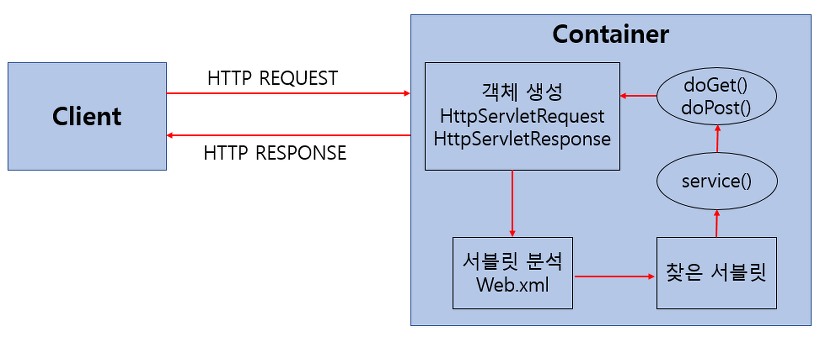
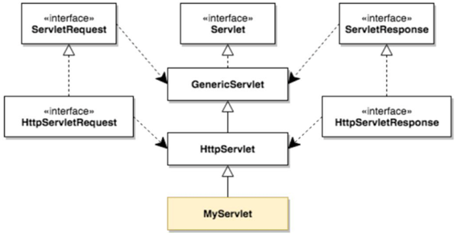
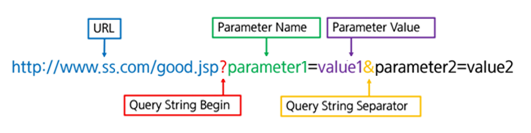

# 📚 <a style="color:#00adb5">WEB</a>

 

# 📚 <a style="color:#00adb5">SERVLET</a>

## <a style="color:#00adb5">SERVLET</a> 이란 무엇인가?
자바 서블릿 ( JAVA Servlet ) 은 <a style="color:red"><strong>자바를 사용하여 웹 페이지를 동적으로 생성하는 서버측 프로그램 혹은 그 사양</strong></a>을 말한다. 
자바 서블릿은 웹 서버의 성능을 향상하기 위해 사용되는 자바 클래스의 일종이다. 
서블릿은 자바로 구현된 CGI 이다. 
CGI는 특별한 라이브러리나 도구가 아니고 별도로 제작된 웹서버와 프로그램간의 교환방식이다. 
자바 서블릿은 JSP와 비슷한 점이 있지만 <a style="color:red"><strong>자바 서블릿은 자바 코드안에 HTML을 포함</strong></a>하고 있고, <a style="color:red"><strong>JSP는 HTML안에 자바 코드를 포함</strong></a>하고 있다.

## <a style="color:#00adb5">SERVLET</a> 의 특징
- 클라이언트의 요청에 대해 동적으로 작동하는 웹 어플리케이션 컴포넌트
- html을 사용하여 요청에 응답한다.
- java thread를 이용하여 동작한다.
- MVC 패턴에서 Controller로 이용된다.
- HTTP 프로토콜 서비스를 지원하는 javax.servlet.http.HttpServlet 클래스를 상속받는다.
- UDP보다 처리 속도가 느리다.
- HTML 번경 시 Servlet을 재컴파일해야하는 단점이 있다.

## <a style="color:#00adb5">SERVLET</a> 의 동작과정

 

1. 사용자 ( Client )가 URL을 입력하면 HTTP Request가 Servlet Container로 전송합니다.
2. 요청을 전송받은 Servlet Container는 HttpServletRequest, HttpServletResponse 객체를 생성한다.
3. web.xml을 기반으로 사용자가 요청한 URL이 어느 서블릿에 대한 요청인지 찾는다.
4. 해당 서블릿에서 service 메서드를 호출한 후 클라이언트의 GET, POST 여부에 따라 doGet() 또는 doPost()를 호출한다.
5. doGet() or doPost() 메서드는 동적 페이지를 생성한 후 HttpServletResponse객체에 응답을 보낸다.
6. 응답이 끝나면 HttpServletRequest, HttpServletResponse 두 객체를 소멸시킨다.

## <a style="color:#00adb5">SERVLET</a> API

 

## <a style="color:#00adb5">SERVLET</a> 의 주요 클래스와 메서드

- HttpServlet 
서블릿을 만들기 위해 반드시 상속해야 할 필수 클래스

- HttpServletRequest 
클라이언트가 데이터를 입력하거나 클라이언트의 정보에 대한 요청 값을 가지고 있는 클래스

- HttpServletResponse 
클라이언트가 요청한 정보를 처리하고 다시 응답하기 위한 정보를 담고 있는 클래스

- HttpSession 
클라이언트가 세션에 정보를 저장하고 세션 기능 유지를 위해서 제공되는 클래스

<h6>HttpServlet에서 제공되는 주요 메서드 
<table width="100%" height="500px" style="text-align:center; font-size:23px">
<tr style= "font-weight:bold">
    <td style='border:3px solid #00adb5' width="40%">메서드</td>
    <td style='border:3px solid #00adb5'>설명</td>
</tr>
<tr>
    <td style='border:3px solid #00adb5' height= "60px">void int()</td>
    <td style='border:3px solid #00adb5'>서블릿의 객체가 생성 될 때 호출되는 메서드</td>
</tr>
<tr>
    <td style='border:3px solid #00adb5' height= "60px">void destroy()</td>
    <td style='border:3px solid #00adb5'>서블릿의 객체가 메모리에서 사라질 때 호출되는 메서드</td>
</tr>
<tr>
    <td style='border:3px solid #00adb5' height= "60px">void service(request, response)</td>
    <td style='border:3px solid #00adb5'>서블릿의 요청이 있을 때 호출되는 메서드</td>
</tr>
<tr>
    <td style='border:3px solid #00adb5' height= "60px">void doGet(request, response)</td>
    <td style='border:3px solid #00adb5'>html에서 form의 메서드가 get일 때 호출되는 메서드</td>
</tr>
<tr>
    <td style='border:3px solid #00adb5' height= "60px">void doPost(request, response)</td>
    <td style='border:3px solid #00adb5'>html에서 form의 메서드가 post일 때 호출되는 메서드</td>
</tr>
</table>

<h6>HttpServletRequest에서 제공되는 주요 메서드 
<table width="100%" height="430px" style="text-align:center; font-size:23px">
<tr style= "font-weight:bold">
    <td style='border:3px solid #00adb5' width="40%">메서드</td>
    <td style='border:3px solid #00adb5'>설명</td>
</tr>
<tr>
    <td style='border:3px solid #00adb5' height= "60px">String getParameter(name)</td>
    <td style='border:3px solid #00adb5'>name 값에 할당된 값을 반환하며 값이 없으면 null을 반환</td>
</tr>
<tr>
    <td style='border:3px solid #00adb5' height= "60px">String[] getParameters(name)</td>
    <td style='border:3px solid #00adb5'>name의 모든 값을 String 배열로 반환</td>
</tr>
<tr>
    <td style='border:3px solid #00adb5' height= "60px">Enumeration getParameterNames()</td>
    <td style='border:3px solid #00adb5'>요청에 사용된 모든 파라미터 이름을 java.util.Enumeration 타입으로 반환</td>
</tr>
<tr>
    <td style='border:3px solid #00adb5' height= "60px">void setCharacterEncoding(env) 
   ※ 보통 env = utf-g 이다.</td>
    <td style='border:3px solid #00adb5'>post방식으로 요청된 문자열의 character encoding을 설정</td>
</tr>
</table>

<h6>HttpServletResponse에서 제공되는 주요 메서드 
<table width="100%" height="400px" style="text-align:center; font-size:23px">
<tr style= "font-weight:bold">
    <td style='border:3px solid #00adb5' width="40%">메서드</td>
    <td style='border:3px solid #00adb5'>설명</td>
</tr>
<tr>
    <td style='border:3px solid #00adb5' height= "60px">void setHeader(name, value)</td>
    <td style='border:3px solid #00adb5'>응답에 포함될 Header를 설정한다.</td>
</tr>
<tr>
    <td style='border:3px solid #00adb5' height= "60px">void setContentType(type)</td>
    <td style='border:3px solid #00adb5'>출력되는 페이지의 contentType을 설정</td>
</tr>
<tr>
    <td style='border:3px solid #00adb5' height= "60px">String getCharacterEncoding()</td>
    <td style='border:3px solid #00adb5'>응답 페이지의 문자 인코딩 Type을 반환</td>
</tr>
<tr>
    <td style='border:3px solid #00adb5' height= "60px">void sendRedirect()</td>
    <td style='border:3px solid #00adb5'>지정된 URL로 요청을 재전송</td>
</tr>
</table>

<h6>HttpSession에서 제공되는 주요 메서드 
<table width="100%" height="600px" style="text-align:center; font-size:23px">
<tr style= "font-weight:bold">
    <td style='border:3px solid #00adb5' width="40%">메서드</td>
    <td style='border:3px solid #00adb5'>설명</td>
</tr>
<tr>
    <td style='border:3px solid #00adb5' height= "60px">String getId()</td>
    <td style='border:3px solid #00adb5'>해당 세션의 세션ID를 반환</td>
</tr>
<tr>
    <td style='border:3px solid #00adb5' height= "60px">long getCreationTime()</td>
    <td style='border:3px solid #00adb5'>세션의 생성된 시간을 반환</td>
</tr>
<tr>
    <td style='border:3px solid #00adb5' height= "60px">long getLastAccessedTime()</td>
    <td style='border:3px solid #00adb5'>클라이언트 요청이 마지막으로 시도된 시간을 반환</td>
</tr>
<tr>
    <td style='border:3px solid #00adb5' height= "60px">void setMaxInactiveInterval(time)</td>
    <td style='border:3px solid #00adb5'>세션을 유지할 시간을 초단위로 설정 
    ※ 사진을 슬라이드처럼 보이게 할 때 사용</td>
</tr>
<tr>
    <td style='border:3px solid #00adb5' height= "60px">boolean isNew()</td>
    <td style='border:3px solid #00adb5'>클라이언트 세션ID를 할당하지 않은 경우 true 값을 반환 
</tr>
<tr>
    <td style='border:3px solid #00adb5' height= "60px">void invalidate()</td>
    <td style='border:3px solid #00adb5'>해당 세션을 모두 종료</td>
</table>

## <a style="color:#00adb5">SERVLET</a> Life-Cycle
Servlet class는 javaSE에서의 class와는 다르게 main method가 없다. 즉 <a style="color:red"><strong>객체의 생성부터 사용의 주체가 사용자가 아닌 Servlet Container에게 있다.</strong></a> 
Client가 요청(request) 하게 되면 Servlet Container는 Servlet 객체를 생성 (한번만)하고, 초기화 (한번만) 하며 요청에 대한 처리 ( 요청시마다 반복 )를 하게 된다. 또한 Servlet 객체가 필요없게 되면 제거하는 일까지 Container가 담당한다.

### <a style="color:#00adb5">SERVLET</a> Life-Cycle의 주요 메서드

 

- init() 
서블릿이 메모리에 로드 될 때 한 번 호출 
코드 수정으로 다시 로드 되면 다시 호출

- doGet() 
GET방식으로 data 전송 시 호출

- doPost() 
POST방식으로 data 전송 시 호출

- service() 
모든 요청은 service()를 통해서 doXXX() 메서드로 이동

- destroy() 
서블릿이 메모리에서 해제되면 호출 
코드가 수정되면 호출

## <a style="color:#00adb5">SERVLET</a> Parameter

### <a style="color:#00adb5">GET</a> 

- 특징 
전송되는 데이터가 URL뒤에 Query String으로 전달. 
입력 값이 적은 경우나 데이터가 노출이 되도 문제가 없을 경우 사용

- 장점 
간단한 데이터를 빠르게 전송 
form tag 뿐만 아니라 직접 URL에 입력하여 전송 가능

- 단점 
데이터 양에 제한이 있다. 

### <a style="color:#00adb5">POST</a> 

- 특징 
URL과 별도로 전송 
HTTP header 뒤 body에 입력 스트림 데이터로 전달

- 장점 
데이터의 제한이 없다. 
최소한의 보안 유지 효과를 볼 수 있다.

- 단점 
전날 데이터의 양이 같을 경우 GET방식 보다 느리다.

## <a style="color:#00adb5">URL ? </a>

 

## <a style="color:#00adb5">SERVLET</a> 마무리
자바 서블릿에 대해 알아보았다. 
솔직히 현재에는 거의 안쓰인다지만 웹 개발의 역사에 있기 때문에 영향들이 있을 거라고 생각한다. 
그건 사실 더 배워봐야 알겠지만 ㅎㅎ 
실습도 해보았는데 확실히 웹 들어오니까 왔다갔다 헷갈리는게 좀 많다.. 
그리고 자바를 왜 착실히 해놓으라는지 알 것 같다. 
해결하기 위한 방법이 다 자바기 때문에 자바를 잘 알고 있지 않으면 방법을 알아도 해결하지 못하는 상황이 발생할 것 같다. 
그리고 servlet은 java 코드안에 HTML을 작성하기 때문에 굉장히 번거로운 작업들이 존재한다. 
그것들을 해소해주고 좀 더 유용한 방법인 JSP 를 더 알아보도록 하자.

    
👏 참조 
<a href="https://mangkyu.tistory.com/14" target=_blank>https://mangkyu.tistory.com/14</a> 