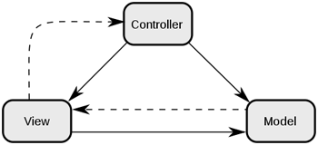

# 📚 <a style="color:#00adb5">WEB</a>

 

# 📚 <a style="color:#00adb5">MVC 패턴</a>

## <a style="color:#00adb5">MVC Pattern</a> 이란 무엇인가?
MVC 패턴은 디자인 패턴 중 하나이다. 
디자인 패턴이란 <a style="color:red"><strong>프로그램이나 어떤 특정한 것을 개발하는 중에 발생했던 문제점들을 정리해서 상황에 따라 간편하게 적용해서 쓸 수 있는 것을 정리하여 특정한 "규약"을 통해 쉽게 쓸 수 있는 형태로 만든 것</strong></a>이다. 
좀 더 쉽고 편리하게 를 추구하며 만드는 것이 디자인 패턴이다.  

 

MVC 는<a style="color:red"><strong> Model, View, Controlle</strong></a>의 약자이다.  
하나의 프로젝트를 구성할 때 세가지의 역할로 구분한 패턴이다.  

사용자가 controller를 조작하면 controller는 model을 통해 데이터를 가져오고 그 정보를 바탕으로 시각적인 표현을 담당하는 View 를 제어하여 사용자에게 전달한다.

## <a style="color:#00adb5">Model 1</a> 
<a style="color:red"><strong>view 와 logic 을 JSP 페이지 하나에서 처리하는 구조</strong></a> 
Client로부터 요청이 들어오게 되면 JSP 페이지는 java beans 나 별도의 service class 를 이용하여 작업을 처리, 결과를 Client 에 출력한다. 
간단한 page를 구성하기 위해 과거에 가장 많이 사용되었던 architecture 

- 장점 
    - 구조가 단순하며 직관적이기 때문에 <strong>배우기 쉽다.</strong>
    - 개발 시간이 비교적 짧기 때문에 <strong>개발 비용이 감소</strong>

- 단점
    - 출력을 위한 view(html) 코드와 로직 처리를 위한 java 코드가 섞여 있기 때문에 JSP 코드 자체가 복잡해 진다.
    - JSP 코드에 Back-End(Developer)와 Front-End(Designer)가 혼재되기 때문에 분업이 힘들어진다.
    - project 규모가 커지게 되면 코드가 복잡해 지므로 유지보수 하기가 어려워 진다.
    - 확장성 ( 신기술의 도입, framework등 ) 이 나쁘다.

## <a style="color:#00adb5">Model 2</a> 
<a style="color:red"><strong>model2는 모든 처리를 JSP 페이지에서 하는 것이 아니라, Client 요청에 대한 처리는 servlet이, logic 처리는 java class(Service, Dao ...), Client 에게 출력하는 response page를 JSP가 담당</strong></a>한다. 
model2 구조는 MVC( Model - View - Controller ) pattern을 웹 개발에 도입한 구조이며 완전히 같은 형태를 보인다. 

- Model ( Service, Dao or Java Beans )
    - <a style="color:red"><strong>Logic ( Business & DB Logic ) 을 처리하는 모든 것</strong></a>
    - controller 로 부터 넘어온 data를 이용하여 이를 수행하고 그에 대한 결과를 다시 controller 에게 return 한다.

- View ( JSP )
    - <a style="color:red"><strong>모든 화면 처리를 담당</strong></a>
    - Client의 요청에 대한 결과 뿐 아니라 Controller에 요청을 보내는 화면단도 jsp에서 처리한다.
    - Logic 처리를 위한 java code는 사라지고 결과 출력을 위한 code만 존재

- Controller ( Servlet )
    - <a style="color:red"><strong>CLient 의 요청을 분석하여 Logic 처리를 위한 Model 단을 호출</strong></a>한다.
    - return 받은 결과 data를 필요에 따라 request, session 등에 저장하고,
    - redirect 또는 forward 방식으로 jsp( view ) page를 이용하여 출력한다.

- 장점
    - 출력을 위한 view ( html ) 코드와 로직 처리를 위한 java 코드가 분리되었기 때문에 JSP는 Model1 에 비해 <strong>코드가 복잡하지 않다.</strong>
    - 화면단과 Logic 단이 분리되었기 때문에 <strong>분업이 용이해졌다.</strong>
    - 기능에 따라 code가 분리되었기 때문에 <strong>유지 보수가 쉬워졌다.</strong>
    - <strong>확장성이 뛰어나다.</strong>

- 단점
    - 구조가 복잡하여 초기 진입이 어렵다.
    - 개발 시간의 증가로 개발 비용 증가

## <a style="color:#00adb5">MVC</a> 마무리
현재 많은 기업과 서비스에서 MVC 패턴를 활용하는 것으로 알고 있다. 
왜 MVC 패턴을 활용할까?  
그것은 model2의 장점을 보면 이해할 수 있다. 
model, view, controller 가 분리되어 각자의 역할에 집중할 수 있게 개발을 한다면 유지보수성, 확장성, 유연성 등이 증가할 것이다. 
결국 중요한 것은 '어떻게 나눌 것 인가' 이다. 그것의 가이드라인이 MVC 패턴인 것이고.. 
웹 백엔드 개발자가 목표라면 필수 of 필수적인 지식이다 !!

    
👏 참조 
<a href="https://m.blog.naver.com/jhc9639/220967034588" target=_blank>https://m.blog.naver.com/jhc9639/220967034588</a> 