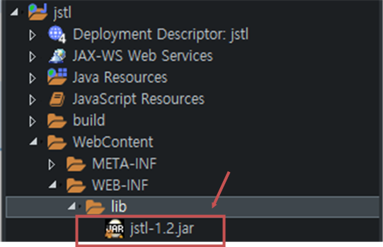

# 📚 <a style="color:#00adb5">WEB</a>

<center>

</center>
<br>

# 📚 <a style="color:#00adb5">JSTL ( JSP Standard Tag Library )</a>

## <a style="color:#00adb5">JSTL</a> 이란 무엇인가?
JSTL은 JAVA EE 기반의 웹 애플리케이션 개발 플랫폼을 위한 컴포넌트 모음이다.<br>
<a style="color:red"><strong>XML 데이터 처리와 조건문, 반복문, 국제화와 지역화 같은 일을 처리하기 위한 JSP 태그 라이브러리를 추가하여 JSP 사양을 확장했다.</strong></a><br>
JSTL은 JSP 페이지 내에서 자바 코드를 바로 사용하지 않고 로직을 내장하는 효율적인 방법을 제공한다.<br>
표준화된 태그 셋을 사용하여 자바 코드가 들락거리는 것 보다 더 코드의 유지보수와 응용 소프트에어 코드와 사용자 인터페이스 간의 관심사의 분리로 이어지게 한다.
<br>
<br>
- custom tag : 개발자가 직접 태그를 작성할 수 있는 기능을 제공
- custom tag 중에서 많이 사용되는 것들을 모아서 JSTL이라는 규약을 만듬
- 논리적인 판단, 반복문의 처리, 데이터베이스 등의 처리를 할 수 있다.
- JSTL은 JSP 페이지에서 스크립트릿을 사용하지 않고 액션을 통해 간단하게 처리할 수 있는 방법을 제공한다.
- JSTL에는 다양한 액션이 있으며, EL 과 함께 사용하여 코드를 간결하게 사용할 수 있다.

## <a style="color:#00adb5">JSTL</a> 사용방법
- 프로젝트안에 넣는 방법
<a href="https://mvnrepository.com/artifact/javax.servlet/jstl">https://mvnrepository.com/artifact/javax.servlet/jstl</a>에서 jstl-1.2/jar 을 다운 받으면 된다.<br>

1. 홈페이지에서 jstl-1.2 클릭
<center>

</center>
<br><br>

2. jar 파일 다운
<center>

</center>
<br><br>

3. dynamic web project 생성 -> WebContent -> WEB-INF -> lib -> jar 파일 저장
<center>

</center>
<br><br>


## <a style="color:#00adb5">JSTL</a> Tag

- directive 선언 형식 <br>
<a style = "color:red; font-size:30px"><strong><%@ taglib prefix="prefix" uri="uri" %></strong></a>

<table width="100%" height="800px" style="text-align:center; font-size:23px">
<tr style='border:3px solid #00adb5; font-weight:bold'>
<td width="15%" height="60px" style='border:3px solid #00adb5'>library</td>
<td width="15%" height="60px" style='border:3px solid #00adb5'>prefix</td>
<td width="30%" height="60px" style='border:3px solid #00adb5'>function</td>
<td width="40%" height="60px" style='border:3px solid #00adb5'>URI</td>
</tr>
<tr style='border:3px solid #00adb5'>
<td width="15%" height="90px" style='color:red; border:3px solid #00adb5'>core</td>
<td width="15%" height="90px" style='color:red; border:3px solid #00adb5'>c</td>
<td width="30%" height="90px" style='color:red; border:3px solid #00adb5'>변수 지원, 흐름제어, URL처리</td>
<td width="40%" height="90px" style='color:red; border:3px solid #00adb5'>http://java.sun.com/jsp/jstl/core</td>
</tr>
<tr style='border:3px solid #00adb5'>
<td width="15%" height="90px" style='border:3px solid #00adb5'>XML</td>
<td width="15%" height="90px" style='border:3px solid #00adb5'>x</td>
<td width="30%" height="90px" style='border:3px solid #00adb5'>XML 코어, 흐름제어, XML 변환</td>
<td width="40%" height="90px" style='border:3px solid #00adb5'>http://java.sun.com/jsp/jstl/xml</td>
</tr>
<tr style='border:3px solid #00adb5'>
<td width="15%" height="90px" style='border:3px solid #00adb5'>국제화</td>
<td width="15%" height="90px" style='border:3px solid #00adb5'>fmt</td>
<td width="30%" height="90px" style='border:3px solid #00adb5'>지역, 메세지 형식, 숫자 및 날짜 형식</td>
<td width="40%" height="90px" style='border:3px solid #00adb5'>http://java.sun.com/jsp/jstl/fmt</td>
</tr>
<tr style='border:3px solid #00adb5'>
<td width="15%" height="90px" style='border:3px solid #00adb5'>database</td>
<td width="15%" height="90px" style='border:3px solid #00adb5'>sql</td>
<td width="30%" height="90px" style='border:3px solid #00adb5'>SQL</td>
<td width="40%" height="90px" style='border:3px solid #00adb5'>http://java.sun.com/jsp/jstl/sql</td>
</tr>
<tr style='border:3px solid #00adb5'>
<td width="15%" height="90px" style='border:3px solid #00adb5'>함수</td>
<td width="15%" height="90px" style='border:3px solid #00adb5'></td>
<td width="30%" height="90px" style='border:3px solid #00adb5'>Collection, String 처리</td>
<td width="40%" height="90px" style='border:3px solid #00adb5'>http://java.sun.com/jsp/jstl/functions</td>
</tr>
</table>


### <a style="color:#00adb5">JSTL</a> - core tag

- 선언 형식 <br>
<a style = "color:red; font-size:30px"><strong><%@ taglib prefix="c" uri="http://java.sun.com/jsp/jstl/core" %></strong></a>


<table width="100%" height="1400px" style="text-align:center; font-size:23px">
<tr style='border:3px solid #00adb5; font-weight:bold'>
<td width="10%" height="60px" style='border:3px solid #00adb5' >function</td>
<td width="20%" style='border:3px solid #00adb5'>tag</td>
<td width="70%" style='border:3px solid #00adb5'>description</td>
</tr>
<tr style='border:3px solid #00adb5'>
<td width="10%" height="90px" style='border:3px solid #00adb5' rowspan="2">변수 지원</td>
<td width="18%" height="90px" style='border:3px solid #00adb5; color:red '>set</td>
<td width="14%" style='border:3px solid #00adb5'>jsp page에서 사용 할 변수 설정</td>
</tr>
<tr style='border:3px solid #00adb5'>
<td width="18%" height="90px" style='border:3px solid #00adb5'>remomve</td>
<td width="18%" style='border:3px solid #00adb5'>설정한 변수를 제거</td>
</tr>
<tr style='border:3px solid #00adb5'>
<td width="18%" style='border:3px solid #00adb5' rowspan="4">흐름 제어</td>
<td width="18%" style='border:3px solid #00adb5; color:red' height="90px">if</td>
<td width="14%" style='border:3px solid #00adb5'>조건에 따른 코드 실행</td>
</tr>
<tr style='border:3px solid #00adb5'>
<td width="18%" style='border:3px solid #00adb5; color:red' height="90px">choose, when, otherwise</td>
<td width="14%" style='border:3px solid #00adb5'>다중 조건을 처리할 때 사용 ( if ~ else if ~ else )</td>
</tr>
<tr style='border:3px solid #00adb5'>
<td width="18%" style='border:3px solid #00adb5; color:red' height="90px">forEach</td>
<td width="14%" style='border:3px solid #00adb5'>array 나 collection의 각 항목을 처리할 때 사용</td>
</tr>
<tr style='border:3px solid #00adb5'>
<td width="18%" style='border:3px solid #00adb5' height="90px">forTokens</td>
<td width="14%" style='border:3px solid #00adb5'>구분자로 분리된 각각의 토큰을 처리할 때 사용<br>
( StringTokenizer )</td>
</tr>
<tr style='border:3px solid #00adb5'>
<td width="18%" height="90px" style='border:3px solid #00adb5' rowspan="3">URL 처리</td>
<td width="18%" height="90px" style='border:3px solid #00adb5'>import</td>
<td width="14%" style='border:3px solid #00adb5'>URL을 사용하여 다른 자원의 결과를 삽입</td>
</tr>
<tr style='border:3px solid #00adb5'>
<td width="18%" height="90px" style='border:3px solid #00adb5'>redirect</td>
<td width="14%" style='border:3px solid #00adb5'>지정된 경로로 redirect</td>
</tr>
<tr style='border:3px solid #00adb5'>
<td width="18%" height="90px" style='border:3px solid #00adb5'>url</td>
<td width="18%" style='border:3px solid #00adb5'>URL 작성</td>
</tr>
<tr style='border:3px solid #00adb5'>
<td width="18%" style='border:3px solid #00adb5' rowspan="2">기타 태그</td>
<td width="14%" height="90px" style='border:3px solid #00adb5'>catch</td>
<td width="50%" style='border:3px solid #00adb5'>Exception 처리에 사용</td>
</tr>
<tr style='border:3px solid #00adb5'>
<td width="18%" height="90px" style='border:3px solid #00adb5'>out</td>
<td width="18%" style='border:3px solid #00adb5;'>JspWriter에 내용을 처리한 후 출력</td>
</tr>
</table>


### <a style="color:#00adb5">JSTL</a> - 변수 선언 : &lt;c:set&gt;

- <c:set> 액션은 <a style="color:red"><strong>변수나 특정 객체의 프로퍼티에 값을 할당할 때 사용</strong></a>
- value 속성의 값이나 액션의 Body Content로 값을 설정
- var 속성은 변수를 나타내며, 변수의 생존범위는 scope 속성으로 설정 ( 디폴트는 page )
- 특정 객체의 프로퍼티에 값을 할당할 때는 target 속성에 객체를 설정하고 property에 프로퍼티명을 설정

```jsp

1. value 속성을 이용하여 생존범위 변수 값 할당
<c:set value="value" var="varName" [scope="{page|request|session|application}"] />

2. 액션의 body 컨텐츠를 사용하여 생존범위 변수 값 할당
<c:set var="varName" [scope="{page|request|session|application}"]>
body content
</c:set>

3. value 속성을 이용하여 대상 객체의 프로퍼티 값 할당
<c:set value="value" target="target" property="propertyName" />

4. 액션의 body 컨텐츠를 사용하여 대상 객체의 프로퍼티 값 할당
<c:set target="target" property="propertyName">
body content
</c:set>

```

### <a style="color:#00adb5">JSTL</a> - 예외 : &lt;c:catch&gt;

- 기본적으로 JSP 페이지는 예외가 발생하면 지정된 오류페이지를 통해 처리한다.
- <c:catch> 액션은 <a style="color:red"><strong>JSP 페이지에서 예외가 발생할 만한 코드를 오류페이지로 넘기지 않고 직접 처리할 때 사용</strong></a>
- var 속성에는 발생한 예외를 담을 page 생존범위 변수를 지정
- <c:catch>와 <c:if> 액션을 함께 사용하여 Java 코드의 try~catch와 같은 기능을 구현할 수 있다.

```java

try {
    String str = null;
    out.println("Length of string : " + str.length());
} catch(Throwable ex){
    out.println(ex.getMessage());
}

```
이 try ~ catch 구문을 JSTL로 표현하면

```jsp

<%@ page contentType="text/html" pageEncoding="UTF-8" errorPage="error.jsp" %>
<%@ taglib prefix="c" uri="http://java.sun.com/jsp/jstl/core" %>

<c:catch var="ex">
<%
    String str = null;
    out.println("Length of string : " + str.length());  // 예외 발생
%>
</c:catch>

<c:if test="$ex != null">
    예외가 발생하였습니다. ${ex.message}
</c:if>

```

### <a style="color:#00adb5">JSTL</a> - 조건문 : &lt;c:if&gt;, &lt;c:choose&gt;&lt;c:when&gt;&lt;c:otherwise&gt;
- <c:if> 액션은 <a style="color:red"><strong>test 속성에 지정된 표현식을 평가하여 결과가 true인 경우 액션의 body 컨텐츠를 수행</strong></a>
- <c:if> 액션의 var 속성은 표현식의 평가 결과인 Boolean 값을 담을 변수를 나타내며, 변수의 생존범위는 scope 속성으로 설정
- <c:choose><c:when><c:otherwise> 액션을 사용하면 if, else if, else 와 같이 처리할 수 있다.

```jsp

1. <c:if> 액션 사용 예
<c:if test="${userType eq 'admin'}">
    <jsp:inclde page="admin.jsp" />
</c:if>


2. <c:if> 액션의 var 속성
<c:if test="${userType eq 'admin'}" var="accessible">
    <jsp:include page="admin.jsp" />
</c:if>
...
<c:if test="${category == 'user' && menu == 'list'}">
    회원 목록.
</c:if>


3. <c:choose><c:when><c:otherwise> 액션 사용 예
<c:choose>
    <c:when test="${userType == 'admin'}">
        관리자 화면 ...
    </c:when>

    <c:when test="${userType == 'member'}">
        회원 사용자 화면 ...
    </c:when>

    <c:otherwise>
        일반 사용자 화면 ...
    </c:otherwise>
</c:choose>
    
```


### <a style="color:#00adb5">JSTL</a> - 반복문 : &lt;c:forEach&gt;

- <c:forEach> 액션은 <a style="color:red"><strong>컬렉션에 있는 항목들에 대하여 액션의 body 컨텐츠를 반복하여 수행</strong></a>
- 컬렉션에는 Array, Collection, Map 또는 콤마로 분리된 문자열이 올 수 있다.
- var 속성에는 반복에 대한 현재 항목을 담는 변수를 지정하고 items 속성은 반복할 항목들을 갖는 컬렉션을 지정
- varStatus 속성에 지정한 변수를 통해 현재 반복의 상태를 알 수 있다.

```jsp

1. 짝수번째 과정명만 출력하기
<c:forEach var="course" items="${courses}" begin="0" end="5" step="2">
    ${course.name}<br>
<c:forEach>

2. courses 리스트를 반복하면서 순번과 과정명 출력하기
<c:forEach var="course" items="${courses}" varStatus="varStatus">
    ${varStatus.count}. ${course.name}
</c:forEach>

```

## <a style="color:#00adb5">JSTL</a> 마무리
JSTL과 다양한 태그에 대해 알아보았다.<br>
여러 유용한 태그들이 많은데 그중 core 태그를 가장 많이 사용한다.<br>
JSTL과 EL을 적절히 사용해서 JSP 페이지 코드를 간단하고 가독성 좋게 구현해야 한다.
