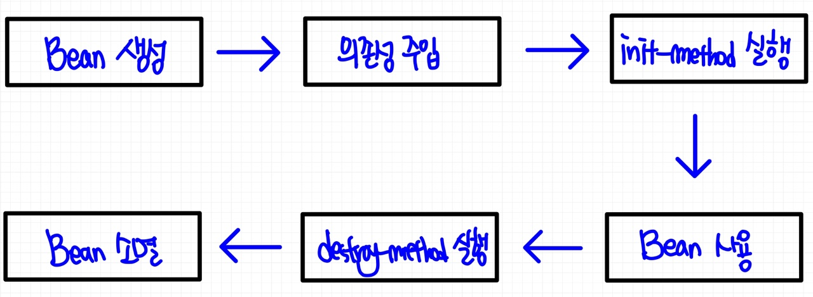

# 📚 <a style="color:#00adb5">SPRING</a>

<center>

</center>
<br>

# 📚 <a style="color:#00adb5">Dependency Injection ( 의존성 주입 )</a>

## <a style="color:#00adb5">Bean</a>
Spring Bean은 기본적으로 *Singleton* 으로 만들어진다. 그러므로 컨테이너가 제공하는 모든 빈의 instance는 동일하다.<br>
컨테이너가 항상 새로운 instance를 반환하게 만들고 싶을 경우 scope를 *prototype* 으로 설정해야한다.

```java
@Service("memberService")
@Scope("singleton")
public class MemberServiceImpl implements MemberService{

    @Override
    public int registerMember(MemberDto memberDto){
        return 0;
    }
}
```
xml bean 설정 ( prototype )
```xml
<bean id="memberService" class="com.test.hello.service2.MemberServiceImpl" scope="prototype"/>
```
<br>
Bean의 생성 범위 지정

- singleton
    - spring container 당 하나의 instance bean만 생성 (default)
- prototype
    - container에 bean을 요청할 때마다 새로운 instance 생성
- request
    - HTTP Request별로 새로운 instance 생성
- session
    - HTTP Session별로 새로운 isntance 생성

<br>
bean 메타 정보의 표현 방식에는 XML Document, Annotation, Java Code 가 있는데 이것들을 통해 BeanDefinition meta data가 되어 IoC Container에 전송된다.<br>
<br>

## <a style="color:#00adb5">Spring Bean</a> 설정

### <a style="color:#00adb5">XML</a>
- XML문서 형태로 빈의 설정 메타 정보를 기술
- <bean> 태그를 통해서 세밀한 제어 가능
<br>

*servlet-context.xml*
```xml
<bean id="memberDao" class="com.test.hello.dao.MemberDaoImpl" />

<bean id="memberService" class="com.test.hello.service2.MemberServiceImpl" scope="prototype" >
    <property name="memberDao" ref="memberDao" />
</bean>
```

### <a style="color:#00adb5">Annotation</a>
- 어플리케이션 규모가 커지고 빈의 개수가 많아질 수록 XML 파일 관리하는 것이 번거롭다.
- 특별한 annotation을 부여해 주면 자동으로 빈 등록이 가능하다.
- "오브젝트 빈 스캐너" 로 "빈 스캐닝"을 통해 자동 등록한다.
    - 빈 스캐너는 기본적으로 클래스 이름을 빈의 아이디로 사용
    - 정확히는 클래스 이름의 첫 글자만 소문자로 바꾼 것을 이용
<br>

```java
@Service
public class MemberServiceImpl implements MemberService{

    // annotation을 사용한 빈 등록 ( Autowired )
    @Autowired
    private MemberDao memberDao;

    @Override
    public int registerMember(MemberDto memberDto){
        return memberDao.registerMember(memberDto);
    }
}
```

<a style="color:red"><strong>Annotation으로 빈을 설정할 경우 반드시 component-scan을 설정해야 한다.</strong></a><br>
servlet-context.xml

```xml
<context:component-scan base-package="com.test.hello.*" />
```

<br>
- Stereotype annotation 종류
    - 빈 자동등록에 사용할 수 있는 annotation
    - 빈 자동인식을 위한 annotation이 여러가지인 이유
        - 계층별로 빈의 특성이나 종류를 구분
        - AOP Pointcut 표현식을 사용하면 특정 annotation이 달린 클래스만 설정 가능
        - 특정 계층의 빈에 부가 기능 부여
<br>
<table>
    <tr>
        <td>Stereotype</td>
        <td>적용 대상</td>
    </tr>
    <tr>
        <td><a style="color:red"><strong>@Repository</strong></a></td>
        <td>Data Access Layer의 DAO 또는 Repository 클래스에 사용<br>
            DataAccessException 자동변환과 같은 AOP의 적용 대상을 선정하기 위해 사용
        </td>
    </tr>
    <tr>
        <td><a style="color:red"><strong>@Service</strong></a></td>
        <td>Service Layer의 클래스에 사용</td>
    </tr>
    <tr>
        <td><a style="color:red"><strong>@Controller</strong></a></td>
        <td>Presentation Layer의 MVC Controller에 사용<br>
            스프링 웹 서블릿에 의해 웹 요청을 처리하는 컨트롤러 빈으로 선정
        </td>
    </tr>
     <tr>
        <td>@Component</td>
        <td>위의 Layer 구분을 적용하기 어려운 일반적인 경우에 설정</td>
    </tr>   
</table>

## <a style="color:#00adb5">Spring Bean의 생명 주기</a>

<center>

</center>
<br>


## <a style="color:#00adb5">DI ( Dependency Injection )</a>
- 외부에서 두 객체 간의 관계를 결정해주는 디자인 패턴
- <a style="color:red"><strong>인터페이스를 사이에 둬서 클래스 레벨에서는 의존관계가 고정되지 않도록 하고 런타임 시에는 관계를 다이나믹하게 주입</strong></a>
- 유연성 확보
- <a style="color:red"><strong>느슨한 결합 ( loose coupling )</strong></a> 의 주요 강점
    - 객체는 인터페이스에 의한 의존 관계만을 알고 있으며, 이 의존 관계를 구현 클래스에 대한 차이를 모른채 서로 다른 구현으로 대체가 가능하다.
- 객체 간의 의존관계를 자신이 아닌 *외부의 조립기가 수행*
    - <a style="color:red"><strong>Spring Container</strong></a>가 DI 조립기를 제공
        - Spring 설정 파일을 통하여 객체 간의 의존관계를 설정
        - Spring Container가 제공하는 API를 이용해 객체를 사용

## <a style="color:#00adb5">DI ( Dependency Injection )</a> spring 설정

### <a style="color:#00adb5">Spring 설정 - xml</a>

#### <a style="color:#00adb5">xml 문서 이용</a>
- Application에서 사용할 Spring 자원들을 설정하는 파일
- Spring Container는 설정파일에 설정된 내용을 읽어 Application에서 필요한 기능들을 제공
- Root tag는 <beans>
- 파일명은 상관 없다.

<br>

*applicationContext.xml*

```xml
<?xml version="1.0" encoding="UTF-8"?>
<beans xmlns="http://www.springframework.org/schema/beans"
	xmlns:xsi="http://www.w3.org/2001/XMLSchema-instance"
	xmlns:context="http://www.springframework.org/schema/context"
	xsi:schemaLocation="http://www.springframework.org/schema/beans http://www.springframework.org/schema/beans/spring-beans.xsd
		http://www.springframework.org/schema/context http://www.springframework.org/schema/context/spring-context-4.3.xsd">
```

#### <a style="color:#00adb5">기본 설정 - bean 객체 생성 및 주입</a>
- 주입 할 객체를 설정 파일에 설정
    - <bean> : 스프링 컨테이너가 관리할 Bean객체를 설정
- 기본 속성
    - name : 주입 받을 곳에서 호출 할 이름 설정
    - id : 주입 받을 곳에서 호출 할 이름 설정 ( 유일 값 )
    - class : 주입 할 객체의 클래스
    - factory-method :  Singleton 패턴으로 작성된 객체의 factory 메서드 호출
    - ref : 참조받을 클래스의 id명

<br>

*applicationContext.xml*

```xml
<bean id="memberDao" class="com.test.hello.dao.MemberDaoImpl" />

<bean id="memberService" class="com.test.hello.service2.MemberServiceImpl" scope="prototype" >
    <property name="memberDao" ref="memberDao" />
</bean>
```
#### <a style="color:#00adb5">기본 설정 - bean 객체 얻기</a>
- 설정 파일에 설정한 bean을 Container가 제공하는 주입기 역할의 api를 통해 주입 받는다.

<br>

*java file*

```java
ApplicationContext context = new ClassPathXmlApplicationContext("com/test/hello/controller4/applicationContext.xml");
CommonService memberService = context.getBean("memberService", MemberService.class);
CommonService adminService = context.getBean("adminService", AdminService.class);
```

### <a style="color:#00adb5">Spring 설정 - annotation</a>
Annotation : 멤버변수에 직접 정의하는 경우 setter method를 만들지 않아도 됨<br>
@Resource, @Autowired, @Inject가 있는데 <a style="color:red"><strong>@Autowired</strong></a>를 주로 사용한다.<br>
*@Autowired*는 Spring Framework에서 지원하는 Dependency 정의 용도의 Annotation으로, Spring Framework에 종속적이긴 하지만 정밀한 Dependency Injection이 필요한 경우에 유용하다.<br><br>

사용법은 *생성자에 등록* 하고 동일한 타입의 bean이 여러 개일 경우에는 *@Qualifier("name")* 으로 식별한다.<br>

```java
public class MemberServiceImpl implements MemberService{

    @Autowired
    @Qualifier("mdao")   // 동일 타입이 여러개 일 경우
    MemberDao memberDao;

    ...
}
```


