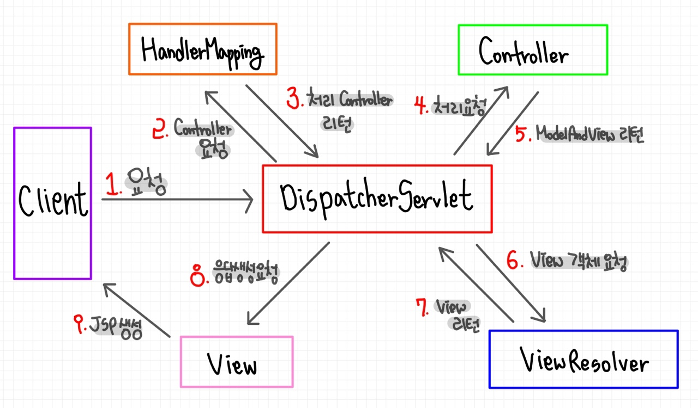

# 📚 <a style="color:#00adb5">SPRING</a>

<center>

</center>
<br>

# 📚 <a style="color:#00adb5">Spring MVC</a>

## <a style="color:#00adb5">MVC ( Model - View - Controller ) Pattern</a> 이란
- Model
    - <a style="color:red"><strong>어플리케이션 상태의 캡슐화</strong></a>
    - 상태 쿼리에 대한 응답
    - 어플리케이션의 기능 표현
    - 변경을 view에 통지
- View
    - <a style="color:red"><strong>모델을 화면에 시각적으로 표현</strong></a>
    - 모델에게 업데이트 요청
    - 사용자의 입력을 컨트롤러에 전달
    - 컨트롤러가 view를 선택하도록 허용
- Controller
    - <a style="color:red"><strong>어플리케이션의 행위 정의</strong></a>
    - 사용자 액션을 모델 업데이트와 mapping
    - 응답에 대한 view 선택

<br>

- MVC Pattern
    - 어플리케이션의 확장을 위해 Model, View, Controlle 세가지 영역으로 분리
    - 컴포넌트의 변경이 다른 영역 컴포넌트에 영향을 미치지 않음 ( 유지보수 용이 )
    - 컴포넌트 간의 결합성이 늦아 프로그램 수정이 용이 ( 확장성이 뛰어남 )
    - <a style="color:red"><strong>장점</strong></a>
        - 화면과 비즈니스 로직을 분리해서 작업 가능
        - 영역별 개발로 인하여 확장성이 뛰어남
        - 표준화된 코드를 사용하므로 공동작업이 용이하고 유지보수성이 좋음
    - <a style="color:red"><strong>단점</strong></a>
        - 개발과정이 복잡해 초기 개발 속도가 늦음
        - 초보자가 이해하고 개발하기에 다소 어려움
    
<br>
- Model 2 ( Web MVC ) 요청 흐름
<center>

</center>
<br>

## <a style="color:#00adb5">Spring MVC</a> 란
- <a style="color:red"><strong>Spring은 DI 나 AOP 같은 기능 뿐만 아니라 Servlet 기반의 WEB 개발을 위한 MVC Framework를 제공</strong></a>
- Spring MVC는 Mode2 Architecture와 Front Controller Pattern을 Framework 차원에서 제공
- 기존 작업들은 Servlet 안에 같이 있었지만 안에서 Auto로 처리할 수 있는 부분과 아닌 부분을 나눈다.
- 기존 동일 반복 작업 같은 경우를 Auto로 처리하고 이 부분이 Framework로 넘어가며 Front Controller 역할을 Spring이 한다.
- 개발자는 Controller 부분 (data)만 신경써서 작업하면 된다.
- Spring MVC Framework는 Spring을 기반으로 하고 있기 때문에 Spring이 제공하는 Transaction 처리나 DI 및 AOP등을 손쉽게 사용

## <a style="color:#00adb5">Spring MVC</a> 구성요소
- <a style="color:red"><strong>DispatcherServlet ( Front Controller )</strong></a>
    - 모든 클라이언트의 요청을 전달받음
    - _Controller에게 클라이언트의 요청을 전달하고, Controller가 리턴 한 결과값을 View에게 전달하여 알맞은 응답을 생성_
- <a style="color:red"><strong>HandlerMapping</strong></a>
    - 클라이언트의 요청 URL을 어떤 Controller가 처리할지를 결정
    - _URL과 요청 정보를 기준으로 어떤 핸들러 객체를 사용할지 결정하는 객체이며, DispatcherServlet은 하나 이상의 핸들러 매핑을 가질 수 있다._
- <a style="color:red"><strong>Controller</strong></a>
    - _클라이언트의 요청을 처리한 뒤, Model을 호출하고 그 결과를 DispatcherServlet에 알려준다._
    - 우리가 신경써야할 부분 !!
- <a style="color:red"><strong>ModelAndView</strong></a>
    - _Controller가 처리한 데이터 및 화면에 대한 정보를 보유한 객체_
- <a style="color:red"><strong>ViewResolver</strong></a>
    - _Controller가 리턴 한 뷰 이름을 기반으로 Controller의 처리 결과를 보여줄 View를 결정_
    - 매번 똑같은 경로글을 생략할 수 있다.
- <a style="color:red"><strong>View</strong></a>
    - _Controller의 처리 결과를 보여줄 응답화면 생성_


## <a style="color:#00adb5">Spring MVC</a> 요청 흐름

<center>

</center>
<br>

- Spring MVC 실행 순서
1. DispatcherServlet이 Client 요청을 수신 ( 그림 1 )
        - 단일 Front Controller Servlet
        - 요청을 수신하여 처리를 다른 컴포넌트에 위임
        - 어느 Controller에 요청을 전송할지 결정
2. DispatcherServlet은 Handler Mapping에 어느 Controller를 사용할 것인지 문의 ( 그림 2, 3 )
        - URL과 Mapping
3. DispatcherServlet은 요청을 Controller에게 전송하고 Controller는 요청을 처리한 후 결과 리턴 ( 그림 4 )
        - Business Login 수행 후 결과 정보 (Model)가 생성되어 JSP와 같은 view에서 사용됨
4. ModelAndView Object에 수행결과가 포함되어 DispatcherServlet에 리턴 ( 그림 5 )
5. ModolAndView는 실제 JSP정보를 갖고 있지 않으며 ( 이름만 가지고 있다 ), ViewResolver가 논리적 이름을 실제 JSP 이름으로 변환 ( 그림 6, 7 )
6. View는 결과정보를 사용하여 화면을 표현함 ( 그림 8, 9 )

<br>

- 시나리오 식으로 정리 ( login을 예를 들어 )<br>

먼저 옛날에는 Client로 부터 'Control?act=login' 으로 입력을 받았다. 이것이 요즘은 ../login 으로 입력을 받는다. <br>
그 입력을 받아 <strong>DispatcherServlet에게 요청</strong>을 한다. <br>
그리고 <strong>Controller를 요청</strong>한다. 이 과정은 'if(act==login){ ... }' 을 진행했던 과정이다.<br>
login을 받았는데 어떻게 처리해야 하냐? <strong>HanlderMapping을 통해 어떤 Controller가 있는데 그 Controller 가 가지고 있는 method를 호출해야 함을 결정</strong>한다.<br>
그래서 그 <strong>Controller에 처리 요청</strong>을 보낸다.<br>
그러면 이제 Controller의 처리 과정이 우리 개발자들이 집중적으로 해야할 일이다. ( Model 처리 ) 그 Controller가 해야하는 기능이나 역할 등에 따라 달라진다.<br>
지금은 login이니 login 메서드가 있을 것이다. 여기 뒤에 <strong>service, dao 과정이 포함</strong>된다.<br>
처리를 하고 <strong>ModelAndView ( 처리과정 포함 )</strong>를 DispatcherServlet에 리턴해준다. 여기서 ModelAndView가 정보를 가지고 있는게 아니라 단지 이름만 가지고 있다. 예를 들면 list라는 jsp의 이름만 가지고 있다.<br>
이 정보를 <strong>ViewResolver에 객체 요청을 하여 거기서 앞, 뒤로 여러 정보들을 붙여서 리턴</strong>해준다. 예를 들면 '../../list.jsp' 가 된다.<br>
그 정보를 이제 <strong>기본 값은 forward 고 redirect로 설정가능한 응답생성 요청</strong>을 한다.<br>
그러고 <strong>View에서 이제 Client에게 JSP를 사용하여 화면을 표현</strong>한다.<br><br>
여기서 DispatcherServlet에 설정을 해주어야한다 !! ( 자동적으로 되는 것이 아님 ! ) <br>
xml을 만들거나 Annotation을 등록하거나.. -> 설정이 끝나면 내부적으로 자동 완성 된다.


## <a style="color:#00adb5">Spring MVC</a> 구현
- Spring MVC를 이용한 Application 구현 Step
    1. web.xml에 DispatcherServlet 등록 및 Spring 설정 파일 등록 ( 최소 3개의 xml file 생성 - web.xml, web( Controller ), NonWeb( Service, DAO ) / DI는 반드시 !! ( xml, java ))
    2. 설정 파일에 HandlerMapping 설정
    3. Controller 구현 및 Context 설정 파일(servlet-context.xml)에 등록
    4. Controller와 JSP 연결을 위해 View Resolver 설정
    5. JSP 코드 작성
- Controller 작성
    - <a style="color:red"><strong>좋은 디자인은 Controller가 많은 일을 하지 않고 Service에 처리를 위임한다.</strong></a><br>
    <center>
    
    </center>
    <br>
<br>

- <a style="color:red"><strong>web.xml -> DispatcherServlet 설정</strong></a>
    - DispatcherServlet을 여러 개 설정가능
    - 각 DispatcherServlet마다 각각의 ApplicationContext 생성
    - 최상위 Root ContextLoader 설정
        - Context 설정 파일들을 로드하기 위해 web.xml 파일에 리스너 설정 ( ContextLoaderListener ) 
        - 리스너 설정이 되면 /WEB-INF/spring/root-context.xml 파일을 읽어서 공통적으로 사용되는 최상위 Context를 생성
        - 그 외의 다른 Context 파일들을 최상위 어플리케이션 Context에 로드하기 위해서는 밑에 코드에서 2번을 처럼..

```xml
<?xml version="1.0" encoding="UTF-8"?>
<web-app version="2.5" xmlns="http://java.sun.com/xml/ns/javaee"
	xmlns:xsi="http://www.w3.org/2001/XMLSchema-instance"
	xsi:schemaLocation="http://java.sun.com/xml/ns/javaee https://java.sun.com/xml/ns/javaee/web-app_2_5.xsd">

	<!-- 프로젝트가 was에 올라가는 순간에 밑에 xml을 읽어서 contextConfigLocation에 호출하는 것-->
	<!-- root-context가 servlet-context 보다 먼저 실행된다 -->
    <!-- context-param은 변수를 선언하는 것이다 -->
	1.
    <context-param>
		<param-name>contextConfigLocation</param-name>
		<param-value>/WEB-INF/spring/root-context.xml</param-value>
	</context-param>

    2.
    <context-param>
        <param-name>contextConfigLocation</param-name>
        <param-value>
        /WEB-INF/spring/root-context.xml
        classpath:com/test/web/application.xml
        <!-- classpath에 위치한 설정파일로부터 로드 -->
        <!-- src(java) 에 있으면 통상적으로 classpath에 있다고 한다. -->
        <!-- src에 있으면 'classpath:...' 으로 작성하고 
             WebContent에 있으면 full 경로를 작성한다.
        -->
        </param-value>
    </context-param>

	
    <!-- web 응용 프로그램 -> 서블릿, 리스너, 필터 ( 이름이 정의되어 있다. ) -->
    <!-- ContextLoaderListener 리스너 설정 !!! -->
	<!-- context가 로딩이 되는 순간  위에것을 읽어라 라는 뜻이다 ( 메모리가 로드되는 순간 ) -->
	<listener>
		<listener-class>org.springframework.web.context.ContextLoaderListener</listener-class>
	</listener>


	<servlet>
		<servlet-name>appServlet</servlet-name>
		<servlet-class>org.springframework.web.servlet.DispatcherServlet</servlet-class>
		<!-- dispatcherservlet의 객체를 만들고 이안에 밑에 것을 집어넣으세요 라는 파라미터이다  -->
		<init-param>
			<param-name>contextConfigLocation</param-name>
			<param-value>/WEB-INF/spring/appServlet/servlet-context.xml</param-value>
		</init-param>
		<load-on-startup>1</load-on-startup>
	</servlet>
		
		
		<!--  '/' 를 사용하면 다 dispatcher가 봐줄 것이다  -->
	<servlet-mapping>
		<servlet-name>appServlet</servlet-name>
		<url-pattern>/</url-pattern>
	</servlet-mapping>

</web-app>
```
<br>
- <a style="color:red"><strong>Application Context 분리</strong></a>
    - 어플리케이션 레이어에 따라 Application Context 분리
    - Security Layer => board-security.xml
    - Web Layer => board-servlet.xml
    - Service Layer => board-service.xml
    - Persistence Layer => board-dao.xml

<br>

- <a style="color:red"><strong>Controller Class 작성</strong></a><br>
예시로 HomeController.java를 작성한다.<br>
여기서 Context 설정파일에 Controller를 꼭 등록해야한다. ( servlet-context.xml ) <br>
파일이 있는 주소를 적어준다.<br>

<br>
_Controller 등록_

```xml
<context:component-scan base-package="com.ssafy.hello" />
```
<br>
_HomeController.java_

```java
package com.ssafy.hello;

import java.text.DateFormat;
import java.util.Date;
import java.util.Locale;

import org.slf4j.Logger;
import org.slf4j.LoggerFactory;
import org.springframework.stereotype.Controller;
import org.springframework.ui.Model;
import org.springframework.web.bind.annotation.RequestMapping;
import org.springframework.web.bind.annotation.RequestMethod;

@Controller
public class HomeController {
	
	private static final Logger logger = LoggerFactory.getLogger(HomeController.class);
	
	@RequestMapping(value = "/", method = RequestMethod.GET)
	public String home(Locale locale, Model model) {
		logger.info("Welcome home! The client locale is {}.", locale);
		
		Date date = new Date();
		DateFormat dateFormat = DateFormat.getDateTimeInstance(DateFormat.LONG, DateFormat.LONG, locale);
		
		String formattedDate = dateFormat.format(date);
		
		model.addAttribute("msg", "안녕 스프링 !!!");
		
		return "index";
	}
}
```
<br>
_Controller 와 response page 연결을 위한 ViewResolver를 설정한다. ( servlet-context.xml )_

```xml
	<beans:bean class="org.springframework.web.servlet.view.InternalResourceViewResolver">
    <!-- property 는 setter 역할 -->
    <!-- 앞에 (prefix) value를 삽입 -->
    <!-- 뒤에 (suffix) value를 삽입 -->
		<beans:property name="prefix" value="/WEB-INF/views/" />
		<beans:property name="suffix" value=".jsp" />
    <!-- 결과는 /WEB-INF/views/index.jsp  가 된다. -->
	</beans:bean>

	<context:component-scan base-package="com.ssafy.hello" />
```

<br>
_JSP ( index.jsp )_<br>
HomeController.java에서 설정해준 msg ( 안녕 스프링 !! )를 화면에 출력해준다.

```jsp
<%@ page language="java" contentType="text/html; charset=UTF-8" pageEncoding="UTF-8"%>
<!DOCTYPE html>
<html>
<head>
<meta charset="UTF-8">
<title>Insert title here</title>
</head>
<body>
    <h3>${msg}</h3>
</body>
</html>
```
<br>

## <a style="color:#00adb5">생성, 설정</a>
- 프로젝트 생성<br>
Spring Legacy Project -> Spring mvc project 
- 설정<br>
pom.xml -> java version ( 1.8 ) , spring version ( 5.3.18 ), 141.142 ( 1.8 )
-> project -> maven -> update project -> force check -> ok

<br><br>
스프링은 코드로 공부하는 것이 아니다 !!!<br>
구조 파악 !!!!! ( 설정 중요 !! ) -> 에러잡기가 힘들다.<br>
<br>
web에 대한 정보는 web.xml을 보면 dispatcherServlet이 설정되어 있다.<br>
여기서 servlet-context.xml을 확인한다. servlet-context.xml에는 Controller에 대한 정보들이 저장되어 있다.<br>
Non web에 대한 정보는 root-context.xml 에 있다. ( service, dao에 대한 정보 )<br>

MVC 패턴은 절대 JSP를 직접 호출하지 않는다 !!<br>
항상 Controller를 거쳐서 호출한다.<br>

그리고 <a style="color:red"><strong>Spring Framework를 사용하면 기존 기능들을 안쓰는 것이 아니라 내부적으로 작업을 해주는 것이다.</strong></a>