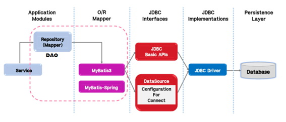
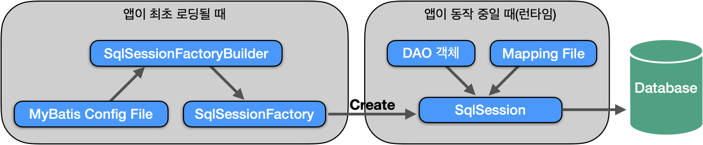

# 📚 <a style="color:#00adb5">MYBATIS</a>

<center>

</center>
<br>

# 📚 <a style="color:#00adb5">MYBATIS</a>

## <a style="color:#00adb5">MYBATIS</a> 란
MyBatis는 <a style="color:red"><strong>Java Object ( DAO )와 SQL문 사이의 자동 Mapping 기능을 지원하는 Persistence Framework 이다. <br>
( 지속성 프레임 워크 : 자료를 DB에 저장하는 과정을 도와주고 자동화하는 매개 SW) , SQL Mapper라고도 불린다. </strong></a><br><br>
SQL문을 별도의 파일로 분리해서 관리한다.<br><br>
Object (DAO) - SQL문 사이의 parameter mapping 작업을 자동으로 해준다.<br><br>
MyBatis는 Hibernate나 JPA와 같은 새로운 DB 프로그래밍 패러다임을 익혀야 하는 부담 없이 *개발자가 익숙한 SQL을 그대로 이용하면서 JDBC 코드 작성의 불편함을 제거해주고 도메인 객체나 VO 객체를 중심으로 개발을 가능하게 해준다.*

## <a style="color:#00adb5">MYBATIS</a> 특징
- <a style="color:red"><strong>쉬운 접근성과 간결한 코드</strong></a>
    - 가장 간단한 persistence framework 
    - JDBC의 모든 기능을 제공
    - 수동적인 parameter 설정과 Query 결과에 대한 mapping 구문을 제거
- <a style="color:red"><strong>SQL문과 프로그래밍 코드의 분리</strong></a>
    - SQL에 변경이 있을 때마다 자바 코드를 수정하거나 컴파일 하지 않아도 됨
    - 협업 할 때 DBA가 SQL을 점검하기 유용하다.
- <a style="color:red"><strong>다양한 프로그래밍 언어로 구현가능</strong></a>
    - JAVA, C#, .NET, Ruby ...

<br>
<center>

</center>
<br>
MyBatis는 <a style="color:red"><strong>DAO와 JDBC 사이에 위치해서 서로를 매핑</strong></a>해준다.<br>
밑에서 얘기할 MyBatis-Spring도 같은 위치에 존재한다. ( Repository (Mapper) - JDBC )


## <a style="color:#00adb5">MYBATIS</a> 동작과정
<center>

</center>
<br>

1. MyBatis Config 파일을 읽어 *SqlSessionFactoryBuilder* 객체를 생성한다.
2. SqlSessionFactoryBuilder 객체를 이용해 *SqlSessionFactory* 객체를 생성한다.
3. 앱 실행 중에 CRUD 처리가 들어오면 SqlSessionFactory로 *SqlSession* 객체를 생성한다.
4. SqlSession 객체를 이용해 DB 요청을 한 후 결과값을 받아온다.
<br>
MyBatis Config는 XML로 작성한다. 파일에는 4가지 정보를 설정한다. <br>
그리고 dtd ( 문서 형식 정의 )가 되어있으므로 순서대로 적어야 한다.
- <a style="color:red"><strong>properties</strong></a><br>
프로퍼티 파일을 정의
- <a style="color:red"><strong>typeAliases</strong></a><br>
mapper.xml에서 사용할 alias 설정 ( 짧은 단어로 사용하기 위해 )
- <a style="color:red"><strong>environments</strong></a><br>
DB 정보를 설정
- <a style="color:red"><strong>mapper</strong></a><br>
어떤 XMl 파일이 mapper 파일인지 설정

<br>

<strong>mybatis-config.xml</strong>

```xml
<?xml version="1.0" encoding="UTF-8" ?>
<!DOCTYPE configuration PUBLIC "-//mybatis.org//DTD Config 3.0//EN"
"http://mybatis.org/dtd/mybatis-3-config.dtd">

<configuration>

	<properties resource="dbinfo.properties"/>

	<typeAliases>
		<typeAlias type="com.test.guestbook.model.MemberDto" alias="member" />
		<typeAlias type="com.test.guestbook.model.GuestBookDto" alias="guestbook" />
		<typeAlias type="com.test.guestbook.model.FileInfoDto" alias="fileinfo" />
	</typeAliases>
	
	<environments default="development">
        <environment id="development">
            <transactionManager type="JDBC"/>
            <dataSource type="POOLED">
            <!-- value 값들은 위에서 가져온 dbinfo.properties에 있다 -->
                <property name="driver" value="${driver}"/>
                <property name="url" value="${url}"/>
                <property name="username" value="${dbid}"/>
                <property name="password" value="${dbpwd}"/>
            </dataSource>
        </environment>
    </environments>
    
    <mappers>
		<mapper resource="guestbook.xml" />
		<mapper resource="member.xml" />
	</mappers>
	
</configuration>
```
<br>
<strong>dbinfo.properties</strong>

```
driver=com.mysql.cj.jdbc.Driver
url=jdbc:mysql://localhost:3306/testweb?serverTimezone=UTC&useUniCode=yes&characterEncoding=UTF-8
dbid=root
dbpwd=1234
```

<br>

mapper에서 정의한 *member.xml* 매퍼 파일은 다음과 같이 작성할 수 있다.
<br><br>
<strong>member.xml</strong>

```xml
<?xml version="1.0" encoding="UTF-8"?>
<!DOCTYPE mapper
PUBLIC "-//mybatis.org//DTD Mapper 3.0//EN" "http://mybatis.org/dtd/mybatis-3-mapper.dtd"> 

<!-- 1. 어디서 사용할 것인가 명시 ( guestbook에도 register가 있을 수 있다 ) -->
<mapper namespace="com.test.guestbook.model.dao.MemberDao">

<!-- 2. id는 메서드의 이름 , 3. parameterType은  config에서 alias 해준 파일 ( Dto 연결 ) -->
<!-- 4. query 문을 만들어 준다. 예전PreparedStatement 에 들어갈 값들은  #{} 로 대체하고 , getter. setter의 property로 설정하면 된다
		values 값들은 getter가 된다.	
		-->
	<insert id="registerMember" parameterType="member">
	insert into test_member (userid, username, userpwd, email, joindate)
	<!-- dto가 가지고 있는 property -->
	values(#{userId}, #{userName}, #{userPwd}, #{email}, now())
	</insert>

<!-- java가 제공해주는 wrapper class는 맨첫글자를 소문자로 바꾸면 된다 -->
<!-- 얻어온거 있으면 전달 - resultType -->
<!-- select 옆에 값들은 setter 가 된다. -->
	<select id="login" parameterType="map" resultType="member">
	<!-- 이름이 다르면 as 줘야한다 ( form, dto, db ) -->
	select username, userid, email
	from test_member
	<!-- map의 key 값 -->
	where userid = #{userId} and userpwd = #{userPwd}
	</select>

</mapper>
```

<br>

다음은 *SqlSessionFactoryBuilder* 와 *SqlSessionFactory* 를 생성하는 코드이다.
<br>

위의 MyBatis 설정 파일을 읽어 *SqlSessionFactoryBuilder* 를 생성한 후 이것으로 *SqlSessionFactory* 를 생성하여 *SqlSession* 객체를 생성해 사용하고 있다.
<br>
<strong>SqlMapConfig.java</strong>

```java
public class SqlMapConfig {
	
	private static SqlSessionFactory factory;

	// 팩토리 생성 
	static {
		try {
			String resource = "mybatis-config.xml";
			Reader reader = Resources.getResourceAsReader(resource);
			factory = new SqlSessionFactoryBuilder().build(reader);
		} catch (IOException e) {
			e.printStackTrace();
		}
	}

	// sql 세션을 만들어 낸다
	public static SqlSession getSqlSession() {
		return factory.openSession();
	}
	
}
```

<br>

실제 SqlSession 메서드를 파라미터로 *mapper id* 와 *mapper 파라미터* 를 넘긴다.<br>
<strong>MemberDaoImpl.java</strong>

```java
@Repository
public class MemberDaoImpl implements MemberDao {

	private final String NAMESPACE = "com.test.guestbook.model.dao.MemberDao.";

// mapper.xml 에서 id를 사용하면 된다. 
	@Override
	public void registerMember(MemberDto memberDto) throws SQLException {
		// sqlmapconfig에 있던 거 사용
		try (SqlSession sqlSession = SqlMapConfig.getSqlSession()) {
			sqlSession.insert(NAMESPACE + "registerMember", memberDto);
			sqlSession.commit();
		}
	}

	@Override
	public MemberDto login(Map<String, String> map) throws SQLException {
		try (SqlSession sqlSession = SqlMapConfig.getSqlSession()) {
			return sqlSession.selectOne(NAMESPACE + "login", map);
		}
	}
}
```

## <a style="color:#00adb5">MyBatis - Spring</a> 란
MyBatis-Spring은 <a style="color:red"><strong>MyBatis를 Spring Framework에 녹여내 좀 더 쉽게 사용하고자하는 연동 모듈</strong></a>이다.<br>

MyBatis-Spring에서는 *Spring Framework의 Bean* 으로 SqlSessionFactoryBean과 SqlSession을 등록한다.<br>
*SqlSessionTemplate* 는 *SqlSession의 구현체* 이다.

<br>
<strong>root-context.xml</strong>

```xml
<!-- 밑에 과정은 SqlMapConfig.java에서 진행되던 과정
	먼저 mybatis-config.xml을 받아와 factory를 만들고 그 factory를 이용해 sql 세션을 만들어 낸다.
	mybatis-config.xml 에서는 db 연결과 쓸 파일 설정, alias 등을 진행한다.
	그것을 다 밑에 구현했기 때문에 기존 SqlMapConfig.java와 mybatis-config.xml는 없어도 된다.
 	-->

	<!-- mybatis-config.xml 에서 enviornments 부분 -->
	<bean id="ds" class="org.springframework.jndi.JndiObjectFactoryBean">
		<property name="jndiName" value="java:comp/env/jdbc/ssafy"></property>
	</bean>


	<!-- mybatis -->
	<!-- SqlMapConfig.java 부분 생성 -->
	<!-- factory 만들어주기 -->
	<bean id="sqlSessionFactoryBean" class="org.mybatis.spring.SqlSessionFactoryBean">
		<!-- 위에 선언한 ds 참조 -->
		<property name="dataSource" ref="ds" />
		<!-- mybatis-config.xml 에서 mappers 부분 -->
		<!-- mapper라는 폴더 밑에 모든 xml을 읽어 오겠다 	mapper가 어딨느냐~	-->
		<property name="mapperLocations" value="classpath:mapper/*.xml" />
		
		<!-- mybatis-config.xml 에서 typeAliases 부분 -->
		<!-- config가 어딨느냐~  -->
		<!-- 폴더 경로 지정해서 연결 -->
		<!-- <property name="configLocation" value="classpath:mybatis-config.xml"/> -->
		<!-- 여기서 package 선언 -> mybatis-config.xml가 없어도된다 -->
		<property name="typeAliasesPackage" value="com.ssafy.guestbook.model"/>
	</bean>
	
	<!-- SqlMapConfig.java 부분 생성 -->
	<!-- default 값이 없어서 반드시 생성자를 가져가야한다 -->
	<!-- factory를 가지고 SqlSession을 만들어라 -->
	<bean id="sqlSession" class="org.mybatis.spring.SqlSessionTemplate">
		<constructor-arg ref="sqlSessionFactoryBean"/>
	</bean>
```

<br>
mapper 설정 파일<br><br>

<strong>member.xml</strong>

```xml
<?xml version="1.0" encoding="UTF-8" ?>
<!DOCTYPE mapper PUBLIC "-//mybatis.org//DTD Mapper 3.0//EN" 
	"http://mybatis.org/dtd/mybatis-3-mapper.dtd">

<mapper namespace="com.test.guestbook.model.mapper.MemberMapper">

	<insert id="registerMember" parameterType="MemberDto">
		insert into ssafy_member (userid, username, userpwd, email, joindate)
		values (#{userId}, #{userName}, #{userPwd}, #{email}, now())
	</insert>

	<select id="login" parameterType="map" resultType="MemberDto">
		select username, userid, email
		from ssafy_member
		where userid = #{userId} and userpwd = #{userPwd}
	</select>
	
</mapper>
```

<br>
이제 준비를 다 마치고 mapper interface에 객체를 굳이 구현 안하고 만들어주는 이유는 해당 interface가 매핑되는 mapper.xml을 알아서 찾아준다.
<br>

<strong>MemberMapper.java</strong>

```java
public interface MemberMapper {

	int idCheck(String id) throws Exception;
	void registerMember(MemberDto memberDto) throws Exception;
	MemberDto login(Map<String, String> map) throws Exception;
}
```