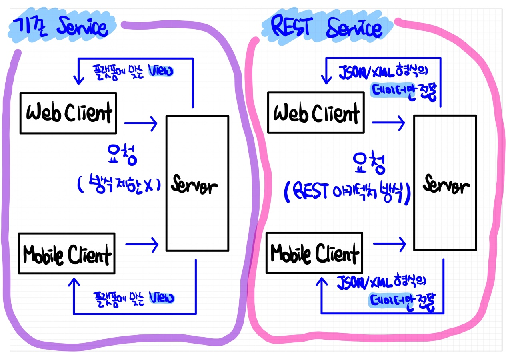

# 📚 <a style="color:#00adb5">REST API</a>

<center>

</center>
<br>

# 📚 <a style="color:#00adb5">REST</a>

## <a style="color:#00adb5">REST</a> 란
REST ( Representational State Transfer ) 의 약자로 <a style="color:red"><strong>하나의 URI는 하나의 고유한 리소스 ( Resource ) 를 대표하도록 설계된다는 개념에 전송방식을 결합해서 원하는 작업을 지정한다.</strong></a><br>
자원을 이름으로 구분하여 해당 자원의 상태를 주고 받는 모든 것을 의미한다.<br>
웹의 장점을 최대한 활용할 수 있는 아키텍처로서 REST가 개발되었다.<br>
<a style="color:red"><strong>HTTP URI를 통해 제어할 자원 ( Resource )을 명시하고, HTTP Method ( GET, POST, PUT, DELETE ) 을 통해 해당 자원 ( Resources ) 에 대한 CRUD Operation을 적용하는 방식의 아키텍처다.</strong></a><br>

*CRUD Operation*
- Create : 데이터 생성 ( <a style="color:red"><strong>POST</strong></a> )
- Read : 데이터 조회 ( <a style="color:red"><strong>GET</strong></a>)
- Update : 데이터 수정 ( <a style="color:red"><strong>PUT</strong></a> )
- Delete : 데이터 삭제 ( <a style="color:red"><strong>DELETE</strong></a> )


## <a style="color:#00adb5">REST</a> 구성
- <a style="color:red"><strong>자원 ( Resource )</strong></a>
    - URI, Server에 존재
- <a style="color:red"><strong>행위 : HTTP Method</strong></a>
    - 4가지 method ( GET, POST, PUT, DELETE )
- <a style="color:red"><strong>표현 ( Representations )</strong></a>
    - Client가 자원의 상태에 대한 조작을 요청하면 Server는 이에 적절한 응답을 보낸다.
    - JSON, XML, TEXT, RSS 등 여러 형태의 응답으로 나타 낼 수 있다.
    - JSON이 가장 많이 사용된다.

<br>

*잘 표현된 HTTP URI로 리소스를 정의하고 HTTP Method로 리소스에 대한 행위를 정의한다.*<br>
*리소스는 JSON, XML 등 여러가지 언어로 표현할 수 있다. ( 제약이 없다 )*

## <a style="color:#00adb5">REST</a> 과 기존 Service ( web ) 비교
- 기존 Service
    - 요청에 대한 처리를 한 후 <a style="color:red"><strong>가공된 data</strong></a>를 이용하여 <a style="color:red"><strong>특정 플랫폼</strong></a>에 적합한 형태의 <a style="color:red"><strong>View</strong></a>로 만들어서 반환
- REST Service
    - <a style="color:red"><strong>data 처리</strong></a>만 한다거나, 처리 후 반환될 data가 있다면 <a style="color:red"><strong>JSON 이나 XML 형식</strong></a>으로 전달. <a style="color:red"><strong>View</strong></a>에 대해서는 신경을 쓸 필요가 없다
    - 이러한 이유로 OPEN API에서 많이 사용

<br>
<center>

</center>
<br>


## <a style="color:#00adb5">REST</a> 특징
- 기존의 전송방식과는 달리 서버는 요청으로 받은 리소스에 대해 <a style="color:red"><strong>순수한 데이터</strong></a>를 처리한다.
- 기존의 GET/POST 외에 PUT, DELETE 방식을 사용하여 리소스에 대한 <a style="color:red"><strong>CRUD 처리</strong></a>를 할 수 있다.
- HTTP URI를 통해 제어할 자원 ( Resource )을 명시하고, HTTP Method ( GET, POST, PUT, DELETE ) 을 통해 해당 자원 ( Resources )을 제어하는 명령을 내리는 아키텍처 이다.
- 모바일, PC, 어플리케이션 등 플랫폼에 제약을 두지 않는다.
- *View* 에 신경쓰지 않는다, 데이터만 전달한다.
- *JSON 포멧*을 제일 많이 사용한다.
- *비동기처리*에 사용한다.
- *Server - Client* 구조이다.
- <a style="color:red"><strong>Stateless</strong></a> : 상태를 유지하지 않는다( 상태정보 기억 X ), 들어온 요청에 처리만 해주면 된다.
- *Cacheable* : 캐시 처리 가능
- *Layered System* : 클라이언트와 서버가 분리되어 있어 중간에 프록시서버, 암호화 계층 등 중간매체를 사용할 수 있다.
- *Uniform Interface* : 특정 언어나 기술에 종속되지 않는다. ( HTTP 표준에만 따른다면 )

## <a style="color:#00adb5">REST</a> 설계 목표
- 컴포넌트들간의 유연한 상호 연동성 확보 ( 더 효율적으로 수행 )
- 범용 인터페이스 ( 개발자는 비즈니스 로직만 고려하면 된다. )
- 각 컴포넌트들의 독립적인 배포
- 지연 감소, 보안강화, 레거시 시스템을 인캡슐레이션 ( 데이터에 헤더가 추가되는 과정 ) 하는 중간 컴포넌트로의 역할

## <a style="color:#00adb5">REST</a> 장점
- 서버와 클라이언트의 역할을 명확히 한다.
- HTTP 프로토콜의 인프라를 그대로 사용하므로 REST API 사용을 위한 별도의 인프라를 구축할 필요가 없다.
- HTTP 프로토콜의 표준을 최대한 활용하여 여러 추가적인 장점을 함께 가져갈 수 있게 한다.
- HTTP 표준 프로토콜에 따르는 모든 플랫폼에서 사용이 가능하다.
- 의도하는 바를 쉽게 파악할 수 있다.
- 여러 가지 서비스 디자인에서 생길 수 있는 문제를 최소화한다.

## <a style="color:#00adb5">REST</a> 단점
- 사용할 수 있는 메서드가 4개 밖에 없다.
- 구형 브라우저에 호환이 잘 안된다.
- 전문성이 요구된다.
- 표준 자체가 없어서 정의가 필요하다. ( 다들 이렇게 쓰더라 ~ 라는 암묵적인 표준만 정해져 있다. )
- HTTP에 상당히 의존적이다.

<br><br>


# 📚 <a style="color:#00adb5">REST API</a>

<br>


## <a style="color:#00adb5">REST API</a> 란
REST API란 <a style="color:red"><strong>REST의 원리를 따르는 API ( Application Programming Interface ) 를 의미</strong></a>한다.<br>
API는 컴퓨터나 컴퓨터 프로그램 사이의 연결이다. 다른 종류의 소프트웨어에 서비스를 제공한다.<br>

## <a style="color:#00adb5">REST API</a> 설계 예시
- 하이픈 (-) 은 사용 가능 하지만 언더바 (_)는 사용하지 않는다.
    - bad : http://jsdevlog.com/test_blog
    - good : http://jsdevlog.com/test-blog

- 특별한 경우를 제외하고 대문자 사용은 하지 않는다. ( 대소문자 구분 )
    - good : http://jsdevlog.com/test

- URI 마지막에 슬래시(/)를 사용하지 않는다.
    - bad : http://jsdevlog.com/test/
    - good : http://jsdevlog.com/test

- 슬래시(/) 로 계층관계를 나타낸다.
    - good : http://jsdevlog.com/study/java

- 확장자가 포함된 파일이름을 직접 포함시키지 않는다.
    - bad : http://jsdevlog.com/picture.jpg
    - good : http://jsdevlog.com/picture

- URI는 명사를 사용한다.
    - bad : http://jsdevlog.com/testing
    - good : http://jsdevlog.com/test

## <a style="color:#00adb5">REST API</a> 와 기존 웹 접근 방식과 차이점

<table>
    <tr>
        <td>작업</td>
        <td>기존 방식 메서드</td>
        <td>기존 방식</td>
        <td>REST 방식 메서드</td>
        <td>REST 방식</td>
        <td>설명</td>
    </tr>
    <tr>
        <td><a style="color:red"><strong>RCreate ( Insert )</strong></a></td>
        <td>POST</td>
        <td>/write.do?id=js</td>
        <td>POST</td>
        <td>/blog/js</td>
        <td>글쓰기</td>
    </tr>
    <tr>
        <td><a style="color:red"><strong>RRead ( Select )</strong></a></td>
        <td>GET</td>
        <td>/view.do?id=js&articleno=10</td>
        <td>GET</td>
        <td>/blog/js/10</td>
        <td>글읽기</td>
    </tr>
    <tr>
        <td><a style="color:red"><strong>RUpdate ( Update )</strong></a></td>
        <td>POST</td>
        <td>/modify.do?id=js</td>
        <td><a style="color:red"><strong>PUT</strong></a></td>
        <td>/blog/js</td>
        <td>글수정</td>
    </tr>
    <tr>
        <td><a style="color:red"><strong>RDelete ( Delete )</strong></a></td>
        <td>GET</td>
        <td>/delete.do?id=js&articleno=10</td>
        <td><a style="color:red"><strong>DELETE</strong></a></td>
        <td>/blog/js/10</td>
        <td>글삭제</td>
    </tr>
</table>

<br>

기존 블로그들은 *GET*과 *POST* 만으로 자원에 대한 CRUD를 처리하고 , *URI*는 액션을 나타냈다.<br>
REST로 변경할 경우 *4가지 method ( GET, POST, PUT, DELETE )*를 모두 사용하여 CRUD를 처리하고 *URI*는 제어하려는 자원을 나타낸다.<br><br>


## <a style="color:#00adb5">REST API</a> 설정
- Jackson library
    - jackson-databind 라이브러리는 객체를 <a style="color:red"><strong>JSON 포멧</strong></a>의 문자열로 변환시켜 브라우저로 전송한다. 
    - jackson-dataformat-xml 라이브러리는 객체를 <a style="color:red"><strong>xml</strong></a>로 브라우저로 전송한다.
    - pom.xml 에 library 추가

```xml
		<!-- https://mvnrepository.com/artifact/com.fasterxml.jackson.core/jackson-databind -->
	 	<dependency>
			<groupId>com.fasterxml.jackson.core</groupId>
			<artifactId>jackson-databind</artifactId>
			<version>${jackson-databind-version}</version>
		</dependency> 
```

- JSON library
    - java에서 JSON 객체를 사용하기 위해 사용되는 데이터형은 보통 <a style="color:red"><strong>JSONObject</strong></a>이다.
    - 이것을 사용하기 위해서는 library를 추가해야한다.

```xml
		<!-- https://mvnrepository.com/artifact/org.json/json -->
		<dependency>
		    <groupId>org.json</groupId>
		    <artifactId>json</artifactId>
		    <version>${json-version}</version>
		</dependency>
```

## <a style="color:#00adb5">REST API 관련 Annotation</a>

<table>
    <tr>
        <td>Annotation</td>
        <td>Description</td>
    </tr>
    <tr>
        <td>@RestController</td>
        <td>Controller가 REST 방식을 처리하기 위한 것임을 명시<br>
            모든 메서드가 @ResponseBody를 가지고 있을 때 설정해주어 @ResponseBody를 생략해준다. 
            </td>
    </tr>
    <tr>
        <td>@ResponseBody</td>
        <td>JSP 같은 뷰로 전달되는 것이 아니라 <a style="color:red"><strong>데이터 자체</strong></a>를 전달<br>
            기존 웹은 return { name : "js" } 라 하면 viewResolver 에 의해 앞에 /WEB-INF/views/....js 가 반환된다.<br>
            그러나 jsp를 보내려는 의도가 아니기 때문에 @ResponseBody 를 사용하면 데이터 자체를 보낼 수 있다.
            </td>
    </tr>
    <tr>
        <td>@PathVariable</td>
        <td>URL 경로에 있는 값을 파라미터로 추출</td>
    </tr>
    <tr>
        <td>@CrossOrigin</td>
        <td>Ajax의 크로스 도메인 문제를 해결<br>
            설정한 URI만 사용할 수 있게 한다. -> 보안 문제<br>
            @CrossOrigin("*") 은 HTTP 표준 프로토콜이면 다 사용할 수 있다는 의미
        </td>
    </tr>
    <tr>
        <td>@RequestBody</td>
        <td><a style="color:red"><strong>JSON 데이터를 원하는 타입으로 바인딩</strong></a><br>
            parameter 가 아닌 JSON으로 받아왔을 때 DTO의 parameter로 매핑시켜주는 역할
        </td>
    </tr>
</table>


<br><br>

# 📚 <a style="color:#00adb5">RESTFUL</a> 

## <a style="color:#00adb5">RESTFUL</a> 이란
RESTFUL 이란 <a style="color:red"><strong>REST의 원리를 따르는 시스템</strong></a>을 의미한다.<br>
하지만 *REST를 사용했다고 해서 모두가 RESTFUL 한 것은 아니다.*<br>
REST API의 설계 규칙을 올바르게 지킨 시스템을 RESTFUL하다 말할 수 있으며<br>
모든 CRUD 기능을 POST로 처리하는 API 혹은 URI 규칙을 올바르게 지키지 못했다면 REST API를 사용했다 하더라도 RESTFUL 하다고 말할 수 없다.


<br><br><br><br>
👏 참조<br>
<a href="https://velog.io/@somday/RESTful-API-%EC%9D%B4%EB%9E%80" target=_blank>https://velog.io/@somday/RESTful-API-%EC%9D%B4%EB%9E%80</a><br>
<a href="https://khj93.tistory.com/entry/%EB%84%A4%ED%8A%B8%EC%9B%8C%ED%81%AC-REST-API%EB%9E%80-REST-RESTful%EC%9D%B4%EB%9E%80" target=_blank>https://khj93.tistory.com/entry/%EB%84%A4%ED%8A%B8%EC%9B%8C%ED%81%AC-REST-API%EB%9E%80-REST-RESTful%EC%9D%B4%EB%9E%80</a><br>