# 📚 <a style="color:#00adb5">SPRINGBOOT</a>

 

# 📚 <a style="color:#00adb5">SPRINGBOOT</a>

## <a style="color:#00adb5">SPRINGBOOT</a> 란
스프링 부트 ( Spring Boot ) 는 <a style="color:red"><strong>스프링 ( Spring ) 을 더 쉽게 이용하기 위한 도구라고 볼 수 있다.</strong></a> 
스프링 프레임워크는 XML로 설정을 해야했고 ( spring3.1 부터는 java로만 가능함 ) 외장 Tomcat에 war 파일을 만들어 배포해야하고, 설정이 필요한 부분을 직접 구성하는 등 ( library 추가, dependency 설정 .. ) 여러 번거로움이 상당히 많았다. 
하지만 Spring Boot는 이러한 Spring의 문제점을 완벽히 해결해서 손쉽게 웹 애플리케이션을 만들고 실행할 수 있도록 도와준다.

## <a style="color:#00adb5">SPRINGBOOT</a> 장점
- 자주 사용되는 <a style="color:red"><strong>library 들의 버전 관리 자동화</strong></a>
- AutoConfig로 복잡한 <a style="color:red"><strong>설정 자동화</strong></a>
- <a style="color:red"><strong>내장 웹서버</strong></a> 제공 
    - 내장 서버를 포함해서 Tomcat 같은 WAS를 추가로 설치하지 않아도 개발 가능
- 실행 가능한 <a style="color:red"><strong>JAR파일</strong></a>로 웹 애플리케이션 개발 가능

### <a style="color:#00adb5">자주 사용되는 library 들의 버전 관리 자동화</a> 
우리가 사용하는 도구들 ( 프레임워크, 라이브러리 등 )에는 기본적으로 버전이 존재한다. 그리고 여러 도구들의 버전을 올바르게 조합해주지 않으면 오류가 발생한다. 

그래서 Spring Boot는 빌드 도구 ( maven, gradle )에 버전을 명시하지 않아도 <a style="color:red"><strong>적합한 library 버전들을 찾아서 가져와주고 관리</strong></a>해준다.

### <a style="color:#00adb5">AutoConfig로 복잡한 설정 자동화</a> 
개발을 하다보면 json 메세지 변환, property 설정 등 여러 공통적인 설정들이 필요하다. 
Spring Boot 는 개발을 위해 <a style="color:red"><strong>필요한 공통적인 부분들을 자동으로 구성</strong></a>해준다. 
그래서 별도의 설정 없이 서버를 바로 띄울 수 있다.

### <a style="color:#00adb5">내장 웹서버 제공</a> 
Spring Framework는 서버를 배포하기 위해 Tomcat과 같은 별도의 외장 웹서버를 설치하고 war 파일을 생성하여 배포해줘야 했다. 
이러한 방법은 상당히 번거롭고 처리 속도도 느리다. 

그러나 Spring Boot는 <a style="color:red"><strong>내장 웹서버 ( 톰캣 or 리액터 네티 )을 가지고 있어서</strong></a> 별도의 작업 없이 빠르게 서버를 실행할 수 있다.

### <a style="color:#00adb5">실행 가능한 JAR파일로 웹 애플리케이션 개발 가능</a> 
위에서 말했듯 Spring은 war파일을 만들어 외장 웹서버에 배포해야 했다. 

그러나 Spring Boot는 순수 자바 애플리케이션 프로그램을 실행하는 것처럼 <a style="color:red"><strong>jar로 실행 가능</strong></a>하도록 하였다. 
이 부분은 애플리케이션 실행에 상당한 편리성을 제공해준다.

## <a style="color:#00adb5">SPRINGBOOT</a> 프로젝트 생성 과정
- <a style="color:#00adb5">Spring Starter Project 생성</a> 
 

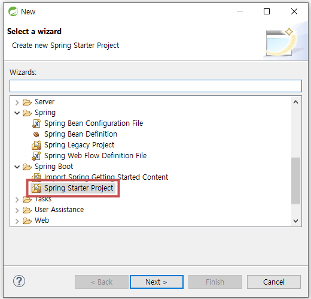

 
- <a style="color:#00adb5">Name, Type ( Maven, Gradle ), Packaging ( jar, war ), Java Version, Language, Group, Package ( 3 depth ) ..  설정</a> 
    - Maven은 안정적이지만 느리다. 그리고 Only JAVA 이다.
    - Gradle은 빠르고 다양한 언어를 지원한다.
    - Spring Boot는 jar을 지원해서 jar을 거의 사용한다. ( 웹 애플리케이션 )
 

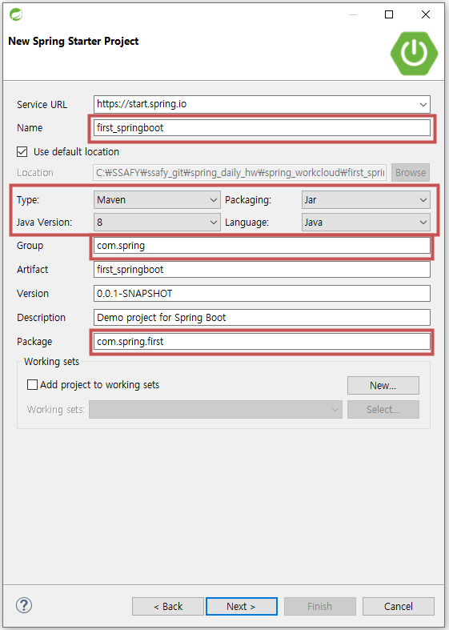

 
- <a style="color:#00adb5">사용할 설정을 선택</a>
    - 기본으로 <a style="color:red"><strong>'Spring Boot DevTools' 과 'Spring Web'</strong></a>은 하는 것을 권장한다.
    - 이 과정이 Spring boot의 큰 장점인 설정을 자동으로 해주는 것이다.
 

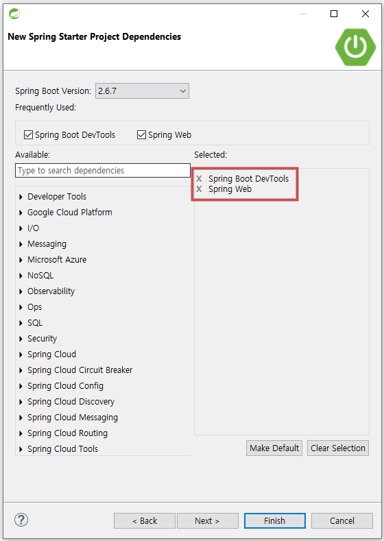

 
- <a style="color:#00adb5">완성된 프로젝트 ( index.html 과 /webapp/WEB-INF/views/home.jsp 는 생성해 놓은 것이다. )</a>
    - src/main/java
        - <a style="color:red"><strong>java source</strong></a> directory
    - FirstSpringBootApplication.java
        - application을 시작할 수 있는 <a style="color:red"><strong>main method</strong></a> 가 존재하는 스프링 구성 메인 클래스
    - static
        - js, css, img, html 등 <a style="color:red"><strong>정적 resource</strong></a> directory
    - templates
        - Spring boot에서 사용 가능한 여러가지 <a style="color:red"><strong>View template</strong></a> ( Thymeleaf , Velocity 등 ) 위치
    - application.properties
        - application 및 스프링의 설정 등에서 사용할 <a style="color:red"><strong>여러가지 property를 정의</strong></a>한 file
        - root-context, servlet-context에서 설정해둔 것 설정 ( 자동 x )
    - src/main
        - <a style="color:red"><strong>jsp</strong></a> 등의 resource directory
 

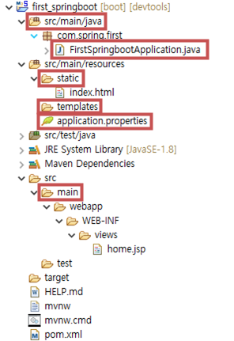

 
- <a style="color:#00adb5">프로젝트 실행</a>
    - main method에서 <a style="color:red"><strong>ctrl+f11 or project Run As -> Spring Boot App</strong></a>
    - 기존 서버들은 다 꺼져있어야 한다 !!
 

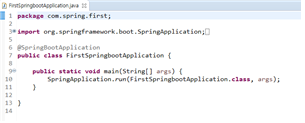

 
- <a style="color:#00adb5">실행 콘솔 창</a>
 

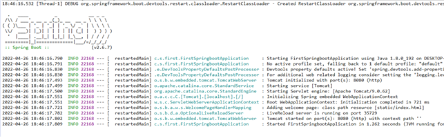

 
- <a style="color:#00adb5">브라우저 열고 http://localhost:8080 실행</a>
    - 아무것도 없을 때는 Whitelabel Error Page가 뜨지만 현재 프로젝트에는 html 파일이 존재하기 때문에 화면이 출력된다.
 

- <a style="color:red"><strong>src/main/resources/static/index.html</strong></a>
 

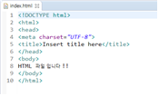

 

- 브라우저 출력
 

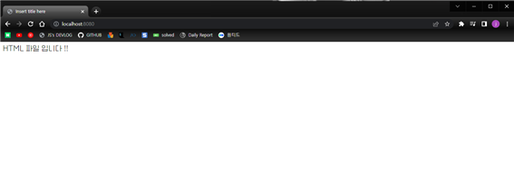

 

- <a style="color:#00adb5">JSP 파일 출력</a>
    - jsp는 Spring Boot 에서 잘 사용되지 않기 때문에 설정을 직접 해줘야 한다.

- Controller 생성

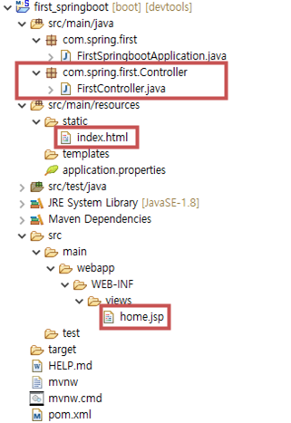

 

- FirstContorller

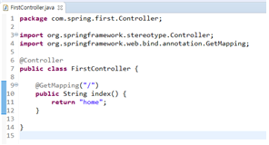

- JSP 파일 생성

- <a style="color:red"><strong>src/main/webapp/WEB-INF/views/home.jsp</strong></a>
 

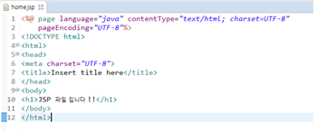

 

- <a style="color:red"><strong>applicataion.properties</strong></a> file에 ViewReolver 설정

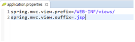

 

- pom.xml에 dependency 추가

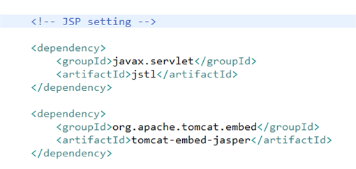

 

- JSP 파일 출력

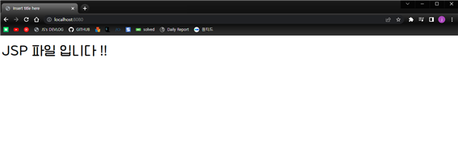

 