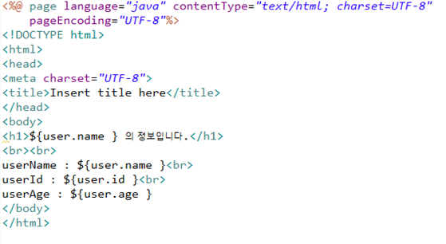

# 📚 <a style="color:#00adb5">SPRINGBOOT</a>

 

# 📚 <a style="color:#00adb5">SPRINGBOOT 활용하여 JSP로 동기 ( synchronous, asynchronous ) 처리 연습하기</a>

여러가지 방법 중에 내가 가장 이해하기 쉬웠던 방법을 사용해서 작성해보겠다. 
DB랑은 연결하지 않고 단지 입력과 출력을 통해 데이터 전달을 할 것이다. 
기능은 사용자의 Name, ID, age를 입력하면 동기, 비동기 처리를 통해 화면에 보여 줄 것이다.

## <a style="color:#00adb5">프로젝트 생성, JSP 환경 설정하기 ( 동기, 비동기 공통 )</a> 
- <a style="color:red">프로젝트 생성</a>
    - 프로젝트 생성 관련해서는 <a href="https://us13579.github.io/web/SPRINGBOOT/" style="color:red"><strong>이 글</strong></a>을 읽으면 된다.

 

 

- <a style="color:red">pom.xml</a>
    - jsp 사용 환경 설정

 

 

- <a style="color:red">applicataion.properties</a>
    - viewResolver 설정
    - root 설정

 

 

## <a style="color:#00adb5">UserDto ( 동기, 비동기 공통 )</a> 
- <a style="color:red">UserDto.java</a>
    - name, id, age

 

 

## <a style="color:#00adb5">home.jsp ( 동기, 비동기 공통 )</a> 
- <a style="color:red">webapp/WEB-INF/views/home.jsp</a>
    - 동기 처리 일 때만 화면이 켜진다.
    - name, id, age 출력

 

 

## <a style="color:#00adb5">MainController ( 동기, 비동기 공통 )</a> 
- <a style="color:red">MainController.java</a>
    - PostMapping 으로 처리
- <a style="color:red">동기 ( synchronous )</a>
    - 데이터가 전달되어 home.jsp 화면이 생성된다. ( 속히 하는 말로 화면이 껌뻑인다 )
- <a style="color:red">비동기 ( asynchronous )</a>
    - 데이터는 logger를 확인해보면 전달되지만 화면이 새로 생성되지 않고 기존 화면단에 나타난다. ( 속히 하는 말로 화면이 안 껌뻑인다 )

 

 

## <a style="color:#00adb5">index.html</a> 

### <a style="color:#00adb5">동기 ( synchronous )</a>  
- <a style="color:red">index.html</a>
- 동기도 button으로 받아 함수를 사용해도 된다. 그리고 location.href로 경로를 설정해주면 된다.

 

 

### <a style="color:#00adb5">비동기 ( asynchronous )</a>  
- <a style="color:red">index.html</a>

 

 

## <a style="color:#00adb5">입력화면 ( 동기, 비동기 공통 ) </a> 
- URL : localhost:8080/practice/index.xml
    - root를 /practice로 설정했다. ( application.properties 에서 )
    - 값은 내가 입력했다.

 

 

## <a style="color:#00adb5">출력화면</a> 

### <a style="color:#00adb5">동기 ( synchronous ) - 출력</a>  
- 화면이 깜빡이면서 home.jsp 화면이 켜진다.
    - <a style="color:red">home.jsp</a>
    - 주소가 /send 인 이유는 MainController에서 설정해주었기 때문

 

 

- Logger 를 통해 정보가 잘 전달되는 것을 볼 수 있다.

 

 

### <a style="color:#00adb5">비동기 ( asynchronous ) - 출력</a>  
- 화면이 깜빡이지 않고 index.html에서 값을 출력한다.
    - <a style="color:red">index.html</a>

 

 

- console에도 잘 출력이 된다.

 

 

- Logger 를 통해 정보가 잘 전달되는 것을 볼 수 있다.

 

 
