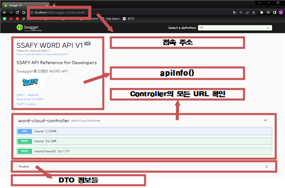
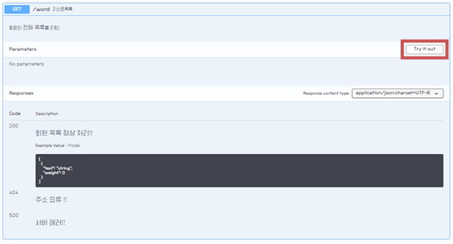
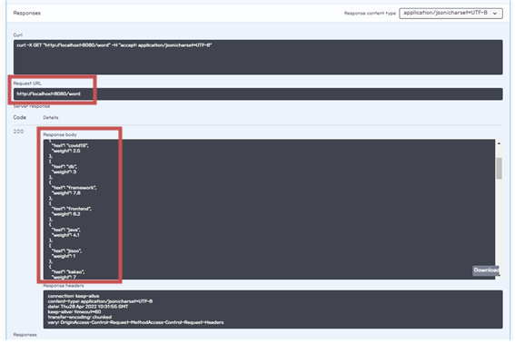
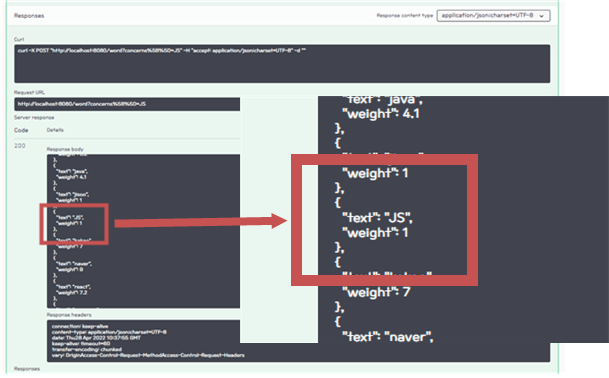
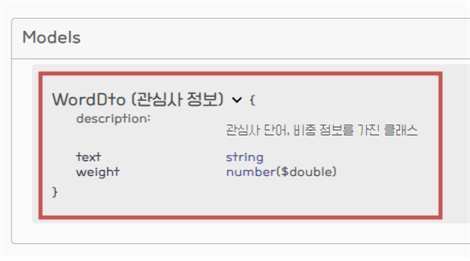

# 📚 <a style="color:#00adb5">SPRINGBOOT</a>

<center>

</center>
<br>

# 📚 <a style="color:#00adb5">SWAGGER</a>

## <a style="color:#00adb5">SWAGGER</a> 란
- <a style="color:red"><strong>간단한 설정으로 프로젝트의 API 목록을 웹에서 확인 및 테스트 할 수 있게 해주는 Library</strong></a>
- Swagger를 사용하면 Controller에 정의되어 있는 <big>모든 URL을 바로 확인</big>할 수 있다.
- API 목록 뿐만 아니라 <big>API의 명세 및 설명도 볼 수 있으며 또한 API를 직접 테스트 해 볼 수도 있다.</big>
- RestController에서만 확인 가능하다.


## <a style="color:#00adb5">SWAGGER</a> 사용 이유
- 프로젝트 개발 시 일반적으로 FrontEnd 개발자와 BackEnd 개발자가 분리된다.
- FrontEnd 개발자의 경우 화면과 로직에 집중하고 BackEnd 개발자가 만든 문서 API를 보며 데이터 처리를 하게 된다.
- 이때 개발 상황의 변화에 따른 <a style="color:red"><strong>API의 추가 또는 변경할 때마다 문서에 적용하는 불편함이 발생</strong></a>한다.
- 이 문제를 해결하기 위해 Swagger를 사용한다.
- 한 마디로 FrontEnd 개발자와 BackEnd 개발자의 <big>의사소통</big>을 돕는다.
- Swagger를 보며 변경된 것을 보고 거기에 따라 개발을 진행한다.

## <a style="color:#00adb5">SWAGGER 적용</a> 

### <a style="color:#00adb5">pom.xml에 dependency 추가</a> 
- <a style="color:red"><strong>Swagger2</strong></a>

```xml
        <dependency>
			<groupId>io.springfox</groupId>
			<artifactId>springfox-swagger2</artifactId>
			<version>2.9.2</version>
		</dependency>
        <dependency>
			<groupId>io.springfox</groupId>
			<artifactId>springfox-swagger-ui</artifactId>
			<version>2.9.2</version>
		</dependency>
```


- <a style="color:red"><strong>Swagger3</strong></a>
    - Swagger3 부터는 1개로 다 설정된다.

```xml
        <dependency>
			<groupId>io.springfox</groupId>
			<artifactId>springfox-boot-starter</artifactId>
			<version>3.0.0</version>
		</dependency>
```

### <a style="color:#00adb5">application.properties</a> 
- SpringBoot 2.6이상 <big>Swagger3.0 적용</big>시 에러 해결을 위해 설정을 해야한다.
    - SpringBoot 2.6.0 부터 요청 경로를 ControllerHandler에 매칭시키기 위한 전략의 기본 값이 ant_path_matcher 전략에서 path_pattern_parser 전략으로 변경 되었다.
    - 그래서 application.properties에서 spring.mvc.pathmatch.matching-strategy=ant_path_matcher로 default 값을 변경한다.

```
#Failed to start bean 'documentationPluginsBootstrapper'; error
spring.mvc.pathmatch.matching-strategy = ANT_PATH_MATCHER
```

### <a style="color:#00adb5">SwaggerConfiguration</a> 

```java
package com.ssafy.guestbook.config;

import static springfox.documentation.builders.PathSelectors.regex;

import java.util.HashSet;
import java.util.Set;

import org.springframework.context.annotation.Bean;
import org.springframework.context.annotation.Configuration;

import springfox.documentation.builders.*;
import springfox.documentation.service.*;
import springfox.documentation.spi.DocumentationType;
import springfox.documentation.spring.web.plugins.Docket;
import springfox.documentation.swagger2.annotations.EnableSwagger2;

@Configuration
@EnableSwagger2
// swagger 설정파일
public class SwaggerConfiguration {

//	Swagger-UI 2.x 확인
//	http://localhost:8080/{your-app-root}/swagger-ui.html
//	Swagger-UI 3.x 확인
//	http://localhost:8080/{your-app-root}/swagger-ui/index.html

	private String version = "V1";
	private String title = "SSAFY GuestBook API " + version;
	
	@Bean
	public Docket api() {
		return new Docket(DocumentationType.SWAGGER_2).consumes(getConsumeContentTypes()).produces(getProduceContentTypes())
					.apiInfo(apiInfo()).groupName(version).select()
					// RestApi가 어디에 있는지 설정
					.apis(RequestHandlerSelectors.basePackage("com.ssafy.guestbook.controller"))
                    // 위치 설정 ( Controller 위치 )
					.paths(regex("/admin/.*")).build()
					.useDefaultResponseMessages(false);
	}
	
	private Set<String> getConsumeContentTypes() {
        Set<String> consumes = new HashSet<>();
        consumes.add("application/json;charset=UTF-8");
//      consumes.add("application/xml;charset=UTF-8");
        consumes.add("application/x-www-form-urlencoded");
        return consumes;
    }

    private Set<String> getProduceContentTypes() {
        Set<String> produces = new HashSet<>();
        produces.add("application/json;charset=UTF-8");
        return produces;
    }

    // 실질적으로 swagger를 관리하는 역할
	private ApiInfo apiInfo() {
		return new ApiInfoBuilder().title(title)
				.description("<h3>SSAFY API Reference for Developers</h3>Swagger를 이용한 GuestBook API<br>") 
				.contact(new Contact("SSAFY", "https://edu.ssafy.com", "ssafy@ssafy.com"))
				.license("SSAFY License")
				.licenseUrl("https://www.ssafy.com/ksp/jsp/swp/etc/swpPrivacy.jsp")
				.version("1.0").build();
	}

}
```


### <a style="color:#00adb5">Controller, DTO</a> 
- Annotation 설명
    - @ApiOperation
        - 해당 Controller 안의 <big>method의 설명</big>을 추가
        - values : 값
        - notes : 내용
    - @ApilmplicitParmam
        - 해당 API Method 호출에 필요한 <big>Parameter들의 설명</big>을 추가
    - @ApiResponse
        - 해당 method의 <big>Response에 대한 설명</big>을 작성
        - 복수로 작성하고 싶으면 @ApiResponses 사용, 배열
    - @Apiparam
        - <big>DTO Field 설명</big>
    - @ApiModel
        - <big>Model(DTO)에 대한 설명</big>

<br>
- <a style="color:red"><strong>WordCloudController.java</strong></a>


```java
package com.ssafy.word.controller;

import java.util.List;

import org.slf4j.Logger;
import org.slf4j.LoggerFactory;
import org.springframework.beans.factory.annotation.Autowired;
import org.springframework.http.HttpStatus;
import org.springframework.http.ResponseEntity;
import org.springframework.web.bind.annotation.*;

import com.ssafy.word.model.WordDto;
import com.ssafy.word.model.service.WordService;

import io.swagger.annotations.Api;
import io.swagger.annotations.ApiOperation;
import io.swagger.annotations.ApiResponse;
import io.swagger.annotations.ApiResponses;


@RestController
@CrossOrigin("*")
@Api("어드민 컨트롤러 V1")
public class WordCloudController {

	private static final Logger logger = LoggerFactory.getLogger(WordCloudController.class);
	
	@Autowired
	private WordService wordService;
	
	@ApiOperation(value = "리스트목록", notes = "회원의 <big>전체 목록</big>을 리턴.")
	@ApiResponses({
		@ApiResponse(code=404, message="주소 요류 !!"),
		@ApiResponse(code=500, message="서버 에러!!"),
		@ApiResponse(code=200, message="회원 목록 정상 처리!!")
	})
	@GetMapping("/word")
	public ResponseEntity<List<WordDto>> listWord() {
		logger.debug("listWord - 호출");
		return new ResponseEntity<>(wordService.listWord(), HttpStatus.OK);
	}
	
	
	@ApiOperation(value = "관심사등록", notes = "관심사 입력")
	@PostMapping("/word")
	public ResponseEntity<List<WordDto>> registWord(@RequestParam(value = "concerns[]") List<String> concerns) {
		logger.debug("registWord - 호출");
		wordService.registWord(concerns);
		return new ResponseEntity<>(wordService.listWord(), HttpStatus.OK);
	}
	
	@ApiOperation(value = "관심사 선택", notes = "관심사선택 후 점수를 올림")
	@PostMapping("/word/{word}")
	public ResponseEntity<List<WordDto>> updateWordCount(@PathVariable("word") String word) {
		logger.debug("updateWordCount - 호출");
		wordService.updateCount(word);
		return new ResponseEntity<>(wordService.listWord(), HttpStatus.OK);
	}
}
```

<br>
- <a style="color:red"><strong>WordDto.java</strong></a>


```java
package com.ssafy.word.model;

import io.swagger.annotations.ApiModel;

@ApiModel(value = "WordDto (관심사 정보)", description = "관심사 단어, 비중 정보를 가진 클래스")
public class WordDto {

	private String text;
	private double weight;

	public String getText() {
		return text;
	}

	public void setText(String text) {
		this.text = text;
	}

	public double getWeight() {
		return weight;
	}

	public void setWeight(double weight) {
		this.weight = weight;
	}
}
```


## <a style="color:#00adb5">SWAGGER 출력</a> 

<a style="color:red"><strong>출력방법</strong></a>

- Swagger2
    - <a style="color:red"><strong>localhost:8080/swagger-ui.html</strong></a>
- Swagger3
    - <a style="color:red"><strong>localhost:8080/swagger-ui/index.html</strong></a>

<center>

</center>
<br>


- <a style="color:red"><strong>method 실행 ( GET )</strong></a>
    - <big>try it out -> execute</big>

<br>
<center>

</center>
<br>

- 요청된 URL 과 응답된 body가 나온다.
- 이것을 보고 이 메서드 실행시 어떤 값이 출력되는지 알 수 있다.

<br>
<center>

</center>
<br>

- <a style="color:red"><strong>method 실행 ( POST )</strong></a>
    - <big>try it out -> 값 입력 -> execute</big>
    - required라고 되어있는 부분은 반드시 입력해야 하는 값이다.

<br>
<center>

</center>
<br>

- 'JS' 가 들어간 것을 볼 수 있다.
- 정상적으로 작동했다는 의미
- 이것을 보고 어떤 값을 넣으면 어떻게 출력되고 저장되는지 알 수 있다.

<br>
<center>

</center>
<br>

- <a style="color:red"><strong>model</strong></a>
    - Dto에서 @ApiModel에서 설정해준 것과 같이 확인할 수 있다.
    - 이것을 통해 <big>Dto 구조</big>를 파악할 수 있다.

<br>
<center>

</center>
<br>
