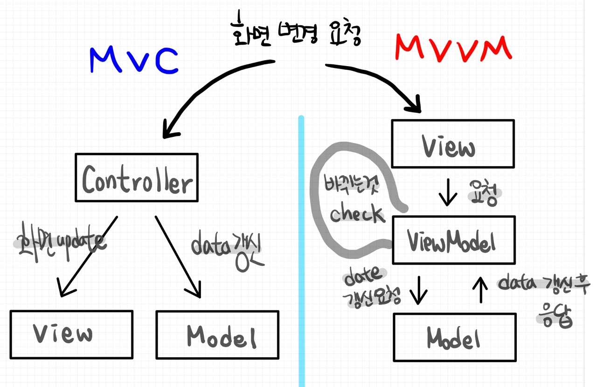

# 📚 <a style="color:#00adb5">Vue.js</a>

 

# 📚 <a style="color:#00adb5">Vue.js</a>

## <a style="color:#00adb5">Vue.js</a> 란

- <a style="color:red"><strong>UI를 빠르게 개발하기 위해서 만들어진 JavaScript Framework ( Progressive Framework )</strong></a>
- <a style="color:red"><strong>MVVM 패턴</strong></a>을 따르며, 어플리케이션 로직과 UI 분리를 위해 설계되었다.
- 다른 Framework ( Angular, React ) 와 비교했을 때 상대적으로 가볍고 빠르다.
- <a style="color:red"><strong>양방향 데이터 바인딩 ( Angular ) 을 동일하게 제공, 그러나 컴포넌트 간 통신은 단방향 데이터 흐름 ( 부모 -> 자식 ) ( React )</strong></a>을 사용

## <a style="color:#00adb5">Vue.js</a> 특징

- Approachable ( 접근성 )
- Versatile ( 유연성 )
- Performant ( 고성능 )

## <a style="color:#00adb5">Vue.js</a> 장점

- 다른 프레임워크와 달리 <big>유연하고 가볍다</big>
- angular.js 와는 달리 기존의 웹 어플리케이션의 <big>일부 UI만 적용하는것도 가능</big>
- SPA ( Single Page Application : 단일 페이지 어플리케이션 ) 구성을 위해 필요한 <big>라우터 기능도 지원</big>
- react.js 와 마찬가지로 가상 DOM을 지원하여 <big>빠른 UI 랜더링이 가능</big>

### <a style="color:#00adb5">React, Angular</a> 의 장점을 가짐

<big>Angular의 양방향 데이터 바인딩 + React의 단방향 데이터 흐름의 장점</big>을 모두 결합한 프레임 워크

- <a style="color:red">양방향 데이터 바인딩</a>
  - 화면에 표시되는 값과 프레임워크의 모델 데이터 값이 동기화 되어 <big>한쪽이 변경되면 다른 한쪽도 자동으로 변경</big>되는 것
- <a style="color:red">단방향 데이터 바인딩</a>
  - 컴포넌트 단방향 통신을 의미하는데 컴포넌트 간 데이터를 전달할 때 항상 <big>상위 컴포넌트에서 하위 컴포넌트 방향으로 전달</big>하게끔 구조화 되어 있는 것을 의미

## <a style="color:#00adb5">MVVM 패턴</a> 이란

 

MVVM ( Model-View-ViewModel ) 은 <a style="color:red"><strong>UI 및 비 UI 코드를 분리하기 위한 UI 아키텍쳐 디자인 패턴</strong></a>이다. 
간단히 말해서 화면 앞단의 화면 동작 관련 로직과 뒷단의 DB 데이터 처리 및 서버 로직을 분리하고, 
뒷단에서 넘어온 데이터를 Model에 담아 View로 넘어가는 중간 지점이라고 보면 된다. 

- <a style="color:red"><strong>Model + View + ViewModel<a style="color:red"><strong>
- <big>Model</big>
  - 순수 자바스크립트의 객체
- <big>View</big>
  - 웹페이지의 DOM ( 리얼 DOM )
- <big>ViewModel</big>
  - 연결, 자동 바인딩, 양방향 통신 가능
  - Listener가 감시하고 있다가 변화가 있으면 작동
  - <a style="color:red"><strong>리얼 DOM을 관리하기 위해 가상 DOM을 만듬<a style="color:red"><strong>

 

기존에는 자바스크립트로 view에 해당하는 DOM에 접근하거나 수정하기 위해 jQuery와 같은 Library를 이용했다. 
Vue는 <a style="color:red"><strong>view와 Model을 연결하고 자동으로 바인딩하므로 양방향 통신을 가능</strong></a>하게 한다.

### <a style="color:#00adb5">MVVM VS MVC</a>

 
