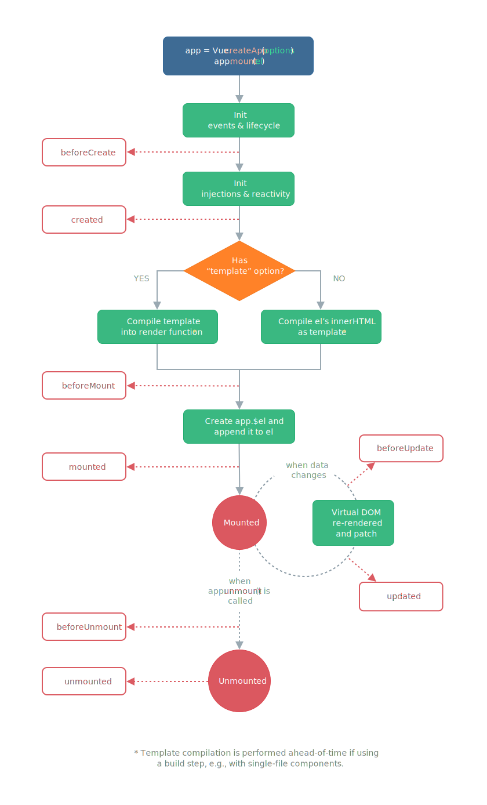

# 📚 <a style="color:#00adb5">Vue.js</a>

 

# 📚 <a style="color:#00adb5">Vue.js</a>

## <a style="color:#00adb5">Vue.js</a> 란
- <a style="color:red"><strong>UI를 빠르게 개발하기 위해서 만들어진 JavaScript Framework ( Progressive Framework )</strong></a>
- <a style="color:red"><strong>MVVM 패턴</strong></a>을 따르며, 어플리케이션 로직과 UI 분리를 위해 설계되었다.
- 다른 Framework ( Angular, React ) 와 비교했을 때 상대적으로 가볍고 빠르다.
- <a style="color:red"><strong>양방향 데이터 바인딩 ( Angular ) 을 동일하게 제공, 그러나 컴포넌트 간 통신은 단방향 데이터 흐름 ( 부모 -> 자식 ) ( React )</strong></a>을 사용

## <a style="color:#00adb5">Vue.js</a> 특징
- Approachable ( 접근성 )
- Versatile ( 유연성 )
- Performant ( 고성능 )

## <a style="color:#00adb5">Vue.js</a> 장점
- 다른 프레임워크와 달리 <big>유연하고 가볍다</big>
- angular.js 와는 달리 기존의 웹 어플리케이션의 <big>일부 UI만 적용하는것도 가능</big>
- SPA ( Single Page Application : 단일 페이지 어플리케이션 ) 구성을 위해 필요한 <big>라우터 기능도 지원</big>
- react.js 와 마찬가지로 가상 DOM을 지원하여 <big>빠른 UI 랜더링이 가능</big>

### <a style="color:#00adb5">React, Angular</a> 의 장점을 가짐
<big>Angular의 양방향 데이터 바인딩 + React의 단방향 데이터 흐름의 장점</big>을 모두 결합한 프레임 워크
- <a style="color:red">양방향 데이터 바인딩</a>
    - 화면에 표시되는 값과 프레임워크의 모델 데이터 값이 동기화 되어 <big>한쪽이 변경되면 다른 한쪽도 자동으로 변경</big>되는 것
- <a style="color:red">단방향 데이터 바인딩</a>
    - 컴포넌트 단방향 통신을 의미하는데 컴포넌트 간 데이터를 전달할 때 항상 <big>상위 컴포넌트에서 하위 컴포넌트 방향으로 전달</big>하게끔 구조화 되어 있는 것을 의미

## <a style="color:#00adb5">MVVM 패턴</a> 이란

 

MVVM ( Model-View-ViewModel ) 은 <a style="color:red"><strong>UI 및 비 UI 코드를 분리하기 위한 UI 아키텍쳐 디자인 패턴</strong></a>이다. 
간단히 말해서 화면 앞단의 화면 동작 관련 로직과 뒷단의 DB 데이터 처리 및 서버 로직을 분리하고, 
뒷단에서 넘어온 데이터를 Model에 담아 View로 넘어가는 중간 지점이라고 보면 된다. 

- <a style="color:red"><strong>Model + View + ViewModel<a style="color:red"><strong>
- <big>Model</big> 
    - 순수 자바스크립트의 객체
- <big>View</big> 
    - 웹페이지의 DOM ( 리얼 DOM )
- <big>ViewModel</big> 
    - 연결, 자동 바인딩, 양방향 통신 가능
    - Listener가 감시하고 있다가 변화가 있으면 작동
    - <a style="color:red"><strong>리얼 DOM을 관리하기 위해 가상 DOM을 만듬<a style="color:red"><strong>

 

기존에는 자바스크립트로 view에 해당하는 DOM에 접근하거나 수정하기 위해 jQuery와 같은 Library를 이용했다. 
Vue는 <a style="color:red"><strong>view와 Model을 연결하고 자동으로 바인딩하므로 양방향 통신을 가능</strong></a>하게 한다.

### <a style="color:#00adb5">MVVM VS MVC</a>

 

## <a style="color:#00adb5">Vue Instance</a>
- <big>el</big>
    - <a style="color:red"><strong>Vue가 적용될 요소 지정</strong></a>
    - CSS Selector or HTML Element
    - 태그에 지정한 ID, 클래스명, 태그명 으로 해당 태그와 Vue Instance를 연결하는 옵션
- <big>data</big>
    - <a style="color:red"><strong>Vue에서 사용되는 정보 저장</strong></a>
    - 객체 또는 함수의 형태
    - key와 value를 지정하는 json 형식
    - 데이터 입력 옵션
- <big>template</big>
    - <a style="color:red"><strong>화면에 표시할 HTML, CSS 등의 마크업 요소를 정의하는 속성</strong></a>
    - 뷰의 데이터 및 기타 속성들도 함께 화면에 그릴 수 있다.
- <big>methods</big>
    - <a style="color:red"><strong>화면 로직 제어와 관계된 method를 정의하는 속성</strong></a>
    - 마우스 클릭 이벤트 처리와 같이 화면의 전반적인 이벤트와 화면 동작과 관련된 로직을 추가
- <big>created</big>
    - <a style="color:red"><strong>뷰 인스턴스가 생성되자 마자 실행할 로직을 정의</strong></a>

## <a style="color:#00adb5">Vue Instance 유효범위</a>
- Vue Instance를 생성하면 <a style="color:red"><strong>HTML의 특정 범위 안에서만 옵션 속성들이 적용</strong></a>
- el 속성과 밀접한 관계가 있다.
- 인스턴스가 화면에 적용되는 과정
    1. 뷰 라이브러리 파일 로딩
    2. 인스턴스 객체 생성 ( 옵션 속성 포함 )
    3. 특정 화면 요소에 인스턴스를 붙임
    4. 인스턴스 내용이 화면 요소로 변환
    5. 변환된 화면 요소를 사용자가 최종 확인

 

 

~~~html

(View)

    <h2>{{message}}</h2>

-> 출력은 " 뷰 생성 " 이 된다.

- 유효범위를 벗어난 경우

<h2>{{message}}</h2>

-> 출력이 {{message}} 로 된다.

~~~

- Vue()로 <big>인스턴스가 생성</big> 되었다. ( new Vue() )
- el 속성이 지정한 화면 요소 ( DOM ) ( #app ) 에 <big>인스턴스가 부착</big>된다.
- el 속성에 인스턴스가 부착된 후 <big>data 속성이 el 속성에 지정한 화면 요소와 그 이하 레벨의 화면 요소에 적용되어 값이 치환</big>된다.

## <a style="color:#00adb5">Vue Instance Life Cycle</a>

 

Vue Instance Life Style을 크게 나누면
- Instance의 <big>생성</big>
- Instance를 화면에 <big>부착</big>
- Instance 내용을 <big>갱신</big>
- Instance <big>제거</big>

<table>
    <tr>
        <td>LifeCycle 속성</td>
        <td>설명</td>
    </tr>
    <tr>
        <td><big>beforeCreate</big></td>
        <td>Vue Instance가 생성되고 각 데이터들의 설정 전에 호출</td>
    </tr>
    <tr>
        <td><big>created</big></td>
        <td>Vue Instance가 생성된 후 데이터들의 설정이 완료된 후 호출 
        Instance가 화면에 부착하기 전이기 때문에 template 속성에 정의된 DOM 요소는 접근 불가 
        서버에 데이터를 요청 ( http 통신 ) 하여 받아오는 로직을 수행하기 좋다
        </td>
    </tr>
    <tr>
        <td><big>beforeMount</big></td>
        <td>마운트가 시작되기 전에 호출</td>
    </tr>
    <tr>
        <td><big>mounted</big></td>
        <td>지정된 element에 Vue Instance 데이터가 마운트 된 후에 호출 
        template 속성에 정의한 화면 요소에 접근할 수 있어 화면 요소를 제어하는 로직 수행
        </td>
    </tr>
    <tr>
        <td><big>beforeUpdate</big></td>
        <td>데이터가 변경될 때 virtual DOM이 랜더링, 패치되기 전에 호출</td>
    </tr>
    <tr>
        <td><big>updated</big></td>
        <td>Vue에서 관리되는 데이터가 변경되어 DOM이 업데이트 된 상태 
        데이터 변경 후 화면 요소 제어와 관련된 로직을 추가</td>
    </tr>
    <tr>
        <td><big>beforeDestroy</big></td>
        <td>Vue Instance가 제거되기 전에 호출</td>
    </tr>
    <tr>
        <td><big>destroyed</big></td>
        <td>Vue Instance가 제거된 후 호출</td>
    </tr>
</table>