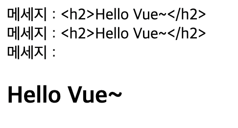
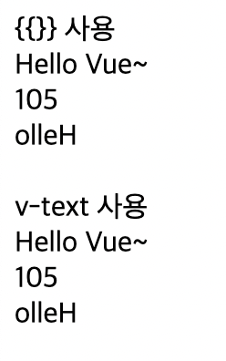

# 📚 <a style="color:#00adb5">Vue.js</a>

<center>

</center>
<br>

# 📚 <a style="color:#00adb5">Template Interpolation</a>

##  <a style="color:#00adb5">Template 문법 - 보간법 ( Interpolation )</a>
- <big>Vue 인스턴스에 있는 데이터</big>를 <big>HTML Template</big>에 표현하기 위해 사용한다.

### 📚 <a style="color:#00adb5">문자열</a>
- 데이터 바인딩의 가장 기본 형태는 <a style="color:red"><strong>"Mustache" 구문 ( 이중 중괄호 )</strong></a>을 사용한 텍스트 보간이다.
    - `{{속성명}}`
- `v-once` 디렉티브를 사용하여 데이터 변경 시 <a style="color:red"><strong>업데이트 되지 않는 일회성 보간</strong></a>을 수행
    - `v-once`
    ```html
    <div id="app">
    <span>메세지 : {{msg}}</span>
    <span v-once>다시는 변경하지 않겠습니다: {{msg}}</span>
    </div>
    
    <script>
        new Vue({
            el: "#app",
            data: {
                msg: 'hello vue~'
            }
        });
    </script>

    // 나중에 콘솔에서 바꿔도 v-once 구문은 바뀌지 않는다
    ```

### 📚 <a style="color:#00adb5">원시 HTML</a>
- 이중 중괄호 ( mustaches ) 는 HTML이 아닌 일반 텍스트로 데이터를 해석
- 실제 HTML을 출력하려면 <a style="color:red"><strong>v-html 디렉티브</strong></a> 사용

```html
<head>
    <meta charset="UTF-8">
    <meta http-equiv="X-UA-Compatible" content="IE=edge">
    <meta name="viewport" content="width=device-width, initial-scale=1.0">
    <title>Document</title>
    <script src="https://cdn.jsdelivr.net/npm/vue/dist/vue.js"></script>
</head>
<body>
    <div id="app">
        <div>메세지 : {{msg}}</div>
        <div v-text="`메세지 : ` + msg">무시된다</div>
        <div v-html="`메세지 : ` + msg">무시된다</div>
    </div>
</body>
<script>
    new Vue({
        el: "#app",
        data:{
            msg: '<h2>Hello Vue~</h2>'
        }
    });
</script>
```

- 출력 화면

<center>

</center>
<br>

### 📚 <a style="color:#00adb5">JavaScript 표현식 사용</a>
- Vue.js는 모든 데이터 바인딩 내에서 <a style="color:red"><strong>JavaScript 표현식</strong></a>의 모든 기능을 지원
- 한가지 제한 사항은 각 바인딩에 하나의 단일 표현식만 포함가능 

```html
<body>
    <div id="app">
        <div>{{}} 사용</div>
        <div>{{msg + ' Vue~'}}</div>
        <div>{{num > 10 ? num*num : num+100}}</div>
        <div>{{msg.split("").reverse().join("")}}</div><br>
        <div>v-text 사용</div>
        <div v-text="msg + ' Vue~'"></div>
        <div v-text="num > 10 ? num * num : num + 100"></div>
        <div v-text="msg.split('').reverse().join('')"></div>
    </div>
</body>
<script>
    new Vue({
        el: "#app",
        data:{
            num: 5,
            msg: 'Hello'
        }
    });
</script>
```

- 출력 화면

<center>

</center>
<br>

##  <a style="color:#00adb5">Template 문법 - 디렉티브 ( Directive )</a>
- 디렉티브는 `v-` 접두사가 있는 특수 속성
- 디렉티브 속성 값은 단일 JavaScript 표현식이 된다. ( v-for는 제외 )
- 디렉티브의 역할은 표현식의 값이 변경될 때 사이드 이펙트를 반응적으로 DOM에 적용

- <big><strong>v-model</strong></big>
    - <a style="color:red"><strong>양방향 바인딩 처리</strong></a>를 위해서 사용 ( form의 input, textarea )


- <big><strong>v-bind</strong></big>
    - <a style="color:red"><strong>엘리먼트의 속성과 바인딩 처리</strong></a>를 위해서 사용
    - v-bind는 약어로 <big>":"</big>로 사용 가능


- <big><strong>v-show</strong></big>
    - <a style="color:red"><strong>조건에 따라 엘리먼트를 화면에 렌더링</strong></a>
    - style의 display를 변경


- <big><strong>v-if, v-else-if, v-else</strong></big>
    - <a style="color:red"><strong>조건에 따라 엘리먼트를 화면에 렌더링</strong></a>

- <big><strong>v-show 와 v-if 의 차이점</strong></big>

<table width="100%">
    <tr>
        <td>  </td>
        <td>v-if</td>
        <td>v-show</td>
    </tr>
    <tr>
        <td>렌더링</td>
        <td>false일 경우 X</td>
        <td>항상 O</td>
    </tr>
    <tr>
        <td>false일 경우</td>
        <td>엘리먼트 삭제</td>
        <td>display:none 적용</td>
    </tr>
    <tr>
        <td>template 지원</td>
        <td>O</td>
        <td>X</td>
    </tr>
    <tr>
        <td>v-else</td>
        <td>O</td>
        <td>X</td>
    </tr>
</table>

- <big><strong>v-for</strong></big>
    - <a style="color:red"><strong>배열이나 객체의 반복에 사용</strong></a>
    - `v-for="요소변수이름 in 배열" v-for="(요소변수이름, 인덱스) in 배열"`

- <big><strong>template</strong></big>
    - <a style="color:red"><strong>여러 개의 태그들을 묶어서 처리</strong></a>해야 할 경우 template를 사용
    - v-if, v-for, component등과 함께 많이 사용

- <big><strong>v-cloak</strong></big>
    - <a style="color:red"><strong>Vue Instance가 준비될 때 까지 mustache 바인딩을 숨기는데</strong></a> 사용
    - `[v-cloak]{display:none}` 과 같은 CSS 규칙과 함께 사용
    - Vue Instance가 준비되면 v-cloak은 제거됨

- <big><strong>Vue Method</strong></big>    
    - Vue Instance는 생성과 관련된 <a style="color:red"><strong>data 및 method의 정의</strong></a> 가능
    - method안에서 data를 `"this.데이터이름"` 으로 접근 가능