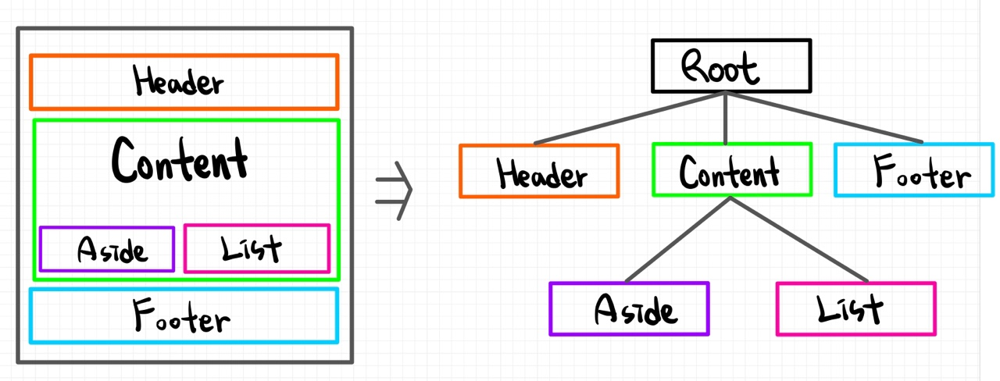
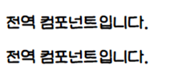
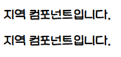
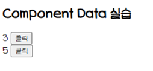
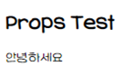
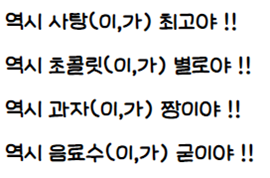
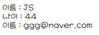
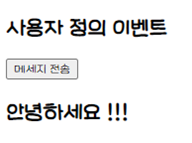
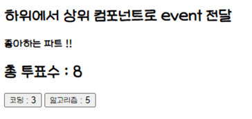

# 📚 <a style="color:#00adb5">Vue.js</a>

<center>

</center>
<br>

# 📚 <a style="color:#00adb5">Vue.js Component</a>

## <a style="color:#00adb5">Vue Component</a>

- Vue의 가장 강력한 기능 중 하나
- <a style="color:red"><strong>HTML Element를 확장하여 재사용 가능한 코드를 캡슐화</strong></a>
- Vue의 컴파일러에 의해 동작이 추가된 사용자 지정 엘리먼트
- Vue Component는 Vue Instance이기도 하기 때문에 모든 옵션 객체를 사용
- Life Cycle Hook 사용 가능
- 전역 컴포넌트와 지역 컴포넌트

<br>
<center>

</center>
<br>

## <a style="color:#00adb5">전역 Component</a>

- 전역 컴포넌트를 등록하려면 <a style="color:red"><strong>Vue.component( tagName, options ) 을 사용한다.</strong></a><br>
- 권장하는 컴포넌트 이름은 <big>케밥 표기법</big>이다 ( 전부 소문자, - )
- <big>component</big>

### <a style="color:#00adb5">전역 Component 예시</a>

```html
<div id="app">
  <my-global></my-global>
  <my-global></my-global>
</div>

<script>
  Vue.component("MyGlobal", {
    template: `<h2>전역 컴포넌트입니다.</h2>`,
  });
  new Vue({
    el: "#app",
  });
</script>
```

- 출력결과

<br>
<center>

</center>
<br>

## <a style="color:#00adb5">지역 Component</a>

- 컴포넌트를 <a style="color:red"><strong>components</strong></a> 인스턴스 옵션으로 등록함으로써 다른 인스턴스/컴포넌트의 범위에서만 사용할 수 있는 컴포넌트
- <big>components</big>

### <a style="color:#00adb5">지역 Component 예시</a>

```html
<div id="app">
  <my-local></my-local>
  <my-local></my-local>
</div>
<div id="app2">
  <my-local></my-local>
  <my-local></my-local>
</div>

<script>
  new Vue({
    el: "#app",
    components: {
      "my-local": {
        template: `<h2>지역 컴포넌트입니다.</h2>`,
      },
    },
  });

  new Vue({
    el: "#app2",
  });
</script>
```

<br>
'app' 에서 component를 등록했기 때문에 'app2'에서는 component가 출력되지 않는 것을 볼 수 있다.<br>

- 출력결과

<br>
<center>

</center>
<br>

## <a style="color:#00adb5">Data는 반드시 함수여야 한다</a>

- <big>Data</big>는 <a style="color:red"><strong>컴포넌트 인스턴스의 함수</strong></a>여야한다.
- 밑에 예제는 버튼을 클릭하면 숫자가 하나씩 증가하는 것이다.

```html
<h2>Component Data 실습</h2>
<div id="counter">
  <number-counter></number-counter>
  <number-counter></number-counter>
</div>
<template id="btn">
  <div>
    <span>{{ count }}</span>
    <button @click="count++">클릭</button>
  </div>
</template>

<script>
  Vue.component("NumberCounter", {
    template: "#btn",
    data() {
      return {
        count: 0,
      };
    },
  });
  new Vue({
    el: "#counter",
  });
</script>
```

- 출력결과

<br>
<center>

</center>
<br>

## <a style="color:#00adb5">Vue Component간 통신</a>

- 상위 ( 부모 ) <-> 하위 ( 자식 ) 컴포넌트 간의 data 전달 방법
- <big>부모에서 자식</big>
  - <a style="color:red"><strong>props</strong></a>라는 특별한 속성을 전달 ( Pass Props )
- <big>자식에서 부모</big>
  - <a style="color:red"><strong>event</strong></a>로만 전달 가능 ( Emit Event )

## <a style="color:#00adb5">상위 컴포넌트에서 하위 컴포넌트로 data 전달</a>

- 하위 컴포넌트는 상위 컴포넌트 값을 <big>직접 참조 불가능</big>
- data와 마찬가지로 props 속성의 값을 template에서 사용 가능

### <a style="color:#00adb5">props</a>

```html
<h2>Props Test</h2>
<div id="app">
  <child-component propsdata="안녕하세요"></child-component>
</div>

<script>
  // 하위 컴포넌트
  Vue.component("ChildComponent", {
    props: ["propsdata"],
    template: `<span>{{propsdata}}</span>`,
  });
  // 상위 컴포넌트
  new Vue({
    el: "#app",
  });
</script>
```

<br>

- 출력결과

<br>
<center>

</center>
<br>

- 랜더링 과정
  1. new Vue()로 상위 컴포넌트인 인스턴스를 하나 생성
  2. Vue.component()를 이용하여 하위 컴포넌트인 ChildComponent를 생성
  3. `<div id="app">` 내부에 `<child-component>` 가 있기 때문에 하위 컴포넌트가 된다. 처음 생성한 인스턴스 객체 ( Vue ) 가 #app의 요소를 가지기 때문에 부모와 자식 관계가 성립한다.
  4. 하위 컴포넌트에 props 속성을 정의 `['propsdata']`
  5. html에 컴포넌트 태그(child-component)를 추가한다.
  6. 하위 컴포넌트에 v-bind 속성을 사용하면 상위 컴포넌트의 data의 key에 접근이 가능하다. ( message ) - 그냥 문자열이면 : 사용 x, 객체를 사용하면 : 사용
  7. 상위 컴포넌트의 message 속성 값인 String 값이 하위 컴포넌트의 propsdata로 전달된다.
  8. 하위 컴포넌트의 template 속성에 정의된 `<span>{{propsdata}}\</span>`에게 전달된다.

### <a style="color:#00adb5">동적 props</a>

- v-bind를 사용하여 부모의 데이터에 <a style="color:red"><strong>props</strong></a>를 동적으로 바인딩 할 수 있다.
- 데이터가 상위에서 업데이트 될 때마다 하위 데이터로도 전달된다.
- v-bind에 대한 단축 구문을 사용하는 것이 더 간단하다.

```html
v-bind
<child v-bind:my-message="parentMsg"></child>

단축 구문
<child :my-message="parentMsg"></child>
```

<hr>

- <big>동적 props</big>

```html
<div id="app">
  <child-component
    v-for="(food , i) in foods"
    :key="i"
    :foods="food"
    :msg="msg[i]"
  ></child-component>
</div>

<script>
  Vue.component("ChildComponent", {
    props: ["foods", "msg"],
    template: `<h2>역시 {{ foods }}(이,가) {{ msg }} !! </h2>`,
  });

  new Vue({
    el: "#app",
    data() {
      return {
        foods: ["사탕", "초콜릿", "과자", "음료수"],
        msg: ["최고야", "별로야", "짱이야", "굳이야"],
      };
    },
  });
</script>
```

- 출력결과

<br>
<center>

</center>
<br>

<hr>

- <big>객체의 속성 전달 props</big>
  - 오브젝트의 모든 속성을 전달 할 경우, v-bind:prop-name 대신 v-bind만 작성함으로써 모든 속성을 prop으로 전달할 수 있다.

```javascript
post{
  id: 1,
  title: 'hello'
}
<blog-post v-bind="post"></blog-post>

// 위 코드는 아래와 같이 동작
<blog-post
  v-bind:id="post.id"
  v-bind:title="post.title"></blog-post>
```

- 객체의 속성 전달 props

```html
<div id="app">
  <member-view
    :member="{name: 'JS', age: '44', email: 'ggg@naver.com'}"
  ></member-view>
</div>

<script>
  Vue.component("MemberView", {
    props: ["member"],
    template: `<div>
                <div>이름 : {{ member.name }}</div>
                <div>나이 : {{ member.age }}</div>
                <div>이름 : {{ member.email }}</div>
                </div>`,
  });
  new Vue({
    el: "#app",
  });
</script>
```

- 출력결과

<br>
<center>

</center>
<br>

## <a style="color:#00adb5">사용자 정의 이벤트 ( Custom Events )</a>

- 이벤트 이름
  - 컴포넌트 및 props와는 달리, 이벤트는 자동 대소문자 변환을 제공하지 않는다.
  - 대소문자를 혼용하는 대신에 emit할 <big>정확한 이벤트 이름</big>을 작성하는 것을 권장
  - v-on이벤트 리스너는 항상 <big>자동으로 소문자 변환</big>된다.
  - 이벤트 이름은 kebab-case ( 소문자, - 사용 ) 를 사용하는 것이 권장

```html
<h2>사용자 정의 이벤트</h2>
<div id="app">
  <button v-on:click="doAction">메세지 전송</button>
  <h2>{{msg}}</h2>
</div>

<script>
  new Vue({
    el: "#app",
    data() {
      return {
        msg: "",
      };
    },
    methods: {
      doAction() {
        // 여기서 this 는 Vue, $는 숨겨져있는 것이다. 여기에 emit이 있다.
        // 이것이 이벤트를 프로그래밍 방식으로 발생
        // 두번째 값을 인자로 전달한다. 여러개 가능
        this.$emit("sendMsg", "안녕하세요 !!!");
      },
    },
    crated() {
      // emit에 대한 반응, 미리 받을 준비를 하고 있어야 한다 ( created )
      // emit 이랑 on 이랑 변수가 짝짝꿍이다
      // msg == '안녕하세요 !!!'
      this.$on("sendMsg", (msg) => {
        this.msg = msg;
      });
    },
  });
</script>
```

- 출력결과

<br>
<center>

</center>
<br>

## <a style="color:#00adb5">하위에서 상위 컴포넌트로 event 전달</a>

- 하위 컴포넌트에서 상위 컴포넌트가 <a style="color:red"><strong>지정한 이벤트를 발생 ( $emit )</strong></a>
  - 이벤트 발생
  - <a style="color:red"><strong>this.$emit("이벤트명");</strong></a>
- 상위 컴포넌트는 하위 컴포넌트가 발생한 <a style="color:red"><strong>이벤트를 수신 ( on )하여 data 처리</strong></a>
  - 이벤트 수신
  - <a style="color:red"><strong>\<child v-on:이벤트명="상위 컴포넌트 메서드명">\</child></strong></a>
- 하위에서 상위로 data 전달은 공식적으로 Vue.js 는 다루지 않는다. ( 단방향 통신에 어긋나므로 ). 그러나 Event Bus를 통해서 이벤트 인자로 data를 전달하는 방법이 있다.

```html
<h2>하위에서 상위 컴포넌트로 event 전달</h2>

<div id="app">
  <h4>좋아하는 파트 !!</h4>
  <h2>총 투표수 : {{ total }}</h2>
  <subject v-on:addtotcount="addTotalCount" title="코딩"></subject>
  <subject v-on:addtotcount="addTotalCount" title="알고리즘"></subject>
</div>

<script>
  Vue.component("Subject", {
    template: `<button v-on:click="addCount">{{ title }} : {{ count }}</button>`,
    props: ["title"],
    data: function () {
      return {
        count: 0,
      };
    },
    methods: {
      addCount: function () {
        this.count += 1;
        // 부모 v-on:이름에 해당하는 이름의 이벤트를 호출
        this.$emit("addtotcount");
      },
    },
  });
  new Vue({
    el: "#app",
    data: {
      total: 0,
    },
    methods: {
      addTotalCount: function () {
        this.total += 1;
      },
    },
  });
</script>
```

- 출력결과

<br>
<center>

</center>
<br>
