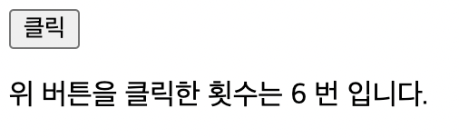
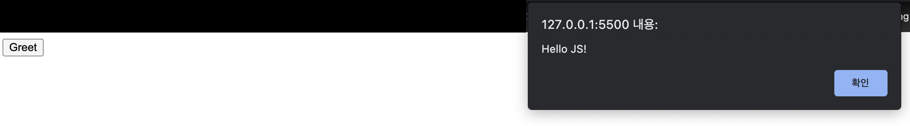
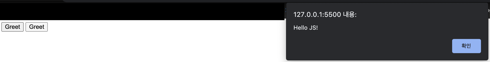
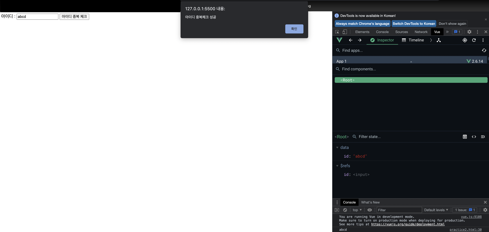
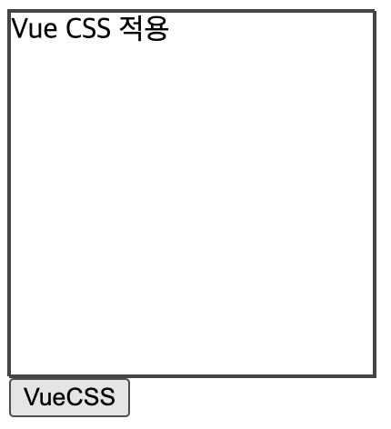
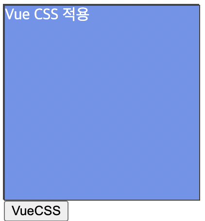

# 📚 <a style="color:#00adb5">Vue.js</a>

<center>

</center>
<br>

# 📚 <a style="color:#00adb5">Vue.js Event</a>

## <a style="color:#00adb5">Vue Event</a> 란
- DOM <a style="color:red"><strong>Event를 청취하기 위해</strong></a> `v-on` directive 사용
- inline event handling
- method를 이용한 event handling

## <a style="color:#00adb5">v-on</a>
- `v-on` directive를 사용하여 <a style="color:red"><strong>DOM 이벤트를 듣고 트리거 될 때 JavaScript를 실행</strong></a>할 수 있다.

<br>

- <big>실습</big>

```html
<div id="app">
        <button v-on:click="cnt += 1">클릭</button>
        <p>위 버튼을 클릭한 횟수는 {{ cnt }} 번 입니다.</p>
    </div>

    <script>
        new Vue({
            el: "#app",
            data: {
                cnt: 0,
            },
        });
    </script>
```

- <big>실행 결과</big>

<center>

</center>
<br>

## <a style="color:#00adb5">method event handler</a>
- 이벤트 발생시 처리 로직을 v-on에 넣기 힘들다. 이 때문에 v-on에서는 이벤트 발생시 처리해야 하는 <a style="color:red"><strong>method를 받아 처리</strong></a>

<br>

- <big>실습</big>

```html
<div id="app">
        <button v-on:click="greet">Greet</button>
    </div>

    <script>
        new Vue({
            el: "#app",
            data: {
                name: 'JS',
            },
            methods:{
                greet(){
                    alert('Hello ' + this.name + '!');
                }
            }
        })
    </script>
```

- <big>실행 결과</big>

<center>

</center>
<br>

## <a style="color:#00adb5">inline method handler</a>
- 메소드 이름을 직접 바인딩 하는 대신 <a style="color:red"><strong>인라인 JavaScript 구문에 메서드를 사용할 수도 있다.</strong></a>
- 원본 DOM 이벤트에 엑세스 해야 하는 경우 특별한 $event 변수를 사용해 메서드에 전달할 수도 있다.

<br>

- <big>실습</big>

```html
<div id="app">
        <button v-on:click="greet1('JS')">Greet</button>
        <button v-on:click="greet2($event, 'JJS')">Greet</button>
    </div>

    <script>
        new Vue({
            el: "#app",
            methods:{
                greet1(msg){
                    alert('Hello ' + msg + '!');
                },
                greet2(e, msg){
                    if(e) e.preventDefault();
                    alert('Hello ' + msg + '!');
                }
            }
        })
    </script>
```

- <big>실행 결과</big>

<center>

</center>
<br>

## <a style="color:#00adb5">이벤트 수식어 ( Event Modifier )</a>
- 위의 예제 처럼 method내에서 작업을 할 수 있지만, method는 DOM의 이벤트를 처리하는 것보다 data 처리를 위한 로직만 작업하는 것이 좋다.
- 이 문제를 해결하기 위해, Vue는 <a style="color:red"><strong>v-on 이벤트에 이벤트 수식어</strong></a>를 제공한다.
- 수식어는 점으로 표시된 점미사이다.

```html
<!-- 클릭 이벤트 전파가 중단됩니다. -->
<a v-on:click.stop="doThis"></a>

<!-- 제출 이벤트가 페이지를 다시 로드 하지 않습니다. -->
<form v-on:submit.prevent="onSubmit"></a>

<!-- 수식어는 체이닝 가능합니다. -->
<a v-on:click.stop.prevent="doThat"></a>

<!-- 단순히 수식어만 사용할 수 있습니다. -->
<form v-on:submit.prevent></form>
```


## <a style="color:#00adb5">키 수식어 ( Key Modifier )</a>
- Vue는 키 이벤트를 수신할 때 v-on에 대한 <a style="color:red"><strong>키 수식어를 추가</strong></a>할 수 있다.

```html
<input v-on:keyup.enter="submit">
```

- keycode

```html
.enter (.13)
.tab
.delete ("Delete" 와 "Backspace" 키 모두를 캡처합니다 )
.esc
.space
.up
.down
.left
.right
```


## <a style="color:#00adb5">ref, $refs</a>
- 뷰에서는 `$refs` 속성을 이용해 DOM에 접근할 수 있다.
- 단, 뷰의 가장 중요한 목적 중 하나는 개발자가 DOM을 다루지 않게 하는 것이므로, 되도록 <a style="color:red"><strong>ref를 사용하는 것을 피하는 것이 좋다.</strong></a>

<br>
- <big>실습</big>

```html
<div id="app">
        아이디 : <input type="text" v-model="id" ref="id"/>
        <button @click="search">아이디 중복 체크</button>
    </div>

    <script>
        new Vue({
            el: "#app",
            data: {
                id: '',
            },
            methods: {
                search(){
                    if(this.id.length==0){
                        alert('아이디를 입력하시오 ! ');
                        // 다시 입력창에 커서 가짐
                        this.$refs.id.focus();
                        return;
                    }
                    console.log(this.$refs.id.value);
                    alert('아이디 중복체크 성공');
                },
            },
        });
    </script>
```

- <big>실행 결과</big>

<center>

</center>
<br>


## <a style="color:#00adb5">CSS class binding</a>
- <a style="color:red"><strong>element의 class와 style을 변경</strong></a>
- `v-bind:class`는 조건에 따라 class를 적용할 수 있다.


<br>
- <big><a style="color:red">class</a> 실습</big>

```html
<div id="app">
        <div v-bind:class="{ active: isActive }">Vue CSS 적용</div>
        <button v-on:click="toggle">VueCSS</button>
    </div>

    <script>
        new Vue({
            el: "#app",
            data: {
                isActive: false,
            },
            methods: {
                toggle: function(todo){
                    this.isActive = !this.isActive;
                },
            },
        });
    </script>

    <style>
        .active{
            background: rgb(106, 148, 238);
            color: white;
        }
        div{
            width: 200px;
            height: 200px;
            border:1px solid #444;
        }
    </style>
```

- <big>실행 결과</big>

<center>

</center>
<center>

</center>
<br>


<br>
- <big><a style="color:red">style</a> 실습</big>

```html
<div id="app">
        <ul>
            <li :class="{completed: todo.done}" :style="myStyle" v-for="todo in todos">
                {{todo.msg}} <button @click="complete(todo)" class="btn">완료</button>
            </li>
        </ul>
    </div>

    <script>
        new Vue({
            el: '#app',
            data:{
                todos: [
                    {
                        msg: '5시간 잠자기',
                        done: false,
                    },
                    {
                        msg: '알고리즘 1시간 공부하기',
                        done: false,
                    },
                    {
                        msg: 'Vue 1시간 공부하기',
                        done: false,
                    },
                ],
                myStyle: {
                    fontSize: '25px',
                },
            },
            methods : {
                complete(todo){
                    todo.done = !todo.done;
                }
            }
        })
    </script>

    <style>
        .completed{
            text-decoration: line-through;
            font-size: italic;
        }
    </style>
```

- <big>실행 결과</big>

<center>

</center>
<br>
