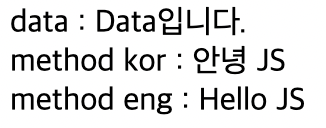
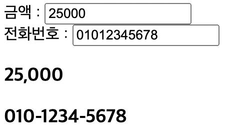
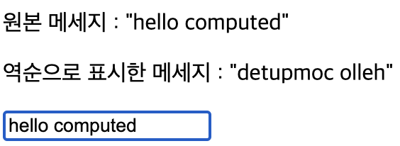
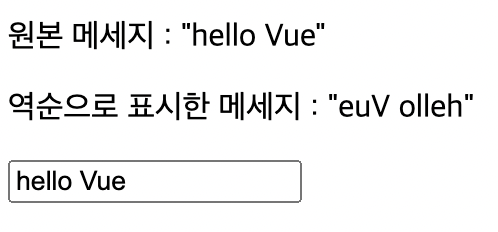

# 📚 <a style="color:#00adb5">Vue.js</a>

<center>

</center>
<br>

# 📚 <a style="color:#00adb5">Vue.js Instance</a>

## <a style="color:#00adb5">Vue Instance</a>

- <big>el</big>
  - <a style="color:red"><strong>Vue가 적용될 요소 지정</strong></a>
  - CSS Selector or HTML Element
  - 태그에 지정한 ID, 클래스명, 태그명 으로 해당 태그와 Vue Instance를 연결하는 옵션
- <big>data</big>
  - <a style="color:red"><strong>Vue에서 사용되는 정보 저장</strong></a>
  - 객체 또는 함수의 형태
  - key와 value를 지정하는 json 형식
  - 데이터 입력 옵션
- <big>template</big>
  - <a style="color:red"><strong>화면에 표시할 HTML, CSS 등의 마크업 요소를 정의하는 속성</strong></a>
  - 뷰의 데이터 및 기타 속성들도 함께 화면에 그릴 수 있다.
- <big>methods</big>
  - <a style="color:red"><strong>화면 로직 제어와 관계된 method를 정의하는 속성</strong></a>
  - 마우스 클릭 이벤트 처리와 같이 화면의 전반적인 이벤트와 화면 동작과 관련된 로직을 추가
- <big>created</big>
  - <a style="color:red"><strong>뷰 인스턴스가 생성되자 마자 실행할 로직을 정의</strong></a>

## <a style="color:#00adb5">Vue Instance 유효범위</a>

- Vue Instance를 생성하면 <a style="color:red"><strong>HTML의 특정 범위 안에서만 옵션 속성들이 적용</strong></a>
- el 속성과 밀접한 관계가 있다.
- 인스턴스가 화면에 적용되는 과정
  1. 뷰 라이브러리 파일 로딩
  2. 인스턴스 객체 생성 ( 옵션 속성 포함 )
  3. 특정 화면 요소에 인스턴스를 붙임
  4. 인스턴스 내용이 화면 요소로 변환
  5. 변환된 화면 요소를 사용자가 최종 확인

<br>
<hr>
<br>

```html
(View)

<div id="app">
  <h2>{{message}}</h2>
</div>

<script>

  (Model)

  var model = {
      message : " 뷰 생성 "
  }

  (View Model)

  new Vue({
      el : '#app',
      data : model
  })
</script>

-> 출력은 " 뷰 생성 " 이 된다. - 유효범위를 벗어난 경우

<div id="app"></div>
<h2>{{message}}</h2>

<script>
  var model = {
    message: " 뷰 생성 ",
  };

  new Vue({
    el: "#app",
    data: model,
  });
</script>

-> 출력이 {{message}} 로 된다.
```

- Vue()로 <big>인스턴스가 생성</big> 되었다. ( new Vue() )
- el 속성이 지정한 화면 요소 ( DOM ) ( #app ) 에 <big>인스턴스가 부착</big>된다.
- el 속성에 인스턴스가 부착된 후 <big>data 속성이 el 속성에 지정한 화면 요소와 그 이하 레벨의 화면 요소에 적용되어 값이 치환</big>된다.

## <a style="color:#00adb5">Vue Instance Life Cycle</a>

<center>

</center>
<br>

Vue Instance Life Style을 크게 나누면

- Instance의 <big>생성</big>
- Instance를 화면에 <big>부착</big>
- Instance 내용을 <big>갱신</big>
- Instance <big>제거</big>

<table>
    <tr>
        <td>LifeCycle 속성</td>
        <td>설명</td>
    </tr>
    <tr>
        <td><big>beforeCreate</big></td>
        <td>Vue Instance가 생성되고 각 데이터들의 설정 전에 호출</td>
    </tr>
    <tr>
        <td><big>created</big></td>
        <td>Vue Instance가 생성된 후 데이터들의 설정이 완료된 후 호출<br>
        Instance가 화면에 부착하기 전이기 때문에 template 속성에 정의된 DOM 요소는 접근 불가<br>
        서버에 데이터를 요청 ( http 통신 ) 하여 받아오는 로직을 수행하기 좋다
        </td>
    </tr>
    <tr>
        <td><big>beforeMount</big></td>
        <td>마운트가 시작되기 전에 호출</td>
    </tr>
    <tr>
        <td><big>mounted</big></td>
        <td>지정된 element에 Vue Instance 데이터가 마운트 된 후에 호출<br>
        template 속성에 정의한 화면 요소에 접근할 수 있어 화면 요소를 제어하는 로직 수행
        </td>
    </tr>
    <tr>
        <td><big>beforeUpdate</big></td>
        <td>데이터가 변경될 때 virtual DOM이 랜더링, 패치되기 전에 호출</td>
    </tr>
    <tr>
        <td><big>updated</big></td>
        <td>Vue에서 관리되는 데이터가 변경되어 DOM이 업데이트 된 상태<br>
        데이터 변경 후 화면 요소 제어와 관련된 로직을 추가</td>
    </tr>
    <tr>
        <td><big>beforeDestroy</big></td>
        <td>Vue Instance가 제거되기 전에 호출</td>
    </tr>
    <tr>
        <td><big>destroyed</big></td>
        <td>Vue Instance가 제거된 후 호출</td>
    </tr>
</table>

## <a style="color:#00adb5">Vue Instance 속성</a>

### <a style="color:#00adb5">Vue Method</a>
- Vue Instance는 생성과 관련된 <a style="color:red"><strong>data 및 method의 정의 가능</strong></a>
- method안에서 data를 `this.데이터이름` 으로 접근 가능

- <big>실습</big>

```html
<body>
    <div id="app">
        <div>data : {{msg}}</div>
        <div>method kor : {{helloKor()}}</div>
        <div>method eng : {{helloEng()}}</div>
    </div>
</body>
<script>
    new Vue({
        el: "#app",
        data: {
            name: 'JS',
            msg: 'Data입니다.',
        },
        methods: {
            helloKor(){
                return "안녕 " + this.name;
            },
            helloEng(){
                return "Hello " + this.name;
            }
        }
    })
</script>
```

- <big>실행 결과</big>

<center>

</center>
<br>

### <a style="color:#00adb5">Vue filter</a>
- 뷰의 필터는 <a style="color:red"><strong>화면에 표시되는 텍스트의 형식을 쉽게 변환</strong></a>해주는 기능
- filter를 이용하여 표현식에 새로운 결과 형식을 적용
- 중괄호 보간법 [{{}}] 또는 v-bind 속성에서 사용이 가능

```html
<!-- 중괄호 보간법 -->
{{ message | capitalize }}

<!-- v-bind -->
<div v-bind:id="rawId | formatId"></div>
```

- <big>전역 필터</big>

```js
Vue.filter(
  'count1', (val) => {
    if(val.length == 0){
      return;
    }
    return `${val} : ${val.length}자`;
  }
)
```

- <big>지역 필터</big>

```js
new Vue({
  el: "#app",
  filters: {
    count1(val, alternative){
      if(val.length == 0){
        return alternative;
      }
      return `${val} : ${val.length}자`;
    }
  }
})
```

- <big>실습</big>
금액은 천 단위마다 ',' 찍기<br>
번호는 사이에 '-' 넣기<br>

```html
<body>
    <div id="app">
       <div>
           금액 : <input type="text" v-model="msg1"><br>
           전화번호 : <input type="text" v-model="msg2">
       </div>
       <div>
           <h3>{{msg1 | price}}</h3>
           <h3>{{msg2 | mobile}}</h3>
       </div>
    </div>
</body>
<script>
    Vue.filter('price', (value) => {
        if(!value) return value;
        return value.toString().replace(/\B(?=(\d{3})+(?!\d))/g, ',');
    });
    Vue.filter('mobile', (value) => {
        if(!value || !(value.length === 10 || value.length === 11)) return value;
        return value.replace(/^(\d{3})(\d{3,4})(\d{4})/g, '$1-$2-$3');
    });
    new Vue({
        el: "#app", 
        data: {
            msg1: '', msg2: '',
        },
    });
</script>
```

- <big>실행 결과</big>

<center>

</center>
<br>

### <a style="color:#00adb5">Vue computed</a>
- 특정 데이터의 <a style="color:red"><strong>변경사항을 실시간으로 처리</strong></a>
- <a style="color:red"><strong>캐싱을 이용</strong></a>하여 데이터의 변경이 없을 경우 캐싱된 데이터를 반환 >> 값
- Setter와 Getter를 직접 지정할 수 있음
- 작성은 method 형태로 작성하지만 Vue에서 proxy 처리하여 property 처럼 사용
- 종속 대상을 따라 저장(캐싱) 된다는 것이다.
- watch 보다는 computed를 권장한다

- <big>실습</big>

```html
<body>
    <div id="app">
        <p>원본 메세지 : "{{ msg }}"</p>
        <p>역순으로 표시한 메세지 : "{{ reverseMsg }}"</p>
        <input type="text" v-model="msg">
    </div>
</body>
<script>
   new Vue({
       el: "#app",
       data: {
           msg: '',
       },
       computed: {
           reverseMsg: function(){
               return this.msg.split('').reverse('').join('');
           },
       },
   });
</script>
```

- <big>실행 결과</big>

<center>

</center>
<br>

### <a style="color:#00adb5">Vue computed VS Vue method</a>

computed 속성은 Vue 인스턴스가 생성될 때, <a style="color:red"><strong>값을 받아 계산하여 저장해 놓는다. ( 캐싱 )</strong></a><br>
결과적으로 3번 출력되는 경우 <big>한 번</big> 실행하는 것과 같다.
<br><br>
method 는 <a style="color:red"><strong>출력될 때 마다 계산</strong></a>한다.<br>
겷과적으로 3번 출력되는 경우 <big>세 번</big> 실행하는 것과 같다.


### <a style="color:#00adb5">Vue watch</a>
- Vue Instance의 <a style="color:red"><strong>특정 property 가 변경될 때 실행할 콜백 함수 설정</strong></a>
- <big>Computed</big>는 종속된 data가 변경되었을 경우 <big>그 data를 다시 계산하여 캐싱</big>한다.
- <big>Watch</big>의 경우는 data가 변경되었을 경우 <big>다른 data를 ( 변경하는 ) 작업</big>을 한다.

- <big>실습</big>

```html
<body>
    <div id="app">
        <p>원본 메세지 : "{{ msg }}"</p>
        <p>역순으로 표시한 메세지 : "{{ reverseMsg }}"</p>
        <input type="text" v-model="msg">
    </div>
</body>
<script>
   new Vue({
       el: "#app",
       data: {
           msg: '',
           reverseMsg: '',
       },
       watch: {
           msg: function(newVal, oldVal){
               this.reverseMsg = newVal.split('').reverse('').join('');
           },
       },
   });
</script>
```

- <big>실행 결과</big>

<center>

</center>
<br>