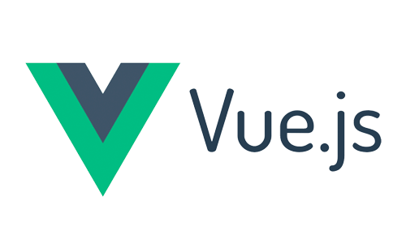

# 📚 <a style="color:#00adb5">Vue.js</a>

<center>

</center>
<br>

# 📚 <a style="color:#00adb5">Vue.js Instance</a>

## <a style="color:#00adb5">Vue Instance</a>

- <big>el</big>
  - <a style="color:red"><strong>Vue가 적용될 요소 지정</strong></a>
  - CSS Selector or HTML Element
  - 태그에 지정한 ID, 클래스명, 태그명 으로 해당 태그와 Vue Instance를 연결하는 옵션
- <big>data</big>
  - <a style="color:red"><strong>Vue에서 사용되는 정보 저장</strong></a>
  - 객체 또는 함수의 형태
  - key와 value를 지정하는 json 형식
  - 데이터 입력 옵션
- <big>template</big>
  - <a style="color:red"><strong>화면에 표시할 HTML, CSS 등의 마크업 요소를 정의하는 속성</strong></a>
  - 뷰의 데이터 및 기타 속성들도 함께 화면에 그릴 수 있다.
- <big>methods</big>
  - <a style="color:red"><strong>화면 로직 제어와 관계된 method를 정의하는 속성</strong></a>
  - 마우스 클릭 이벤트 처리와 같이 화면의 전반적인 이벤트와 화면 동작과 관련된 로직을 추가
- <big>created</big>
  - <a style="color:red"><strong>뷰 인스턴스가 생성되자 마자 실행할 로직을 정의</strong></a>

## <a style="color:#00adb5">Vue Instance 유효범위</a>

- Vue Instance를 생성하면 <a style="color:red"><strong>HTML의 특정 범위 안에서만 옵션 속성들이 적용</strong></a>
- el 속성과 밀접한 관계가 있다.
- 인스턴스가 화면에 적용되는 과정
  1. 뷰 라이브러리 파일 로딩
  2. 인스턴스 객체 생성 ( 옵션 속성 포함 )
  3. 특정 화면 요소에 인스턴스를 붙임
  4. 인스턴스 내용이 화면 요소로 변환
  5. 변환된 화면 요소를 사용자가 최종 확인

<br>
<hr>
<br>

```html
(View)

<div id="app">
  <h2>{{message}}</h2>
</div>

<script>

  (Model)

  var model = {
      message : " 뷰 생성 "
  }

  (View Model)

  new Vue({
      el : '#app',
      data : model
  })
</script>

-> 출력은 " 뷰 생성 " 이 된다. - 유효범위를 벗어난 경우

<div id="app"></div>
<h2>{{message}}</h2>

<script>
  var model = {
    message: " 뷰 생성 ",
  };

  new Vue({
    el: "#app",
    data: model,
  });
</script>

-> 출력이 {{message}} 로 된다.
```

- Vue()로 <big>인스턴스가 생성</big> 되었다. ( new Vue() )
- el 속성이 지정한 화면 요소 ( DOM ) ( #app ) 에 <big>인스턴스가 부착</big>된다.
- el 속성에 인스턴스가 부착된 후 <big>data 속성이 el 속성에 지정한 화면 요소와 그 이하 레벨의 화면 요소에 적용되어 값이 치환</big>된다.

## <a style="color:#00adb5">Vue Instance Life Cycle</a>

<center>

</center>
<br>

Vue Instance Life Style을 크게 나누면

- Instance의 <big>생성</big>
- Instance를 화면에 <big>부착</big>
- Instance 내용을 <big>갱신</big>
- Instance <big>제거</big>

<table>
    <tr>
        <td>LifeCycle 속성</td>
        <td>설명</td>
    </tr>
    <tr>
        <td><big>beforeCreate</big></td>
        <td>Vue Instance가 생성되고 각 데이터들의 설정 전에 호출</td>
    </tr>
    <tr>
        <td><big>created</big></td>
        <td>Vue Instance가 생성된 후 데이터들의 설정이 완료된 후 호출<br>
        Instance가 화면에 부착하기 전이기 때문에 template 속성에 정의된 DOM 요소는 접근 불가<br>
        서버에 데이터를 요청 ( http 통신 ) 하여 받아오는 로직을 수행하기 좋다
        </td>
    </tr>
    <tr>
        <td><big>beforeMount</big></td>
        <td>마운트가 시작되기 전에 호출</td>
    </tr>
    <tr>
        <td><big>mounted</big></td>
        <td>지정된 element에 Vue Instance 데이터가 마운트 된 후에 호출<br>
        template 속성에 정의한 화면 요소에 접근할 수 있어 화면 요소를 제어하는 로직 수행
        </td>
    </tr>
    <tr>
        <td><big>beforeUpdate</big></td>
        <td>데이터가 변경될 때 virtual DOM이 랜더링, 패치되기 전에 호출</td>
    </tr>
    <tr>
        <td><big>updated</big></td>
        <td>Vue에서 관리되는 데이터가 변경되어 DOM이 업데이트 된 상태<br>
        데이터 변경 후 화면 요소 제어와 관련된 로직을 추가</td>
    </tr>
    <tr>
        <td><big>beforeDestroy</big></td>
        <td>Vue Instance가 제거되기 전에 호출</td>
    </tr>
    <tr>
        <td><big>destroyed</big></td>
        <td>Vue Instance가 제거된 후 호출</td>
    </tr>
</table>

## <a style="color:#00adb5">Vue Instance 속성</a>

### <a style="color:#00adb5">Vue Method</a>

### <a style="color:#00adb5">Vue filter</a>

### <a style="color:#00adb5">Vue computed</a>

### <a style="color:#00adb5">Vue watch</a>
