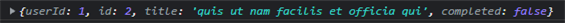
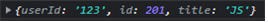
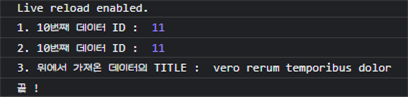
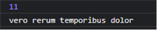
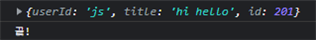

# 📚 <a style="color:#00adb5">Axios</a>

## <a style="color:#00adb5">Axios</a> 란

- <big>Axios</big>는 Vue에서 권고하는 <a style="color:red"><strong>HTTP 비동기 통신 라이브러리</strong></a>이다.
- <a style="color:red"><strong>Promise</strong></a> 기반의 HTTP 통신 라이브러리이며 상대적으로 다른 HTTP 통신 라이브러리들에 비해 문서화가 잘되어 있고 API가 다양하다.
- axios.get(URL) -> Promise 객체 리턴
- then ( 오류가 발생하지 않을 때 ), catch ( 오류가 발생할 때 ) 사용가능
- Promise
  - 서버에 데이터를 요청하여 받아오는 동작과 같은 <big>비동기 로직 처리</big>에 유용한 자바스크립트 라이브러리
  - 자바 스크립트는 단일 스레드로 특정 로직의 처리가 끝날때까지 기다려주지 않는다.
  - 따라서 데이터를 요청하고 받아올 때까지 기다렸다가 화면에 나타내는 로직을 실행해야 할 때 주로 promise를 활용

## <a style="color:#00adb5">Axios 설치</a>

- CDN 방식

```html
<script src="https://cdn.jsdelivr.net/npm/axios/dist/axios.min.js"></script>
```

- NPM 방식
  - npm install axios

## <a style="color:#00adb5">Axios 대표 API</a>

- <a style="color:red"><strong>axios.get('URL 주소').then().catch()</strong></a>
  - 해당 URL 주소에 대해 <a style="color:red"><strong>HTTP GET 요청</strong></a>을 보냄
  - 서버에서 보낸 데이터를 <big>정상적으로 받아오면 then()</big> 안에 정의된 로직이 실행되고
  - 데이터를 받아올 때 <big>오류가 발생하면 catch()</big>에 정의한 로직이 실행
- <a style="color:red"><strong>axios.post('URL 주소').then().catch()</strong></a>
  - 해당 URL 주소에 대해 <a style="color:red"><strong>HTTP POST 요청</strong></a>을 보냄
  - then()과 catch() 방식은 get 방식과 동일
- <a style="color:red"><strong>axios({옵션 속성})</strong></a>
  - HTTP 요청에 대한 자세한 속성들을 직접 정의해서 보낼 수 있다.
  - 데이터 요청을 보낼 URL, HTTP 요청방식, 보내는 데이터 유형 등등

## <a style="color:#00adb5">Axios 예시</a>

### <a style="color:#00adb5">axios(config)</a>

json 예시 파일 ( jsonplaceholder )을 이용한 실습

- <big>GET</big>

```javascript
// jsonplaceholder
const URL = "https://jsonplaceholder.typicode.com/todos";

axios({
  method: "get",
  url: URL,
  responseType: "json",
}).then((response) => {
  console.log(response.data[1]);
});
```

- 결과

<center>

</center>
<br>

- <big>POST</big>

```javascript
// jsonplaceholder
const URL = "https://jsonplaceholder.typicode.com/todos";

axios({
  method: "post",
  url: URL,
  data: {
    userId: "123",
    id: "123",
    title: "JS",
  },
}).then((response) => {
  console.log(response.data);
});
```

- 결과

<center>

</center>
<br>

### <a style="color:#00adb5">axios.get(url[,config])</a>

<a style="color:red"><strong>Read</strong></a>

- <big>기본 문법</big>

```javascript
// 1.
axios({
  method: "get",
  url: "/board/10",
});

// 2. axios() default 는 get 이다.
axios("/board/10");

// 3.
axios.get("/board/10");
```

- <big>활용</big>

```javascript
// jsonplaceholder
const URL = "https://jsonplaceholder.typicode.com/todos";

axios
  .get(URL)
  .then((response) => {
    console.log("1. 10번째 데이터 ID : ", response.data[10].id);
    return response.data[10].id;
  })
  .then((id) => {
    console.log("2. 10번째 데이터 ID : ", id);
    return axios.get(`${URL}/${id}`);
  })
  .then((todo) => {
    console.log("3. 위에서 가져온 데이터의 TITLE : ", todo.data.title);
  })
  .catch((error) => {
    console.log(error);
  })
  .finally(() => {
    console.log("끝 !");
  });
```

- 결과

<center>

</center>
<br>

### <a style="color:#00adb5">axios.get(url[,config]) - async, await 사용</a>

js에서 async/await를 이용한 비동기 구문이 추가 되었기에 axios도 이를 지원한다.<br>
기존 then 방법보다 보기에도 작성하기에도 깔끔하다.<br>

```javascript
// jsonplaceholder
const URL = "https://jsonplaceholder.typicode.com/todos";

async function getTodo(URL) {
  const response = await axios.get(URL);
  const id = response.data[10].id;
  const todo = await axios.get(`${URL}/${id}`);
  console.log(todo.data.id);
  console.log(todo.data.title);
}

getTodo(URL);
```

- 결과

<center>

</center>
<br>

### <a style="color:#00adb5">axios.post(url[,config])</a>

<a style="color:red"><strong>Create</strong></a>

- <big>기본 문법</big>

```javascript
// 1.
axios({
  method: "post",
  url: "/board",
  data: { userid: "js", subject: "안녕하세요" },
});

// 2.
axios.post("/board", {
  userid: "js",
  subject: "안녕하세요",
});
```

- <big>활용</big>

```javascript
// jsonplaceholder
const URL = "https://jsonplaceholder.typicode.com/todos";

axios
  .post(URL, {
    userId: "js",
    title: "hi hello",
  })
  .then((response) => {
    console.log(response.data);
  })
  .catch((error) => {
    console.log(error);
  })
  .finally(() => {
    console.log("끝!");
  });
```

- 결과

<center>

</center>
<br>

### <a style="color:#00adb5">axios.put(url[,config])</a>

<a style="color:red"><strong>Update</strong></a>

- <big>기본 문법</big>

```javascript
// 1.
axios({
  method: "put",
  url: "/board/10",
  data: { subject: "안녕하세요", content: "오늘도 좋은 하루 되세요 ^^" },
});

// 2.
axios.put("/board/10", {
  subject: "안녕하세요",
  content: "오늘도 좋은 하루 되세요 ^^",
});
```

### <a style="color:#00adb5">axios.delete(url[,config])</a>

<a style="color:red"><strong>Delete</strong></a>

- <big>기본 문법</big>

```javascript
// 1.
axios({
  method: "delete",
  url: "/board/10",
});

// 2.
axios("/board/10", {
  method: "delete",
});

// 3.
axios.delete("/board/10");
```
