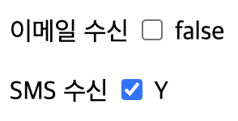
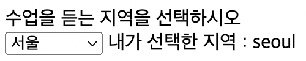

# 📚 <a style="color:#00adb5">Vue.js</a>

<center>

</center>
<br>

# 📚 <a style="color:#00adb5">Vue.js Form Input Bindings</a>

## <a style="color:#00adb5">Vue 폼 입력 바인딩 ( Form Input Bindings )</a> 이란
- `v-model` directive를 사용하여 <a style="color:red"><strong>폼 input과 textarea element에 양방향 데이터 바인딩을 생성</strong></a>할 수 있다.
    - <big>text와 textarea 태그</big>는 value 속성과 input 이벤트를 사용한다.
    - <big>체크박스들과 라디오 버튼</big> 들은 checked 속성과 change 이벤트를 사용한다.
    - <big>Select 태그</big>는 value를 prop으로 , change를 이벤트로 사용한다.


## <a style="color:#00adb5">form - text, textarea</a>
- 문자열 ( text )

```html
<input v-model="msg" placeholder="여기를 수정하세요">
<p>메세지 : {{msg}}</p>
```

- 여러줄을 가진 문장 ( textarea )
    - 텍스트 영역의 보간 `(<textarea>{{text}}</textarea>)`은 작동하지 안ㄹ는다. >> `v-model`를 사용

```html
<span>여러 줄을 가지는 메세지:</span>
<p style="white-space: pre-line">{{msg}}</p>
<br>
<textarea v-model="msg" placeholder="여러줄을 입력해보세요"></textarea>

```

- <big>실습</big>

```html
<div id="app">
        <div>
             아이디 : <input v-model="id" placeholder="아이디를 입력하세요"> 
            <!-- .lazy 수식어를 추가하여 change 이벤트 이후에 동기화 할 수 있습니다. -->
            <!-- lazy를 사용안하면 한글자씩 작성하는 순간 바로 반영이 되지만, lazy를 사용하면 다 작성하고 반영을 할 수 있다 -->
            <!-- 아이디 : <input v-model.lazy="id" placeholder="아이디를 입력하세요"> -->
        </div>
        <div>
            메세지 : <textarea v-model="msg" placeholder="내용을 입력하세요"></textarea>
        </div>
        <p>{{id}} 님에게 보내는 메세지 : {{msg}}</p>
    </div>

    <script>
        new Vue({
            el: "#app",
            data: {
                id: '',
                msg: '',
            },
        });
    </script>
```


- <big>실행 결과</big>

<center>

</center>
<br>


## <a style="color:#00adb5">form - checkbox</a>
- 하나의 체크박스는 <a style="color:red"><strong>단일 boolean 값</strong></a>을 갖는다.

```html
<input type="checkbox" id="checkbox" v-model="checked">
<label for="checkbox">{{checked}}</lable>
```

- <big>단일 체크박스 실습</big>

```html
 <div id="app">
        <p>
            이메일 수신
            <input type="checkbox" id="emailYN" v-model="email">
            <label for="emailYN">{{ email }}</label>
        </p>
        <p>
            SMS 수신
            <input type="checkbox" id="smsYN" v-model="sms" true-value="Y" false-value="N"/>
            <label for="smsYN">{{ sms }}</label>
        </p>
    </div>

    <script>
        new Vue({
            el: '#app',
            data: {
                email: false,
                sms: 'Y',
            }
        });
    </script>
```


- <big>실행 결과</big>

<center>

</center>
<br>

<br>

- 여러 개의 체크박스는 <a style="color:red"><strong>같은 배열을 바인딩</strong></a> 할 수 있다.
- 배열의 값과 checkbox의 value 속성이 같을 경우 체크 처리됨

- <big>여러개 체크박스 실습</big>

```html
 <div id="app">
        <div>당신이 가고싶은 지역을 선택하세요 !!</div>
        <input type="checkbox" id="seoul" value="서울" v-model="checkedAreas">
        <label for="seoul">서울</label>
        <input type="checkbox" id="daegu" value="대구" v-model="checkedAreas">
        <label for="daegu">대구</label>
        <input type="checkbox" id="busan" value="부산" v-model="checkedAreas">
        <label for="busan">부산</label>
        <input type="checkbox" id="daejeon" value="대전" v-model="checkedAreas">
        <label for="daejeon">대전</label>
        <br>
        <span>체크한 이름 : {{checkedAreas}}</span>
    </div>

    <script>
        new Vue({
            el: '#app',
            data: {
                checkedAreas: [],
            }
        });
    </script>
```


- <big>실행 결과</big>

<center>

</center>
<br>


## <a style="color:#00adb5">form - radio</a>
- radio의 경우 <a style="color:red"><strong>선택된 항목의 value 속성의 값을 관리</strong></a>

```html
<input type="radio" id="one" value="One" v-model="picked">
<label for="one">One</label>
<br>
<input type="radio" id="two" value="Two" v-model="picked">
<label for="two">Two</label>
<br>
<span>선택: {{picked}}</span>
```

- <big>실습</big>

```html
<div id="app">
        <div>수업을 듣는 지역을 선택하시오 </div>
        <div>
            <input type="radio" id="daegu" value="대구" v-model="ckArea">
            <label for="daegu">대구</label>
            <input type="radio" id="seoul" value="서울" v-model="ckArea">
            <label for="seoul">서울</label>
            <input type="radio" id="gumi" value="구미" v-model="ckArea">
            <label for="gumi">구미</label>
            <input type="radio" id="daejeon" value="대전" v-model="ckArea">
            <label for="daejeon">대전</label>
        </div>
        <span>내가 선택한 지역 : {{ckArea}}</span>
    </div>

    <script>
        new Vue({
            el: '#app',
            data: {
               ckArea: '대구',
            }
        });
    </script>
```


- <big>실행 결과</big>

<center>

</center>
<br>


## <a style="color:#00adb5">form - select</a>
- select box일 경우 <a style="color:red"><strong>선택된 항목의 value 속성의 값을 관리</strong></a>
- `v-model` 표현식의 초기 값이 어떤 옵션에도 없으면, `<select>` element는 "선택없음" 상태로 렌더링된다.

```html
<select v-model="selectedHobby">
    <option disabled value="">선택</option>
    <option value="공부">공부</option>
    <option value="노래">노래</option>
    <option value="춤">춤</option>
</select>
<span>선택함 : {{ selected }}</span>
```

- <big>실습</big>

```html
<div id="app">
        <div>수업을 듣는 지역을 선택하시오 </div>
        <select v-model="selectedArea">
            <option value="">선택하세요</option>
            <option value="daegu">대구</option>
            <option value="gumi">구미</option>
            <option value="seoul">서울</option>
            <option value="daejeon">대전</option>
        </select>        
        <span>내가 선택한 지역 : {{ selectedArea }}</span>
    </div>

    <script>
        new Vue({
            el: '#app',
            data: {
                selectedArea: '',
            }
        });
    </script>
```


- <big>실행 결과</big>

<center>

</center>
<br>


## <a style="color:#00adb5">form - 수식어 ( Modifiers )</a>
- `.lazy`
    - .lazy 수식어를 추가하여 change 이벤트 이후에 동기화 할 수 있습니다.

```html
<input v-model.lazy="msg">
```

- `.number`
    - 사용자 입력이 자동으로 숫자로 형 변환 되기를 원하면, v-model이 관리하는 input에 number 수식어를 추가하면 된다.

```html
<input v-model.number="age" type="number">
```

- `.trim`
    - v-model이 관리하는 input을 자동으로 trim 하기 원하면, trim 수정자를 추가하면 된다.

```html
<input v-model.trim="msg">
```