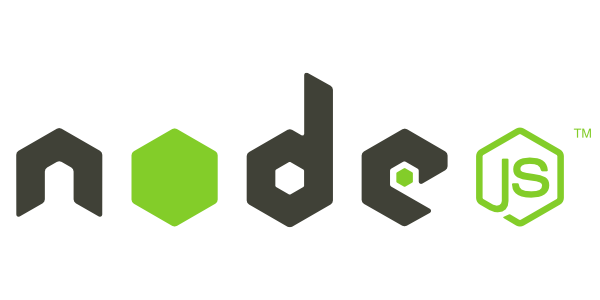

# 📚 <a style="color:#00adb5">Node.js</a>

<center>

</center>
<br>

## <a style="color:#00adb5">Node.js</a> 란

- <a style="color:red"><strong>Node.js</strong></a>는 Chrome V8 JavaScript 엔진으로 빌드 된 <a style="color:red"><strong>JavaScript 런타임</strong></a>이다.
- 즉, Node를 통해 <big>다양한 자바스크립트 애플리케이션</big>을 실행할 수 있으며, 서버를 실행하는데 가장 많이 사용된다.
  - Node.js는 JavaScript를 <big><strong>서버</strong></big>에서도 사용할 수 있도록 만든 프로그램이다.
  - Node.js는 V8이라는 JavaScript 엔진 위에서 동작하는 자바스크립트 런타임 ( 환경 ) 이다.
  - Node.js는 서버사이트 스크립트 언어가 아니다. <a style="color:red"><strong>프로그램 ( 환경 )</strong></a> 이다.
  - Node.js는 웹서버와 같이 확장성 있는 네트워크 프로그램을 제작하기 위해 만들어졌다.
- Node.js는 확장성이 있는 네트워크 어플리케이션 개발에 사용되는 <big><strong>소프트웨어 플랫폼</strong></big>이다. 특히 서버사이트에서 많이 사용된다.
- 내장 HTTP 서버 라이브러리를 포함하고 있어 웹 서버에서 <big><strong>아파치 등의 별도 소프트웨어 없이 동작하는 것이 가능</strong></big> 하다.
- Node.js를 이용하여 <big><strong>웹 브라우저와 무관한 프로그램</strong></big>을 만들 수 있다.
- 중요한 것은 Node.js를 이용해서 <a style="color:red"><strong><big>서버</big></strong></a> 를 만들 수 있다는 것이다.
- 한 가지 언어로 전체 웹 페이지를 만들 수 있게 된 것이다.

## <a style="color:#00adb5">Node.js</a> 장점

- 멀티 스레드 방식에 비해 적은 컴퓨터 자원을 사용
- I/O 작업이 많은 서버로 적합
- 웹 서버가 내장되어 있어 별도의 웹 서버를 설치할 필요가 없다.
- JavaScript를 사용하기 때문에 JSON 형식과 쉽게 호환된다.

## <a style="color:#00adb5">JavaScript 런타임</a> 이란

- <big>런타임</big>이란 특정 언어로 만든 <a style="color:red"><strong>프로그램을 실행할 수 있는 환경</strong></a>을 의미한다.
- 따라서 Node.js 는 자바스크립트 프로그램을 컴퓨터에서 실행 할 수 있게 하는 <a style="color:red"><strong>자바스크립트 실행기</strong></a>이다.

## <a style="color:#00adb5">Node.js</a> 설치 과정

- Node.js 설치하기
  - <a href="https://nodejs.org/ko/">node.js</a> 에서 LTS 버젼 다운로드
  - cmd 에서 'node -v' 를 통해 버젼 확인
- npm package ( Node.js 기본 패키지 관리자 ) 생성
  - npm은 스프링의 maven 같은 것과 비슷하다.
  - 저장할 폴더 cmd 창에서 `npm init` 을 통해 패키지 생성 ( package.json 이 생성됨 )
  - <a href="https://www.npmjs.com/">npm 공식 홈페이지</a> 에서 필요한 모듈 설치
  - package.json 열고 새 터미널 열어서 `npm i prompt-sync` 설치 ( git bash 사용 추천 )
- js 파일 만들고 `node js-fileName.js` 으로 실행

# 📚 <a style="color:#00adb5">Vue/Cil Project</a>

## <a style="color:#00adb5">@vue/cli</a> 이란

- CLI = Command Line Interface
- Vue.js 개발을 위한 시스템으로 <a style="color:red"><strong>Vue.js에서 공식으로 제공하는 CLI ( 권장 )</strong></a>
- 개발의 편리성을 위해 필수처럼 사용
- Vue 프로젝트를 빠르게 구성할 수 있는 스캐폴딩 ( 적절한 인지적 도움을 제공 ) 을 제공
- Vue와 관련된 오픈 소스들의 대부분이 CLI를 통해 구성이 가능하도록 구현되어 있다.

## <a style="color:#00adb5">Vue/Cli 프로젝트 에러 점검 & 설정</a>

- Vue 는 컴포넌트 이름에 합성어를 필수적으로 사용해야한다.
  - .vue filename이 HomeView 이런식
- Vue 는 end line <big>CRLF</big>를 지원하지 않는다 -> <big>LF</big> 으로 수정 ( 윈도우 )
- esline(prettier) error
  - package.json -> eslineConfig -> rule 에 추가
  - 또는 eslintrc.js 에 prettier rule 추가
  - `"prettier/prettier": ["error", {"endOfLine": "auto"}]`
- vue 는 tab space size 2만 지원
  - vscode -> "ctrl" + "," -> prettier Tab Width : 2
- 기타 설정
  - vscode -> "ctrl" + "," -> prettier Print Width : 80
- prettier 설정 완료 후 에러가 나는 파일에 가서 prettier로 auto formatting 해주기
  - 파일 화면 우클릭 -> 문서서식프로그램

## <a style="color:#00adb5">Vue/Cli 실습 & 설정</a>

- Vue Cli 다운
  - `npm install -g @vue/cli` 설치
- Vue/Cli 프로젝트 생성
  - `vue create<project-name>`
  - 생성 중 중지 : `ctrl+c`
  - 서버 실행 : `npm run serve`
  - 브라우저 : `localhost:8080`
    1. manualy 선택
    2. bable, vuex, router, linter 선택
    3. vue 2.x 버젼 선택
    4. 라우터 모드 기본 history 사용
    5. eslint + prettier 사용
    6. lint on save yes
    7. in package.json
- npm 모듈 설치 ( 홈페이지가서 검색 )
  - axios
  - moment ( 날짜 포맷팅 해주는 도구 )
- rule 에 추가
- .vue 파일에 <big>ctrl + spacebar</big> -> 기본 양식 적용
- img 는 <big>assets 폴더</big>에
- App.vue 에 HeaderNav 연결
- 기존 js 파일 template 는 <big>.vue 파일 template</big>로
- routes -> <big>router/index.js</big>
- <big>router에 연결되는 것</big>은 <a style="color:red">views 폴더</a>에 ( 화면 구성 )
- <big>하위 컴포넌트</big> 들은 <a style="color:red">components 폴더</a>에 ( 화면 안에서 바뀌는 것들 )
- style 에 <big>scoped 설정</big>해서 그 파일에서만 사용 ( 설정 안하면 전역으로 쓰일 수 있다 )
- 전체적으로 사용하는 style은 <big>App.vue에 저장</big>하면 편하다.
- src/api에 폴더 생성
  - <big>http.js 파일</big>하면 생성 ( axios )
  - 나중에 axios 사용시 import ! `import http from "@/api/http"`
  - rest 사용시 매번 url 을 수정해야하는 번거로움을 줄일 수 있다.

```javascript
// http.js

import axios from "axios";

// axios 만들기
export default axios.create({
  // URL
  baseURL: "http://localhost:9999/vue",
  // 담아서 보내는 것
  headers: {
    "Content-Type": "application/json",
  },
});
```

# 📚 <a style="color:#00adb5">SFC ( Single File Component )</a>

- <a style="color:red"><strong>확장자가 ".vue"인 파일</strong></a>
- <a style="color:red"><strong><big>.vue = template + script + style</big></strong></a>
- 구문 강조가 가능
- 컴포넌트에만 CSS의 범위를 제한할 수 있음
- 전처리기를 사용해 기능의 확장이 가능

## <a style="color:#00adb5">SFC - template</a>

- `<template>`
- 기본언어 : <a style="color:red"><strong>HTML</strong></a>
- 각 \*.vue 파일은 한번에 <big>최대 하나</big>의 `<template>` 블록을 포함할 수 있다. ( <a style="color:red"><strong>한개의 root element</strong></a> )
- 내용은 문자열로 추출되어 컴파일 된 Vue Component의 template 옵션으로 사용

## <a style="color:#00adb5">SFC - script</a>

- `<script>`
- 기본언어 : <a style="color:red"><strong>JS</strong></a>
- 각 \*.vue 파일은 한번에 <big>최대 하나</big>의 `<script>` 블록을 포함할 수 있다.
- ES2015(ES6)을 지원하여 import 와 export 사용 가능

## <a style="color:#00adb5">SFC - template</a>

- `<style>`
- 기본언어 : <a style="color:red"><strong>CSS</strong></a>
- 각 \*.vue 파일은 <big>여러 개</big>의 `<style>` 태그를 지원
- <big>scoped</big> 속성을 이용하여 현재 컴포넌트에서만 사용 가능한 css를 지정 가능

<br><br><br><br>
👏 참조<br>
<a href="https://hanamon.kr/nodejs-%EA%B0%9C%EB%85%90-%EC%9D%B4%ED%95%B4%ED%95%98%EA%B8%B0/" target=_blank>https://hanamon.kr/nodejs-%EA%B0%9C%EB%85%90-%EC%9D%B4%ED%95%B4%ED%95%98%EA%B8%B0/</a><br>
